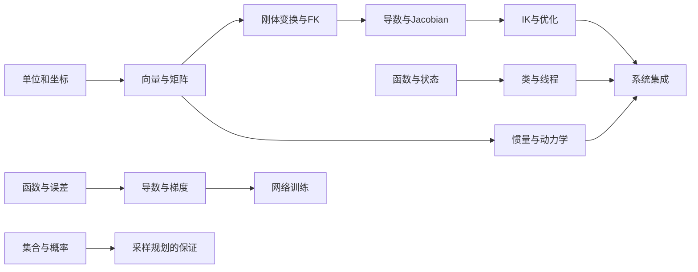

# 第一周之后：每个暂缓主题都有下一步

若需要各门类完整的工程训练，请优先按[工程课程](ENGINEERING_PATH.md)推进；本页继续作为单个原理问题的短课索引。CAN FD与EtherCAT已各自独立成课，其他门类也有实现、诊断和交付任务。

[返回七天主线](WEEK_PLAN.md) · [按技术问题查手册](DEPTH_MAP.md)

“本周选学”表示可以安排到后续学习，不表示它不重要。先完成当天正文与过关题，再选一个专题。下面每个入口都有本地解释、算例、练习答案和指定参考阅读；外部资料打不开，也能先做本地例子。

表中的时间是第一次阅读和做小例子的建议预算，不是掌握整门学科所需时间。研究论文、完整系统和硬件实践需要另行安排。

| 对应天 | 原来暂缓的内容 | 先补什么 | 本地入口与第一次完成的事 | 建议分段 |
|---|---|---|---|---|
| 1 | 矩阵 | 坐标、乘法和加法 | [矩阵为什么有用](handbook/17_extension_workshops.md#day1)：手算一个点旋转前后的坐标；再读第15章 | 2次×45分钟 |
| 1 | 类、线程 | 变量、函数、输入输出 | [对象与并发](handbook/17_extension_workshops.md#software)：区分对象状态，画出反馈队列与超时 | 2次×45分钟 |
| 2 | 六轴设计、惯量矩阵 | 力矩、轴、质量、矩阵乘法 | [结构到动力学](handbook/17_extension_workshops.md#day2)：算长方体惯量，列设计约束 | 3次×45分钟 |
| 3 | 总线电气细节 | 电压、参考地、位和时间 | [连接到有效消息](handbook/17_extension_workshops.md#day3)：算UART时间和终端并联，按层查故障 | 3次×45分钟 |
| 4 | 求逆矩阵、优化推导 | 坐标变换、函数、斜率 | [逆变换到数值IK](handbook/17_extension_workshops.md#day4)：手算逆平移与一次阻尼更新 | 3次×45分钟 |
| 5 | 高维规划证明 | 集合、概率、路径与边检查 | [高维与概率保证](handbook/17_extension_workshops.md#day5)：算网格规模，解释有限时间与渐近结论 | 2次×45分钟 |
| 6 | 神经网络训练细节 | 函数、导数、训练/验证/测试 | [训练到底改了什么](handbook/17_extension_workshops.md#day6)：手算前向、反向和一次更新 | 3次×45分钟 |
| 7 | 真机部署、完整系统开发 | 接口、状态、测试、版本 | [从工具到系统](handbook/17_extension_workshops.md#day7)：做离线集成合同与故障用例 | 3次×45分钟，硬件实践另排 |

## 每个专题都按四步读

先读“为什么现在需要它”，再做最小算例；用自己的话解释自检答案，最后带着具体问题打开参考书。不要为了理解一行矩阵先从头学完整本线性代数。

不同主题会共享基础。例如第2天的惯量矩阵和第4天的逆变换，都要用第1天扩展里的矩阵；因此表格按原课程归属列出，实际深入顺序应服从先修关系。

图不显示时按箭头文字阅读：坐标→矩阵→变换→Jacobian→IK；力矩加上矩阵→动力学；函数和误差→导数→训练；集合和概率→采样规划；函数和状态→并发→集成。

## 第一周以后怎样选择

先用一次学习时间补最影响自己的基础，再选一个方向连续学习。机械方向从结构与惯量进入任务、传动和动力学；运动方向从变换进入IK、控制和规划；感知AI方向从坐标、误差进入标定、估计和训练；软件方向从接口、通信进入并发、测试和集成。各方向最终仍需要理解其他模块的输入输出。

已有基础的人可以直接做每节自检。能解释过程且能处理换一个输入，就进入后续手册；只认得术语、不能说明单位或假设时，回到对应算例。延伸到研究层时使用[前置知识与文献路线](handbook/16_prerequisites_and_deeper_topics.md)。

## 自学记录

每次只记五行：今天要解决的问题；输入和单位；手算或程序结果；一个失败条件；下一步要读的小节。用[问题卡](templates/LEARNING_QUESTION.md)请教同事时附上这些记录。同事暂时没空时，可以继续不依赖这个问题的纸笔题。
