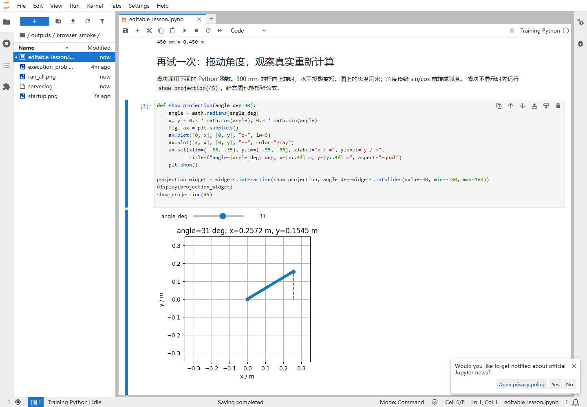

# 在浏览器里改 Python、运行实验、调用工具

现在有13本可编辑的 Notebook：入门操作1本、七天实验7本、深入专题5本。文字、公式、图像和程序放在同一页；按 Shift+Enter 运行代码块，修改参数后重新运行就会得到新的图和数值。

本次提供的是**本机 JupyterLab 课堂**：浏览器显示页面，本机 Python 执行计算。没有发布公共网址。它支持本地文件、Python包和命令行工具，适合接着使用我们的项目。Notebook 将讲解和可运行代码组合在一个文件中，参见 [JupyterLab 官方说明](https://jupyterlab.readthedocs.io/en/stable/user/notebook.html)。

## 1. Windows第一次安装

打开终端，进入本仓库。下面只安装课堂依赖，不需要复制其他机器人仓库；第一次下载需要网络和数百MB左右的可用空间，实际取决于已有依赖。

```powershell
cd D:\code_agent\trainning_materials
python -m venv .venv
.\.venv\Scripts\python.exe -m pip install --upgrade pip
.\.venv\Scripts\python.exe -m pip install -r requirements-interactive.txt
.\.venv\Scripts\python.exe tools/start_classroom.py
```

路径不同就替换第一行。无需激活环境，也不用改 PowerShell 的执行策略。安装完成后，以后双击仓库里的 `start_classroom.cmd` 即可；终端运行期间保持打开。关闭服务在终端按 Ctrl+C，按 Jupyter 提示确认。

Linux/macOS对应命令：

```bash
python3 -m venv .venv
.venv/bin/python -m pip install --upgrade pip
.venv/bin/python -m pip install -r requirements-interactive.txt
.venv/bin/python tools/start_classroom.py
```

启动器将课堂设为文件根目录，创建项目内的 **Training Python** 内核，并把 Jupyter 状态放在忽略提交的 `outputs/jupyter/`。默认只监听127.0.0.1并保留 Jupyter 的登录令牌。浏览器没自动打开时，复制终端给出的完整本机地址。Jupyter会按可用端口启动，使用实际打印的地址，参见[官方启动说明](https://jupyterlab.readthedocs.io/en/stable/getting_started/starting.html)。

## 2. 第一次操作：约10分钟

启动器每次创建独立的 `outputs/jupyter/runtime-*` 目录，登录文件由当前启动账户生成；不同账户或隔离环境的测试不会复用同一份登录文件。

1. 打开 [00_start_here.ipynb](notebooks/00_start_here.ipynb)，右上角选择 **Training Python**。如果弹出 **Select Kernel**，在下拉框选 **Training Python** 再点 **Select**。下载后双击文件若只看到文本，说明还没有在 JupyterLab 中打开。
2. 点击第一块准备代码，按 Shift+Enter；若刚选择了内核却没有输出，再运行一次。接着运行毫米换米的代码，将300改为450，确认输出0.450。
3. 运行滑块代码，拖动角度，观察投影变化。图中的轴标为英文和单位，避免不同机器缺少中文字体。
4. 从七天表格进入当日实验。先做默认值；每次只改一个参数，写下修改前的预测。
5. 用 File → Save Notebook As 保存自己的版本。提交前执行 Kernel → Restart Kernel and Run All Cells，再 Ctrl+S。

`[*]`表示忙；方形停止按钮可中断。变量留在内核内存中，执行顺序未必等于页面顺序，重启再全跑可以发现这种隐藏依赖。修改 `labs` 源文件后也要重启或显式 reload，避免仍用旧导入。

## 3. 每天新增了哪些技术实验

下面是本机实测画面：将角度从30°调到31°，Python重算后，图中的投影变为x≈0.2572m、y≈0.1545m。上方代码也能直接编辑。



| Notebook | 技术内容 | 可观察输出 |
|---|---|---|
| [01](notebooks/01_units_and_code.ipynb) | 单位、函数合同、非有限值、CSV | 位移、异常、位置散点 |
| [02](notebooks/02_body_and_frames.ipynb) | 静力矩、URDF、齐次变换、任意轴旋转 | 工具点、矩阵正交性、模型声明 |
| [03](notebooks/03_communication.ipynb) | 字段、大小端、量化、序号回绕、新鲜度 | 十六进制包、拒绝原因、超时状态 |
| [04](notebooks/04_kinematics_control.ipynb) | 解析IK、雅可比差分、DLS、轨迹、PID | 关节拖动、迭代误差、速度与力矩曲线 |
| [05](notebooks/05_collision_planning.ipynb) | 球间隙、A*、边检查、分级工作空间筛选 | 碰撞滑块、路径、各阶段通过数 |
| [06](notebooks/06_perception_learning.ipynb) | 针孔投影、外参、Kalman、梯度下降 | 滤波滑块、真实训练记录播放、留出误差 |
| [07](notebooks/07_tools_and_delivery.ipynb) | 源码查看、子进程、返回码、测试、报告 | 工具输出、测试日志、环境与结果JSON |

每本都有推导、默认参数、可修改任务、已知结果或断言。多关节动力学、三维姿态IK、工程通信预算与AI评估补充在[工程细节](handbook/09_engineering_details.md)。

## 4. “其他工具”怎样接

浏览器负责编辑，本机内核可以 `import` 已安装模块，读写CSV/URDF，调用 Python 脚本，也可以用 `subprocess.run` 调用 CMake、Git、tshark 等可执行程序。第七天已有可运行示例；命令都传参数列表、指定工作目录、保留返回码并设超时。

| 工具 | 本课程可做什么 | 还需要什么 |
|---|---|---|
| NumPy / Matplotlib / widgets | 算矩阵、画曲线、拖参数、播放记录 | 已列入交互依赖 |
| Python脚本 / unittest | 运行课程算法、检查已知预期 | 第七天直接运行 |
| Wireshark / tshark | 打开离线PCAP，查看UDP载荷 | 另装Wireshark；教材数据已提供 |
| Git / VS Code | 看修改、编辑脚本、调试 | 另装工具；见[工具说明](TOOLS.md) |
| FreeCAD / CMake / ROS | CAD、编译与机器人系统实验 | 对应项目环境与操作系统支持 |
| GPU / 相机 / CAN驱动 | 进阶项目中的计算或设备接入 | 设备所在机器的驱动与权限；基础课不依赖 |
| AI编码工具 | 用任务卡生成修改建议，再跑测试 | 自己已有工具即可；课程没有绑定付费API |

JupyterLab 终端也运行在服务所在机器，权限等同启动它的账户，见[官方终端说明](https://jupyterlab.readthedocs.io/en/stable/user/terminal.html)。因此在学校电脑浏览远程服务器时，子进程使用的是服务器文件和工具。

## 5. 本机、纯浏览器与真正在线的区别

| 方式 | Python在哪运行 | 文件和外部工具 | 本次状态 |
|---|---|---|---|
| 本机JupyterLab | 启动服务的电脑 | 本机Python包、文件、命令行工具 | 已提供启动器与13本教材 |
| 远程JupyterLab/JupyterHub | 服务器 | 服务器上的环境；多人需独立账户/内核 | 未部署，需要确定服务器和访问方式 |
| JupyterLite | 浏览器WebAssembly | 包和系统调用受限，不适合直接接本机工具 | 方案说明，未制作站点 |

JupyterLite 的运行方式与包限制见[官方说明](https://jupyterlite.readthedocs.io/en/stable/troubleshooting.html)。本课程第七天要执行子进程，故当前采用完整 Python 内核。要给同事共享，先共享整个 `trainning_materials` 目录（不含 `.venv`、`outputs`）；每台机器按安装步骤建环境。不要把本机网址当成已部署的公共课堂。

## 6. 常见问题

| 现象 | 处理 |
|---|---|
| `No module named jupyterlab` | 用 `.venv` 的Python安装依赖和启动，不要混用解释器 |
| 找不到 Training Python | 用启动器启动；它会写入项目内kernelspec；已开旧服务则先退出再启动 |
| `NameError` / ROOT找不到 | 先运行第一块；保留完整目录，把内核工作目录设在课程或notebooks目录 |
| 改了代码却结果不变 | 重新运行对应块；导入模块有缓存时重启内核 |
| widgets只有文本 | 确认ipywidgets安装在启动环境与内核；重新运行；用同页显式函数调用查看静态图 |
| 网络下载失败 | 检查当前网络/代理；先升级本环境pip；原CLI实验仍可离线使用 |
| assert失败 | 先恢复默认参数判断环境；改实验条件后需推导新的预期，不能直接删除所有断言 |

维护者可运行 `python tools/build_notebooks.py`，将 `notebooks/source/*.py` 的分块讲义重新生成 `.ipynb`；**这会覆盖同名教材笔记，所以学员另存自己的副本**。构建器不在课堂启动时自动运行。

安装交互依赖后，执行 `.venv` 的 `python tools/check_notebooks.py` 会在每本独立的新内核中完整执行，输出保存到 `outputs/executed_notebooks/`，教材原文件不被覆盖。验证方法参见 [nbclient](https://nbclient.readthedocs.io/en/latest/client.html)，交互控件参见 [ipywidgets](https://ipywidgets.readthedocs.io/en/stable/examples/Using%20Interact.html)。

## 7. 新增深入实验与逐步演示

这3本专题可接在对应日课程后，也可作为第二周内容。仍用同一个Training Python内核，修改代码后按Shift+Enter。

| 专题 | 可修改和运行的内容 | 先阅读 |
|---|---|---|
| [08 协议栈](notebooks/08_protocol_stack.ipynb) | 拆解PCAP的50字节、TCP长度分帧、错误长度、CAN逐位仲裁 | [通信历史与协议栈](handbook/10_communication_stack_history.md) |
| [09 IK方法](notebooks/09_ik_families.ipynb) | 代数消元、两解平均反例、425点数据表检索初值、30目标迭代比较 | [逆运动学方法家族](handbook/11_inverse_kinematics_families.md) |
| [10 视觉推理](notebooks/10_visual_reasoning.ipynb) | 改步长比较Jacobian与真实FK；改反馈延迟；比较滤波平滑与滞后 | [系统深入](handbook/13_systems_deepening.md) |

[16主题逐步演示器](assets/interactive/concept_player.html)是另一个入口：直接双击HTML即可，可暂停、单步、拖进度。每步给出观察对象、数值、解释和适用范围。它播放Python预计算结果；要改变算法与参数，使用上面的Notebook。详细主题及旧GIF的改进说明见[演示指南](assets/interactive/README.md)。

GitHub等工具的协作练习见[工具链](handbook/12_developer_toolchain.md)，并附[Issue](templates/ISSUE_EXERCISE.md)、[PR](templates/PULL_REQUEST_EXERCISE.md)与[CI示例](templates/course_checks.yml)。CI文件放在templates中供学习，尚未启用远程工作流。

## 新增基础衔接实验

| Notebook | 配套讲义 | 学习结果 |
|---|---|---|
| [11 坐标、矩阵与FK](notebooks/11_frames_matrices_fk.ipynb) | [第15章](handbook/15_frames_matrices_fk.md) | 逐格计算、点/方向、逆变换、顺序对照、固定点换坐标与FK |
| [12 物理链路](notebooks/12_physical_links.ipynb) | [第14章](handbook/14_physical_connections.md) | UART采样、SPI移位时间、终端并联、差分/共模和I²C上升沿 |

基础不足时先按[前置路线](handbook/16_prerequisites_and_deeper_topics.md)补课；试用AI在线答疑的具体素材和范围见[OpenMAIC方案](OPENMAIC.md)。这两本仍用本机Training Python内核，未连接真机。
