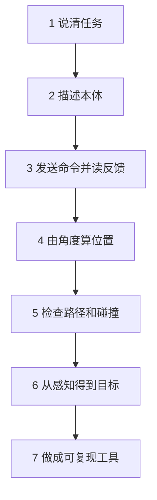

# 七课学习路线

[首页](README.md) · [自学提示](SELF_STUDY.md) · [扩展资料](EXTENSIONS.md)

沿一条主线学习：先把任务说清楚，再认识机器人、通信、运动、避障和感知，最后把它们做成一个小工具。每天完成一课即可，也可以拆成几次学习。

固定顺序：**读正文 → 做一个实验 → 完成三题自检 → 继续下一课**。Notebook、手册和论文属于扩展资料，不影响基础课推进。

| 课次 | 主题 | 你会带走什么 | 正文 |
|---|---|---|---|
| 1 | 任务与代码 | 单位换算、坐标约定、三行程序 | [第一课](lessons/day01_system_and_code.md) |
| 2 | 本体与模型 | 两杆模型、零位、力矩、URDF基础 | [第二课](lessons/day02_body_and_urdf.md) |
| 3 | 通信与反馈 | 字节消息、字段解读、反馈是否过期 | [第三课](lessons/day03_communication.md) |
| 4 | 运动与控制 | FK、IK、轨迹和反馈的区别 | [第四课](lessons/day04_control.md) |
| 5 | 碰撞与规划 | 路径、碰撞近似、A*绕行 | [第五课](lessons/day05_collision_workspace.md) |
| 6 | 感知与AI | 像素到位置、误差、训练与测试 | [第六课](lessons/day06_perception_ai.md) |
| 7 | 软件交付 | 一个可测试、可复现的FK小工具 | [第七课](lessons/day07_vibe_coding.md) |

## 这条顺序解决什么问题

先学已知目标下的运动，再学感知如何提供目标，是为了让每一步都能接上下一步。真实项目中感知、规划和控制会循环工作；这套入门课按依赖关系展开。

## 需要实操时

接线、读反馈、有限运动和调电机，请转到[单电机实操路线](PRACTICAL_PATH.md)。它是岗位操作路线，按设备条件安排，不需要把后续工程专题全部学完。

## 学完之后

想深入某个问题，去[扩展资料](EXTENSIONS.md)；需要完整工程训练，去[工程课程](ENGINEERING_PATH.md)。基础课先做到能解释、能运行小实验、能说明结果，专业推导和硬件验证按工作需要继续。
