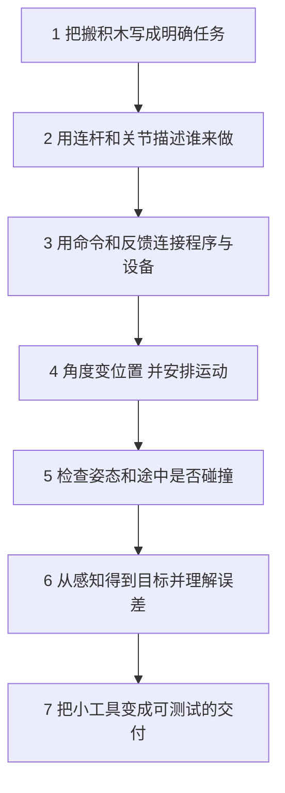

# 七天路线：每天只增加一个需要解决的问题

[首页](README.md) · [自学方法](SELF_STUDY.md) · [本周选学与后续课程](EXTENSIONS.md)

第一周每天约3小时。零基础学员可以把“一天”拆成两次，按过关情况推进；一周目标是建立开发全景和最小动手能力，后续专题不计入这21小时。没有电脑时先做纸笔与数据阅读，程序运行留待有电脑后补齐。

面向上岗操作时，配合[单电机实操路线](PRACTICAL_PATH.md)：第2天后做设备辨认与接线，第3天后做只读反馈，第4天后做有限运动和控制对照，第7天交接工位记录。实操按各卡过关条件推进，额外安排工位时间；接线和调电机属于这条工作路线的必做项。还没学FK/IK时，也可先完成单电机反馈与单位检查。

**固定顺序：当天正文 → 一个基础实验 → 三题自检与订正 → 看下一天衔接。** Notebook08–12、长篇手册和论文属于选学，正文偶尔提到它们时可以先记录入口。

## 一眼看懂这一周

| 天 | 先会什么 | 今天新学什么 | 留下一份具体成果 | 本周选学，后续有课 |
|---|---|---|---|---|
| [1：任务与代码](lessons/day01_system_and_code.md) | 加减乘除 | 单位、坐标、程序步骤 | 单位换算、三行程序、任务清单 | [矩阵](handbook/17_extension_workshops.md#day1)、[类与线程](handbook/17_extension_workshops.md#software) |
| [2：本体与模型](lessons/day02_body_and_urdf.md) | 单位和位置 | 连杆、关节、角度、力矩 | 两杆图、零位约定、一行力矩 | [六轴设计与惯量矩阵](handbook/17_extension_workshops.md#day2) |
| [3：通信与反馈](lessons/day03_communication.md) | 程序输入输出 | 字节、消息、反馈、超时 | 8字节解读与一次超时计算 | [总线物理连接与电气细节](handbook/17_extension_workshops.md#day3) |
| [4：运动与控制](lessons/day04_control.md) | 两杆、角度、反馈 | sin/cos、FK/IK、轨迹、反馈纠正 | 一个FK手算、一条IK结果、曲线解释 | [逆矩阵与优化推导](handbook/17_extension_workshops.md#day4) |
| [5：碰撞与规划](lessons/day05_collision_workspace.md) | 能到与怎样动 | 碰撞近似、路径、A* | 19步方格路线与一次边检查解释 | [高维规划与理论保证](handbook/17_extension_workshops.md#day5) |
| [6：感知与AI](lessons/day06_perception_ai.md) | 坐标、误差、目标 | 像素、标定、滤波、学习 | 数据链图与训练/测试拆分理由 | [神经网络训练细节](handbook/17_extension_workshops.md#day6) |
| [7：软件交付](lessons/day07_vibe_coding.md) | 前六天的最小例子 | 测试、版本、AI协作与复现 | 角度到位置工具、测试、使用说明 | [真机部署与完整系统](handbook/17_extension_workshops.md#day7) |

表格最后一列是继续学习的入口。每项都有本地小课堂、先修提示、例子和参考材料；不是只列一个术语让你自行搜索。

## 为什么按这个顺序

图的顺序是教学依赖；真实系统里的感知通常会先提供目标，再交给规划与控制。先学已知目标下的运动，是为了第六天能理解感知结果要送到哪里。

## 每天3小时怎样用

20分钟回顾先修并预测；40分钟读正文和看一个图；40分钟纸笔计算；50分钟做一个实验（安装卡住时先读对应CSV或输出）；30分钟自检、订正和记录问题。休息时间另留。第一次安装可单独安排一次准备时间，不必占掉当天全部学习时间。

## 第1天：让数字有含义

从“把积木放进盒子”拆出看位置、规划、运动、检查完成。先写清300mm等于0.3m，再用三行程序核对；最后在纸上约定原点和x/y方向。这样明天画机器人时，长度与位置都有共同含义。

学习：[第一天正文](lessons/day01_system_and_code.md) → [实验01](notebooks/01_units_and_code.ipynb)。补基础：[数学台阶](beginner/MATH_STEPS.md)的单位与坐标、[操作卡](beginner/COMPUTER_FIRST_STEPS.md)的文件与运行。

**过关：** 450mm是多少米？(3,2)的坐标必须先约定什么？答案：0.45m；原点、轴方向和单位。把换算输入改成450后重新运行，才能核对修改是否生效。

**接到明天：** 位置只是一个点，手臂却有长度和可动的连接处；下一步把点扩展成连杆与关节。

## 第2天：从一个点变成一条会动的链

使用轴间距30cm与20cm两根纸条，固定基座，约定两杆朝右为零位。第二个角相对第一杆量，所以它跟第一杆一起转。先摆明白，再认识URDF里哪条描述连杆、哪条描述关节，最后算负载为什么需要力矩。

学习：[第二天正文](lessons/day02_body_and_urdf.md) → [实验02](notebooks/02_body_and_frames.ipynb)。第一次只完成两杆、轴与零位、力矩和URDF字段观察；Notebook中的矩阵细节可在第4天之后回来。矩阵不是今天开始的前提。

**过关：** 0.3m水平力臂末端受垂直向下2N力，力矩大小是多少？答案0.6N·m。换成沿杆方向的力，绕固定端的力矩为0；因此力的方向也要写清。

**接到明天：** 模型告诉我们哪些关节可以动，还需要把目标角度送到设备，并知道它实际动到哪里。

## 第3天：把“转到这里”变成可核对的消息

先用纸上字段表表示节点1、序号7、角度250毫弧度，再看8个字节怎样按约定组合。这里先把弧度当作角度单位：1000毫弧度等于1弧度；第4天再解释它与度、sin/cos的关系。接着画“生成→发送→执行→反馈”四个时刻。

学习：[第三天正文](lessons/day03_communication.md) → [实验03](notebooks/03_communication.ipynb)。主线先读字段与超时；物理连接、协议历史和抓包工具可沿当天扩展深入，工具暂未安装时用现成日志完成核心题。

**过关：** 本课重复序号不刷新有效时间。最后有效反馈0.020s，当前0.181s，允许年龄100ms，是否超时？答案：161ms，超时。必须说明规则，不能只看“收到消息”的日志。

**接到明天：** 现在消息可以带两个关节角；接下来要知道这两个角让工具尖落在哪里，以及目标位置该对应哪些角。

## 第4天：由角到点，再由误差到修正

本日概念较多，按两段学：先做投影与FK/IK，再学轨迹与反馈。30cm杆转30°贡献(25.98,15)cm；20cm杆相对再转60°，对桌面方向就是90°，贡献(0,20)cm。合计(25.98,35)cm。先掌握这一步，再看矩阵写法。

学习：[第四天正文](lessons/day04_control.md) → [实验04](notebooks/04_kinematics_control.ipynb)。只要求能解释FK、IK与反馈的区别，手算一次FK，读一条IK结果和一段速度曲线；完整求解器、PID调参与推导留给扩展。sin/cos不熟先用正文查表。

**过关：** q1=0°、q2=90°的末端是哪？得到几何解是否说明电机会准确到达？答案：(30,20)cm；不能，还要看轨迹、反馈、驱动与模型误差。

**接到明天：** 两个角既确定工具点，也确定整根手臂的摆法；避障检查要看连杆与整段运动，不能只看工具终点。

## 第5天：合法终点之间也可能隔着墙

把一个姿态理解为一组关节角，把路径理解为一串相连姿态。球与盒子让碰撞检查变快，但过大近似会拒绝本来可行的折叠姿态，过小近似会漏掉零件。然后用二维方格A*练习搜索和绕行，认识节点与边的区别。

学习：[第五天正文](lessons/day05_collision_workspace.md) → [实验05](notebooks/05_collision_planning.ipynb)。手工方格任务用于理解搜索；它不等于已经解决真实六轴机器人规划。

**过关：** 已验证路径两端无碰撞，能直接连线执行吗？答案不能，要检查中间运动；曲线平滑后也应重新检查。数出教材路线19条移动边，20个访问位置不能误记为20步。

**接到明天：** 前面假定目标和障碍位置已知；接下来从相机获得这些信息，并理解测量误差如何影响动作。

## 第6天：从图像里的格子到机器人使用的位置

先画“像素→相机坐标→基座坐标→工具目标”。像素不是米，需要几何与标定。再看重复测量为何不同、滤波为何既能减小波动也可能引入滞后。最后用简单拟合说明学习怎样从数据调整参数。

学习：[第六天正文](lessons/day06_perception_ai.md) → [实验06](notebooks/06_perception_learning.ipynb)。先完成坐标链、一个误差/滤波例子和拆分理由，网络反向传播在扩展里继续。

**过关：** 相机坐标(0.1,0,1)m，相机相对基座平移(0.2,0,0.3)m且无旋转，基座坐标是多少？答案(0.3,0,1.3)m。若有旋转，不能只相加。训练和测试使用同一段相邻视频帧，也不能证明换场景有效。

**接到明天：** 模块越来越多，必须把输入、输出、单位和失败条件写成可执行的检查；下一步用最小FK工具练习交付。

## 第7天：交付一件别人能复现的小工具

主线工具统一输入角度（度）、输出位置（米），杆长0.3m和0.2m。正文保留厘米版手算实现，转换到交付版时要同步换数值和说明。先用三个已知姿态核对，再检验错误输入，记录版本、环境与运行步骤。

学习：[第七天正文](lessons/day07_vibe_coding.md) → [实验07](notebooks/07_tools_and_delivery.ipynb)。Git/AI工具用于帮助记录和修改；没有GitHub账号或付费AI也可以完成本地交付。工具名称更多的比较见后续工具链手册。

**过关：** (0°,90°)输出应约为(0.3,0.2)m；说明里写米而程序输出(30,20)就没通过。正文厘米函数是计算示范，交付时还需错误输入检查。保留运行命令、输出、测试和README；只完成离线运行就记录为离线验证。

**下一阶段：** 按[扩展选课表](EXTENSIONS.md)选择一个方向。先解决当前项目最需要的基础，再继续算法与系统；整机设计、真机部署和大型模型训练需要独立的后续学习与实践计划。
