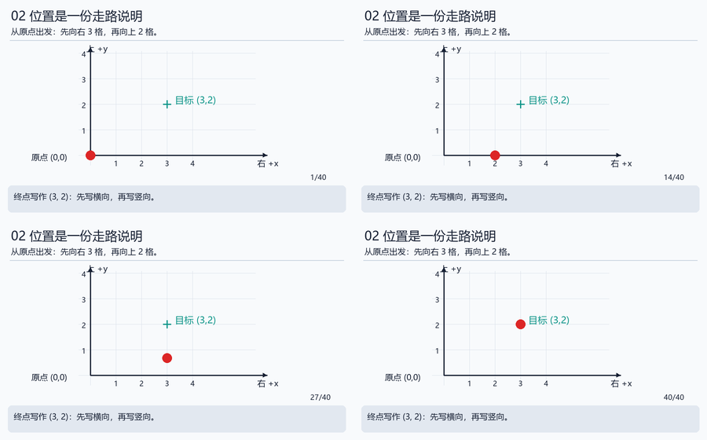
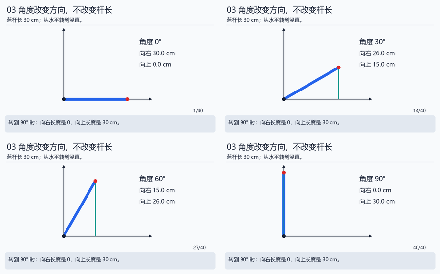

# 数学小台阶：每次只多学一件事

这不是数学考试。遇到陌生符号就回到对应台阶，把数代进去算一次，再回正文。前五级足够开始一周主线；第六级以后为进入进阶手册做准备。

## 台阶1：同一物体可以用不同单位描述

一根尺子长30厘米，也长0.30米。厘米刻度比米小，因此数值更大。厘米转米除100，毫米转米除1000。反过来，米转厘米乘100。

先判断合理数量级：桌面小机械臂的一根杆不太可能长300米。如果文件里写300，先查单位，别急着让算法处理。

练习：50毫米、1.2米分别是多少米、厘米？答案0.05米、120厘米。把换算过程写成等式，并在每个数字后写单位。

## 台阶2：比例与平均值

16次尝试成功12次，比例=12÷16=0.75，也就是75%。这只描述这16次，不保证今后所有情况都一样。

三个测量9、10、11，平均数=(9+10+11)÷3=10。平均数把多次测量合成一个数，但可能隐藏变化：若前面全是9、后面全是11，就不能说物体一直是10。

练习：5次中成功4次，比例是多少？答案80%。数据2、4、9的均值是多少？答案5。

## 台阶3：坐标是有起点和方向的说明

把原点当作“从这里出发”，x表示横向、y表示竖向。点(3,2)表示向右3格、向上2格。点(−1,2)表示向左1格、向上2格。每格可能1厘米，也可能1米，必须说明。



从(3,2)去(5,1)，横向改变+2、竖向改变−1，因此变化量是(2,−1)。变化量描述“差多少”，位置描述“在哪里”。

练习：从(1,1)到(1,4)，变了什么？答案横向不变，竖向+3。改变原点后，同一物体的数字可能变化，物体本身不一定移动。

## 台阶4：角度是转了多少

一圈360°，半圈180°，四分之一圈90°。先约定从哪里开始量，以及哪个方向是正。我们的纸条从向右开始，逆时针为正。

弧度是另一种角度单位。想象半径1的圆，走过与半径一样长的一段圆弧，对应1弧度。一圈弧长是2π个半径，所以一圈是2π弧度。π约3.14159。

```text
180° = π rad
90°  = π/2 rad ≈ 1.5708 rad
30°  = π/6 rad ≈ 0.5236 rad
度转弧度：度数 × π / 180
```

Python已经提供math.radians做转换。练习：180°输入Python三角函数前应变成多少？答案约3.14159，不是180。

## 台阶5：sin与cos只是两个长度比例

一根斜杆，向右投影的长度除以杆长叫cos，向上投影的长度除以杆长叫sin。它们随角度变化，杆长本身没变。



30°时，cos约0.866，sin=0.5。20厘米的杆横向约17.32厘米、竖向10厘米。90°时横向0，竖向20厘米。这能帮助你检查公式有没有把横竖写反。

两根杆接在一起，把第一段位移和第二段位移相加即可。关键是第二杆方向要从同一个桌面坐标系来表达，因此需要把相对角相加。

## 台阶6：速度是每秒改变多少

先认识代码里常见的小数写法：1e-3就是0.001，1e-6就是0.000001，表示小数点向左移动3位、6位。它不是新单位，后面仍要写米、秒等。看到“误差<1e-6 m”，就读作“误差小于0.000001米”。

3秒转过0.6弧度，平均速度=0.6÷3=0.2弧度/秒。平均值不说明中途是否加速。若速度每秒从0.1变成0.3，变化量0.2，平均加速度0.2弧度/秒²。

采样就是每隔一小段时间记录一次。100 Hz表示理想每秒100次，间隔1÷100=.01秒。间隔不准会影响估计和控制。

## 台阶7：函数与曲线

函数像一台规则明确的小机器：输入一个数，按规则给出结果。规则y=2x+1，输入0得到1，输入3得到7。画图时，横轴放输入x，竖轴放输出y。

模型拟合就是尝试找一条规则贴近数据。误差=预测−参考；平方误差把误差平方，避免正负抵消。预测3、参考5，误差−2，平方误差4。

先看轴名和单位，再看曲线。两张图如果纵轴范围不同，看起来都很平，也可能有不同误差。

## 台阶8：向量、矩阵和局部变化（进阶入口）

向量可先理解为按顺序装好的几个数，例如二维位移(2,−1)。矩阵是一张按规则把一组数变成另一组数的表。`[[1,2],[3,4]]`乘(5,6)，第一行算1×5+2×6=17，第二行算3×5+4×6=39，得到(17,39)。

雅可比就是一张“关节稍微变一点，末端大约怎样变”的表。先知道局部近似是什么意思，再到 [运动学手册](../handbook/02_kinematics.md) 学它的公式；不要把它当第一天必须会的知识。

## 台阶9：力、质量和力矩（机械补充）

千克描述质量，牛顿描述力。地面附近，质量乘近似重力加速度可以估计重力：.5 kg×9.81 m/s²≈4.905 N。

水平力臂.2 m时，重力矩约4.905×.2=.981 N·m。力臂是能产生绕轴转动作用的垂直距离，不是所有情况下都直接等于杆长。第一周先算水平杆例子，再学叉积。
