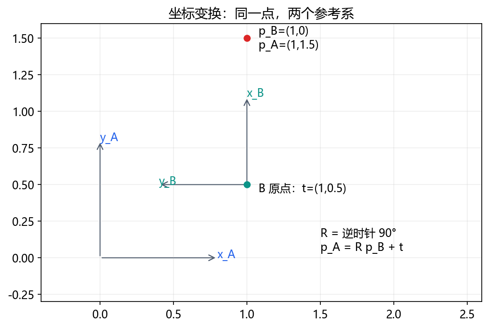

# 00｜数学与代码：把符号变成可以算的东西

**对应工程训练：**[本门完整任务](../engineering/01_math.md)，将本章原理接到配置、实现、排错和交付。

矩阵乘法的逐格算例、基向量、齐次坐标、逆变换与左/右乘见[第15章](15_frames_matrices_fk.md)；缺失前置可按[第16章](16_prerequisites_and_deeper_topics.md)补课。

接着读[代数、集合、微积分和概率各自解决什么问题](13_systems_deepening.md)，用维度、差分和误差传播把数学接到机器人计算。

这是进阶阅读。零基础先完成 [七天正文](../WEEK_PLAN.md)，不认识符号时查 [数学小台阶](../beginner/MATH_STEPS.md)，先读 [算法故事](../beginner/ALGORITHM_STORIES.md)建立直觉。

必读约60–90分钟，练习45分钟。前提是会用计算器；目标是手算坐标变换、读懂循环。

## 1. 标量、向量、矩阵

温度25是标量；位置[x,y,z]是向量；矩阵表示从一组数到另一组数的线性映射。必须说明单位与参考系，位置向量不能直接与角度向量相加。

长度 `||v||=sqrt(vx²+vy²+vz²)`；点积 `a·b=Σa_i*b_i` 衡量方向关系，例如[1,0]与[0,1]点积为0，即垂直。三维叉积 `a×b` 给出垂直方向；力矩 `τ=r×F`，大小还与夹角有关。

矩阵乘向量就是按行做点积：`[[1,2],[3,4]]×[5,6]=[17,39]`。m×n矩阵乘n×1向量得到m×1向量。AB与BA一般不同，尺寸还可能不允许交换。

**自检：** `[[0,-1],[1,0]]×[2,0]`？答案[0,2]，相当于逆时针旋转90°。

## 2. 三角函数

单位圆上角q对应(cos q,sin q)。长l的杆相对x轴转q，末端为(l cos q,l sin q)。弧度=弧长/半径，一圈2π，90°=π/2。Python的sin/cos输入弧度。

`atan(y/x)`会丢象限信息，x=0还会出问题；`atan2(y,x)`用两个分量判断方向。例如atan2(1,-1)=135°。

**例题：** l=.3 m、q=30°。先转π/6，cos=√3/2、sin=1/2，得到(.259808,.15) m。错误地输入sin(30)会计算30 rad。

## 3. 旋转与平移



B原点在A系为(1,.5)，B的x轴相对A转90°。B系点p_B=(1,0)，先转成(0,1)，再平移得到p_A=(1,1.5)。公式 `p_A=R_AB p_B+t_AB`。

旋转矩阵的列是新坐标轴在旧系中的表达。合法旋转满足 `R^T R=I`、`det(R)=1`。齐次矩阵统一旋转和平移：

```text
T_AB = [ R_AB  t_AB ]     p_A = T_AB [p_B;1]
       [ 0 0 0   1   ]
T_BA = [ R_AB^T  -R_AB^T t_AB ]
       [ 0 0 0          1      ]
```

返回B系时先减平移再逆旋转：`R^T(p_A-t)`。不能只对平移取负。方向向量不受平移影响，齐次最后一维用0；点用1。

**自检：** A系(1,1.5)返回B系是(1,0)；A系(1,.5)返回B系是(0,0)。

## 4. 从代码到数值

def定义函数，return把结果交给调用者，print只显示。for逐项处理，if决定分支。输入输出是第一张调试地图。

```python
import math
def endpoint(length_m, angle_deg):
    if length_m <= 0:
        raise ValueError("length must be positive")
    angle_rad = math.radians(angle_deg)
    return length_m*math.cos(angle_rad), length_m*math.sin(angle_rad)
x, y = endpoint(0.3, 30)
print(x, y)
```

依次观察参数、条件、转换和返回值，与手算对照。负长度应该在哪行停止？异常是明确失败路径，不应用`except: pass`隐藏。打开实验中的fk，把变量标成输入、中间量、输出。先确定哪个值首次偏离预期，再改代码。

## 5. 导数和数值误差（第4天前读）

导数是局部变化率，位置的时间导数是速度。中央差分 `(f(x+h)-f(x-h))/(2h)` 可核对解析导数。多输入多输出，把每个输出对各输入的偏导排成雅可比。两角度到二维位置，J是2×2，元素单位m/rad。

`Δp≈JΔq`是小变化的局部近似，步子过大未必有效。浮点数不是无限精度；误差容差要带单位，位置误差<1e-6 m与角度误差<1e-6 rad不是同一要求。
