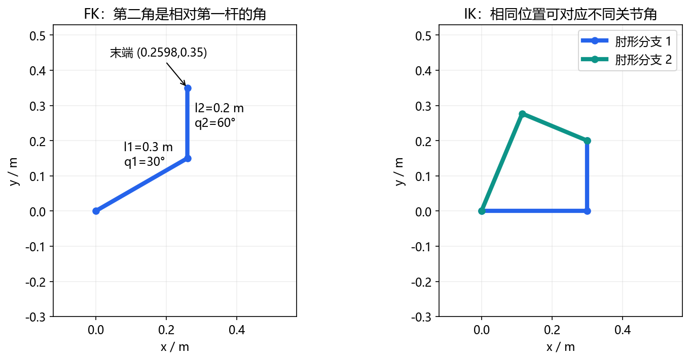
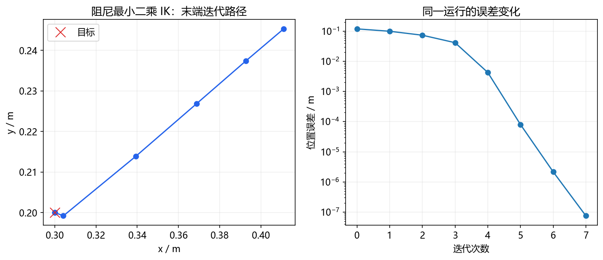

# 02｜运动学：从两根杆推到六轴机械臂

这是进阶阅读。零基础先完成 [七天正文](../WEEK_PLAN.md)，不认识符号时查 [数学小台阶](../beginner/MATH_STEPS.md)，先读 [算法故事](../beginner/ALGORITHM_STORIES.md)建立直觉。

分两次学习，共2–3小时加实验。先修：[数学基础](00_foundations.md)。目标是会算、会画、会解释失败。

## 1. 构型、位姿与参考系

构型q是内部自由度取值，末端位姿包含位置与方向。六个转动关节不自动意味着任意笛卡尔位姿都可达。

`T_AB`把B坐标转为A坐标；串联FK是`T_base_1(q1) T_1_2(q2)…T_n_tool`。前一个child须接上下一个parent，工具固定偏移也要乘进去。法兰坐标不是夹爪尖端坐标。

方向可用旋转矩阵、轴角、单位四元数表示。RPY要说明次序；常见URDF固定轴RPY对应`Rz(yaw) Ry(pitch) Rx(roll)`。四元数wxyz/xyzw需核对，q与−q表示相同旋转。不能用欧拉角逐项相减处理所有方向误差。

## 2. 两连杆FK推导



第一杆方向q1，第二杆相对第一杆转q2，因此第二杆世界方向q1+q2。把两段位移相加：

```text
x = l1 cos(q1) + l2 cos(q1+q2)
y = l1 sin(q1) + l2 sin(q1+q2)
工具平面方向 phi = q1+q2
```

l1=.3、l2=.2、q1=30°、q2=60°：第一杆(.259808,.15)，第二杆方向90°、位移(0,.2)，末端(.259808,.35) m。任意指定x、y、phi是三个约束，两个自由度一般无法全部满足。

无障碍、无限位的位置可达区是`|l1-l2|≤sqrt(x²+y²)≤l1+l2`，本例内半径.1 m、外半径.5 m；真实限位和碰撞会缩小区域。

## 3. DH、URDF和指数积

标准DH组织相邻框架为`A_i=Rz(theta_i) Tz(d_i) Tx(a_i) Rx(alpha_i)`。转动关节theta包含关节变量，移动关节d包含关节变量。改进DH的框架和顺序不同，不要混表。

URDF直接定义连接、origin和axis；转动关节可理解为零位固定变换后乘关节框架内的轴旋转。指数积用螺旋轴与零位末端变换组织整链。这些方式在正确约定下可描述同一机器人。

入门先沿URDF逐步相乘；需要标定或算法对照时再转DH/指数积。转换后必须用多个关节配置做FK等价检查。

## 4. 解析IK：余弦定理

给定(x,y)，基座到末端距离平方r²=x²+y²，两杆满足：

```text
c2 = (x²+y²-l1²-l2²)/(2*l1*l2)
q2 = ±acos(c2)
q1 = atan2(y,x)-atan2(l2 sin(q2), l1+l2 cos(q2))
```

|c2|>1说明不在几何可达环。只有极小浮点越界可裁回[−1,1]，不能把远处目标也裁成“解”。

目标(.3,.2)时c2=0，q2=±90°；正分支q1=0°，负分支q1≈67.380°。FK复算都为(.3,.2)。选解还要看当前姿态距离、限位、碰撞与连续性；奇异边界处两公式分支可能合并。

运行`python labs/course_lab.py kinematics`；再运行`python labs/kinematics_explorer.py`，点击可达环内外并切换分支。

## 5. 雅可比与奇异

逐项对FK求偏导：

```text
J = [ -l1 sin(q1)-l2 sin(q1+q2)   -l2 sin(q1+q2) ]
    [  l1 cos(q1)+l2 cos(q1+q2)    l2 cos(q1+q2) ]
Δp ≈ J Δq               pdot = J qdot
```

每列表示只动相应关节时末端的局部变化。q=(0,90°)时`J=[[-.2,-.2],[.3,0]]`；Δq=(.01,0) rad预测Δp≈(−.002,.003) m。用FK前后差值检查；步子缩小通常更接近导数，直至浮点误差占主导。


`det(J)=l1*l2*sin(q2)`，q2=0或π时降秩。完全伸直时第一行全0，瞬时转动仅提供y向一阶运动；向内的x变化可能要先弯曲。这说明局部运动能力，不等于机器人永远不能向内到达。

## 6. 数值IK：重复局部纠正

从seed出发计算误差，再更新关节。二维位置任务的阻尼最小二乘形式：

```text
e = p_target-FK(q)
Δq = J^T (J J^T + λ² I)^(-1) e
q_next = q + α Δq
```

λ>0抑制近奇异的大步长，α控制步子。本例用米和弧度，只有位置任务；真实六维位姿须明确误差、雅可比与权重，不能直接混加米和弧度。

实际通常解线性方程，不显式求大矩阵逆。教学2×2系统用解析求解，另加角步长上限和回溯：新误差未下降就缩步。达到误差、用完步数、无下降、数值故障须分别报告。



运行`python labs/algorithm_lab.py ik`，本例误差应<1e-6 m；JSON中的history逐项记录迭代。再试seed=(0,0)、target=(.3,0)，可能停在stationary_seed，虽然解析IK有解。数值失败不等于几何不可达。

背景参考 [Modern Robotics数值IK课程](https://modernrobotics.northwestern.edu/nu-gm-book-resource/6-2-numerical-inverse-kinematics-part-1-of-2/)。图和二维阻尼实现为本课程自建。

## 7. 方法比较与排错

| 方法 | 思路 | 优点 | 限制 |
|---|---|---|---|
| 解析IK | 解结构几何 | 快，可枚举分支 | 结构特定 |
| 雅可比转置 | 沿J^T e方向走 | 简单 | 步长敏感、可停滞 |
| 伪逆IK | 局部最小二乘 | 通用 | 近奇异放大步长 |
| 阻尼最小二乘 | 正则化局部问题 | 较平稳 | 阻尼与速度、精度取舍 |
| CCD | 逐关节降低误差 | 直观 | 顺序、局部解、约束影响大 |

排错：单位→参考系→FK→雅可比差分→误差定义→seed/步长→限位/碰撞。关闭约束的结果仅能标作诊断。

## 8. 自检

q1=90°、q2=0，末端(0,.5) m。仅凭目标位置无法判断哪个IK分支最好。雅可比可用每关节中央差分独立核对，不要在测试里再抄同一解析公式。两自由度不能保证同时满足任意x、y、phi。
