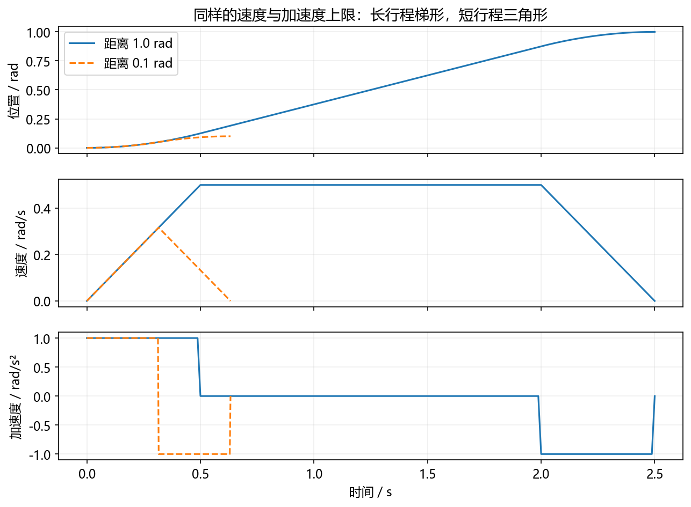
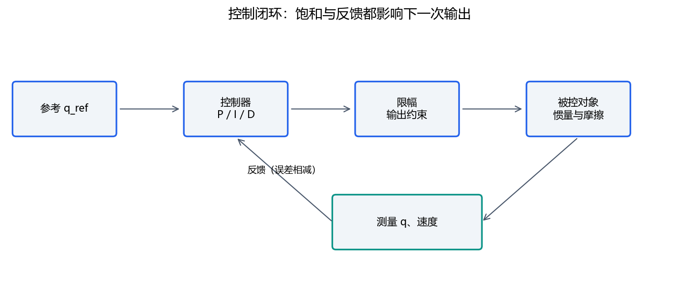
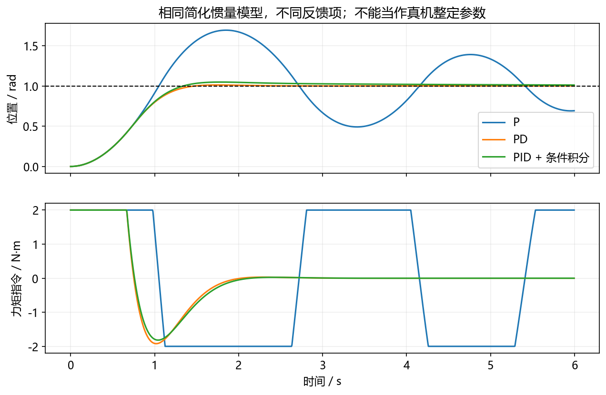

# 03｜动力学、轨迹与控制算法

接着读[采样、延迟、串级、前馈与LQR/MPC](13_systems_deepening.md)，并在[可编辑实验](../notebooks/10_visual_reasoning.ipynb)中比较同一控制器在不同反馈延迟下的结果。

这是进阶阅读。零基础先完成 [七天正文](../WEEK_PLAN.md)，不认识符号时查 [数学小台阶](../beginner/MATH_STEPS.md)，先读 [算法故事](../beginner/ALGORITHM_STORIES.md)建立直觉。

必读1–4节约90分钟，5–6节进阶。先修FK、速度和误差。目标：分清模型、参考轨迹、反馈控制和执行约束。

## 1. 运动学回答位置，动力学回答力

FK输入角度、输出位姿，不计算需要多大电流。动力学考虑质量、惯量、重力与外力。机械臂常见形式是：

```text
M(q) qddot + C(q,qdot) qdot + g(q) + friction = tau + J^T F_external
```

M是惯量矩阵，C项表示与速度有关的耦合，g是重力，tau是驱动力矩。力与雅可比必须用匹配的框架和分量约定。第一周不要求从零推矩阵，先说清哪些因素在当前仿真中存在。

本课PID实验只用单轴单位惯量：`qddot=tau−.3*qdot`。这是教学动力学，未包含重力、减速器、电流环、弹性和接触。上一版P控制实验`q_next=q+v*dt`甚至直接把速度当可实现输入；两种模型的增益不能直接比较。

## 2. 给运动加上时间：梯形速度



从静止到静止走距离D，速度上限vmax、加速度上限amax。加速到上限需`ta=vmax/amax`，加速与减速共走`Dcrit=vmax²/amax`。

若D≥Dcrit：中间匀速，`tc=(D−Dcrit)/vmax`，总时间T=2ta+tc。若D<Dcrit：来不及达到速度上限，形成三角形，峰值`vp=sqrt(D*amax)`，T=2vp/amax。

**完整例题：** D=1 rad，vmax=.5 rad/s，amax=1 rad/s²。ta=.5 s，Dcrit=.25 rad，tc=1.5 s，总时间2.5 s。D改为.1 rad时，vp≈.31623 rad/s，T≈.63246 s。

加速段q=.5*a*t²，速度v=a*t。匀速段累加前段位移。减速段可从剩余时间计算`q=D−.5*a*(T−t)²`。梯形加速度在切换点跳变；S曲线还约束加加速度jerk，使变化更平滑。三次/五次多项式可满足端点导数条件，但不自动保证中间不超限。

运行`python labs/algorithm_lab.py trajectory`。先手算三个时间，再核对输出。多关节同步需要共享完成时间并重新检查各轴限制，不能只各自跑一条最快轨迹。

## 3. PID每一项在做什么



误差`e=q_ref−q`。P提供与当前误差成比例的纠正；I积累过去误差以减少某些稳态偏差；D对变化起阻尼作用，但对噪声敏感。

```text
I_k = I_(k-1) + e_k dt
u_raw = Kp e_k + Ki I_k + Kd de/dt
u = clip(u_raw, -u_max, u_max)
```

离散积分必须乘dt，导数必须除dt。若固定目标且能测速度，可以用`−Kd*qdot`作为D项，避免目标跳变造成导数冲击。实际测量噪声和滤波又会引入取舍。

例：e=.1 rad，Kp=4 s⁻¹，对速度控制模型得到.4 rad/s；限速.2后实际指令.2。积分项若仍一直累加，会在误差变小后继续推动，产生积分饱和。条件积分在已饱和且误差继续推动饱和方向时暂停累积；反算抗饱和则按实际与未限幅输出的差修正积分。

## 4. 读懂响应图再改参数



看四项：上升时间、超调、稳定时间、稳态误差。还看输出是否频繁饱和、采样是否稳定、噪声是否被放大。图中相同惯量模型与力矩上限下加入D后行为改变；它展示机制，不提供真实机器人整定值。

运行`python labs/algorithm_lab.py pid`，JSON保存每个时刻的位置、速度和力矩。改一个增益前写预测：例如降低Kp通常减弱纠正，但不能脱离I/D和约束断言所有指标都变好。真实控制循环还需测实际dt和截止时间，不能把`time.sleep`当严格实时保证。

**自检：** 为什么参考可达，控制仍到不了？可能有输出饱和、模式不符、负载过大、通信或反馈问题；先检查指令与测量，不先改IK。

## 5. 前馈、LQR与MPC（进阶）

前馈根据模型预先提供所需力矩，例如重力补偿；反馈纠正残余误差。纯前馈依赖模型准确性，通常仍配反馈。计算力矩控制利用动力学模型补偿非线性项，但模型误差和执行约束仍存在。

LQR针对线性系统，使用状态反馈`u=−Kx`，通过状态偏差与控制代价的二次型权衡求K。状态可以包含位置误差与速度。局部线性化可用于非线性系统附近，但要说明适用区域。参考 [MIT LQR课程](https://underactuated.mit.edu/lqr.html)。

MPC反复求有限时域优化：预测未来、带约束求动作序列、只执行第一步、用新反馈重算。它能显式考虑约束，也需要模型、计算预算和失败处理。LQR与MPC不是无条件替换PID的“升级按钮”。轨迹优化的建模背景见 [MIT轨迹优化课程](https://underactuated.mit.edu/trajopt.html)。

## 6. 验收与答案

问：D=.1、vmax=.5、amax=1为什么不是梯形？答：临界距离.25，大于实际距离，因此达不到.5的速度。

问：把循环频率翻倍，离散I与D代码可以不改dt吗？答：不可以，物理积分和导数都依赖实际时间。

问：PID曲线平稳是否证明真机安全？答：不能；本例省略真实执行器、几何与许多动态因素。
