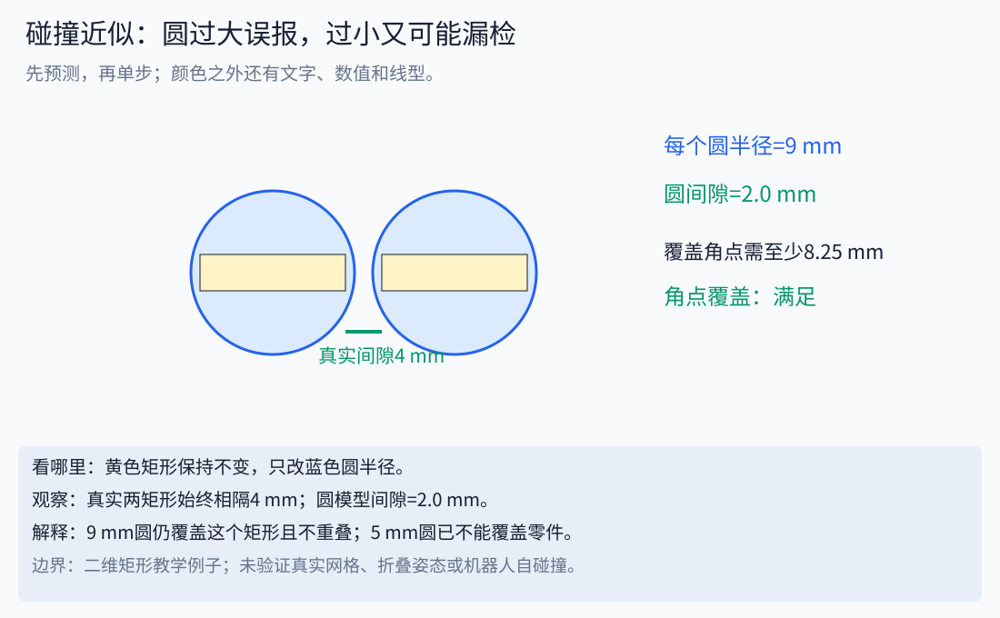
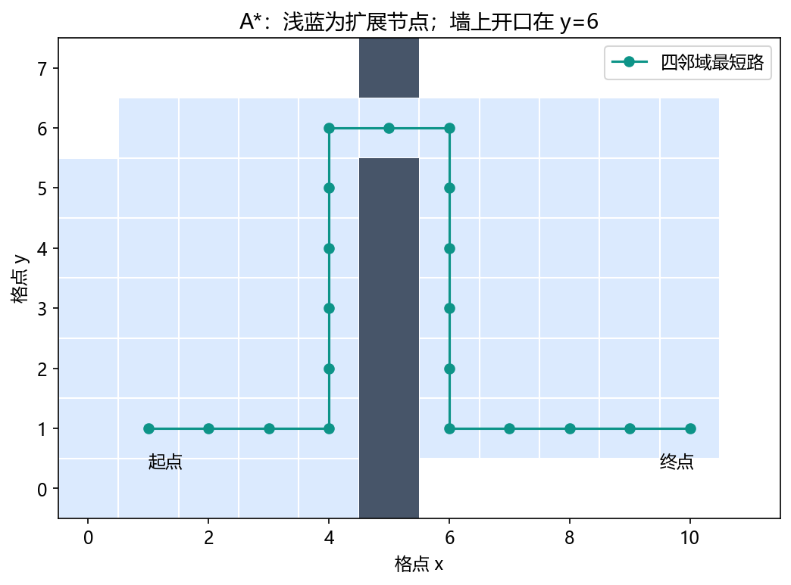

# 04｜碰撞与规划：从找路到可执行轨迹

接着读[图搜索、采样、优化及边检查](13_systems_deepening.md)。[逐步演示器](../assets/interactive/concept_player.html)可查看A*每次扩展的g/h/f，以及碰撞近似过大误报、过小覆盖不足的区别。

这是进阶阅读。零基础先完成 [七天正文](../WEEK_PLAN.md)，不认识符号时查 [数学小台阶](../beginner/MATH_STEPS.md)，先读 [算法故事](../beginner/ALGORITHM_STORIES.md)建立直觉。

必读约90分钟，A*实验45分钟。目标：知道算法搜索什么空间、检查什么约束，以及失败意味着什么。




这是二维教学几何。用[碰撞近似主题](../assets/interactive/concept_player.html)逐步比较15、12、9、5mm半径，区分误报与覆盖不足；真实机器人仍需检查网格、姿态和碰撞对。

## 1. 工作空间和构型空间

工作空间画末端或零件在三维世界的位置；构型空间把全部关节值q当作一个点。两轴机器人能画(q1,q2)平面，六轴则是六维。一个实体障碍物可以对应很多碰撞关节组合。


图左使用零厚度两连杆和一个圆形障碍物；图右红色是碰撞角度样本。红区不是障碍物物理外形，它表示“哪些关节组合不允许”。实际应考虑杆厚、工具、自碰撞和关节限制。

## 2. 状态有效不等于连接有效

状态检查回答q是否有效；边检查回答从q_a到q_b沿指定插值走过的整段是否有效。两个端点无碰撞，中间仍可穿过障碍物。离散边检查的步长过大可能漏检，连续碰撞检查则使用不同算法与几何假设。

宽阶段用包围盒等快速排除不可能相交的对象；窄阶段进一步检查球、凸体或三角网格。球间隙`||c1−c2||−r1−r2`只是当前球模型的距离。缩小球可能减少误判，也可能造成覆盖缺口；应分别验证外扩与漏覆盖。

## 3. Dijkstra与A*：离散图上的最短路

Dijkstra总扩展当前累计代价g最小的节点。A*加入到目标的估计h，按f=g+h选择。图中节点和边要先定义，边代价必须符合算法假设。

本课用四邻域网格，每步代价1，曼哈顿启发式`h=|x−x_goal|+|y−y_goal|`。没有障碍时这是准确最短步数；有障碍时不会高估。对该一致启发式，正确维护更优g与队列可得到本图的最短路。

```text
把起点放入优先队列，g(start)=0
取 f 最小的节点；跳过过期队列项
若为目标，沿 parent 回溯路径
枚举合法邻居，计算 new_g=g+边代价
若 new_g 更小，更新 g、parent，并放回队列
队列空则本图没有路径
```



例题起点(1,1)、终点(10,1)，墙在x=5，开口y=6。至少向上5步、水平9步、向下5步，总19步。实验应输出cost=19。关闭开口后无路；去掉墙后cost=9。

运行`python labs/algorithm_lab.py planning`，看path和expanded。路径最短不等于最安全或最平滑；若需要距离障碍物远些，应明确不同代价，且重新验证启发式是否适配。图越精细、维度越高，网格规模增长越快。

## 4. PRM、RRT与RRT*：不铺满全部网格

PRM先采样有效构型，尝试连接邻近样本，形成可复用路线图，再查询起终点。RRT从起点长树：采样q_rand、找近邻q_near、朝目标延伸一小步q_new、检查连接、接入树。RRT-Connect从两端生长并尝试连接。

```text
q_rand → 最近树节点 q_near → 朝它走一步 q_new
                          ↓
               整段有效才添加节点和边
```

RRT*还会选择更低代价父节点并重连邻居。在相应假设下讨论的是渐近最优性质，不是有限运行时间必得最优。PRM常用于同环境多次查询，RRT类常用于单次查询；狭窄通道、距离度量和碰撞成本都会影响表现。[OMPL规划器说明](https://ompl.kavrakilab.org/planners.html)提供这些家族的官方实现入口。此处介绍方法，本仓库不冒充实现了OMPL。

## 5. 路径之后：平滑与时间参数化

规划得到q路径后，可能做捷径或平滑；每次改变几何路径都要重新验证碰撞。再按速度、加速度等限制分配时间。对关节空间直线插值，末端一般不是笛卡尔直线；笛卡尔直线也可能穿过奇异或无解区。

工作空间采样回答“这个位置某些姿态有没有找到解”，不提供从当前姿态到目标的连续路径。DWS阈值过滤也不是规划成功率。报告里明确空间、采样和判据。

## 6. 轨迹优化与算法选择（进阶）

轨迹优化直接把一串状态/动作当决策变量，最小化平滑性、时间或能量代价，同时约束运动学、动力学和碰撞。初值、约束近似和局部极值影响结果；优化返回数值也需检查实际残差。

二维地图找路先理解A*；高维关节规划了解采样；跟踪与约束考虑时间参数化和控制；模型充分且任务需要时再研究轨迹优化/MPC。没有一个算法只凭名称就适合所有任务。

**自检：** A*无路是否证明机器人无路？只证明当前离散图及检查下无路。RRT有限样本失败不能证明连续空间不存在路径。平滑路径必须重新检查边，而非只检查端点。
