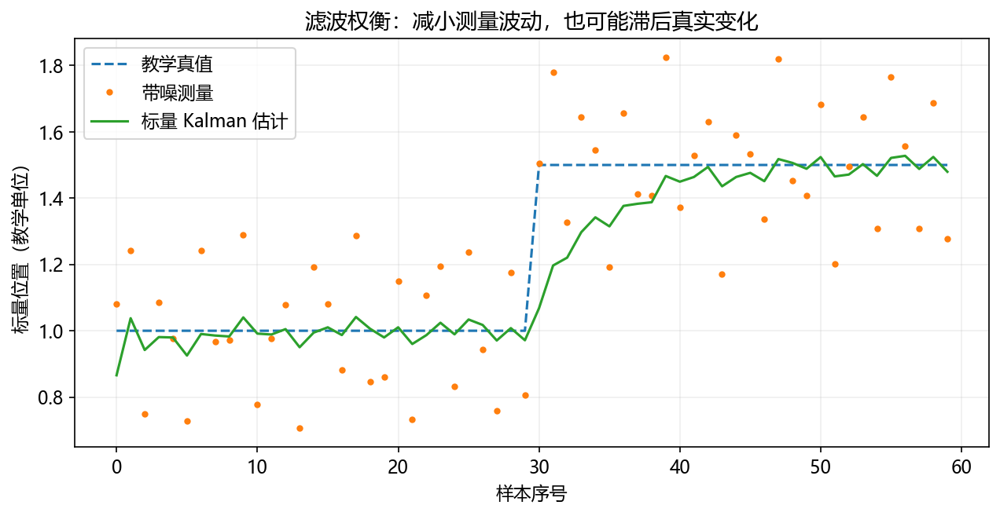

# 05｜感知、标定与状态估计

接着读[误差传播、RANSAC、ICP/PnP与可观测性](13_systems_deepening.md)；[视觉推理实验](../notebooks/10_visual_reasoning.ipynb)用同一测量比较平滑与滞后。

这是进阶阅读。零基础先完成 [七天正文](../WEEK_PLAN.md)，不认识符号时查 [数学小台阶](../beginner/MATH_STEPS.md)，先读 [算法故事](../beginner/ALGORITHM_STORIES.md)建立直觉。

必读约75分钟，实验45分钟。目标：从像素走到机器人坐标，手算一次滤波更新，说明不确定性。

## 1. 相机到基座的计算链


针孔模型中，对已去畸变或与内参一致处理的像素(u,v)，已知光轴方向深度Z：`X=(u−cx)*Z/fx`、`Y=(v−cy)*Z/fy`。相机点p_camera=(X,Y,Z)，再乘T_base_camera得到基座坐标。

例：fx=fy=500像素、cx=320、cy=240，像素(370,240)，Z=1 m，得到(.1,0,1) m。相机到基座只有平移(.2,0,.3) m且旋转为单位阵，则p_base=(.3,0,1.3) m。若输入深度实际是1000 mm却当1000 m，坐标会错误放大。

深度传感器输出可能是不同含义或尺度，需查设备约定。仅有单张RGB检测框通常缺少深度和完整方向，不能直接成为抓取位姿。

## 2. 三种标定不要混淆

相机内参/畸变标定解决成像；外参解决相机与其他框架的关系；机器人几何标定修正关节零偏、轴和尺寸等模型参数。手眼标定是相机与机器人相关框架之间的变换估计。

眼在手上：`T_base_camera(t)=T_base_tool(t)*T_tool_camera`，需要图像对应时刻的工具姿态。眼在手外：固定安装的T_base_camera通常不随关节变化，但移动安装后要重新核对。

手眼常通过多次运动约束写成AX=XB；A、B的定义和取逆依坐标约定，不要从不同代码拼接公式。运动要有足够方向变化，单一方向或近乎静止数据可能退化。团队历史calibration文件用于理解流程，不能替代当前装配的标定。

验证应保留独立观测点：看重投影误差，也看已知三维点与实际任务误差。仅训练/拟合误差小不能证明外部精度。

## 3. 状态估计为什么不直接用测量

编码器、视觉、IMU有噪声、频率与延迟差异。滑动平均简单，但窗口增加会滞后；指数平滑`x_k=(1−α)x_(k−1)+αz_k`也有平滑与响应折衷。突变可能是真实运动，也可能是异常观测，需要模型与上下文。

Kalman滤波在模型和噪声假设下同时维护估计与不确定性。估计不是“真实值”，方差也不等于绝对误差保证。线性高斯假设外需谨慎解释。

## 4. 手算一次标量Kalman

随机游走模型x_k=x_(k−1)+w，测量z_k=x_k+v。过程方差Q、测量方差R：

```text
预测：x_minus = x_prev      P_minus = P_prev + Q
增益：K = P_minus / (P_minus + R)
更新：x = x_minus + K*(z-x_minus)
      P = (1-K)*P_minus
```

例：x_prev=0，P_prev=1，Q=0，R=1，z=2。P_minus=1，K=.5，x=1，P=.5。R改成9，K=.1，x=.2：测量越不可信，单次更新越保守。Q、R是方差，标准差.1对应方差.01。



运行`python labs/algorithm_lab.py filter`。图中真值中途变化；滤波降低波动但需要响应时间。减小Q可能更平滑但跟踪更慢，R也影响权重，不要单看“曲线很平”。

## 5. EKF、RANSAC、PnP与ICP（进阶）

EKF对非线性过程/观测在当前估计附近线性化，使用雅可比传播不确定性；初值、模型与线性化区域很重要。它不是对任意非线性问题都最优。

RANSAC反复从小样本拟合候选模型，按残差阈值找内点，再评估；适用于有离群点的情形，但依赖正确模型、足够内点和合理阈值。PnP从已知3D点与2D对应求相机相对位姿，需要内参及对应质量。函数约定见 [OpenCV calib3d](https://docs.opencv.org/4.13.0/d9/d0c/group__calib3d.html)。

ICP迭代关联点云并估计变换，容易受初值、对称结构、对应错误与局部极值影响。不要将低配准残差直接解释为全局定位正确，参见 [Open3D官方ICP教程](https://www.open3d.org/docs/release/tutorial/pipelines/icp_registration.html)。

## 6. 自检

检测框不包含完整抓取坐标；需要深度/模型、坐标变换、时间和工具定义。手眼标定不是内参标定。把Q/R误写为标准差会改变权重。滤波后误差变小要在独立真值或任务指标上检查，不能只凭视觉平滑。
