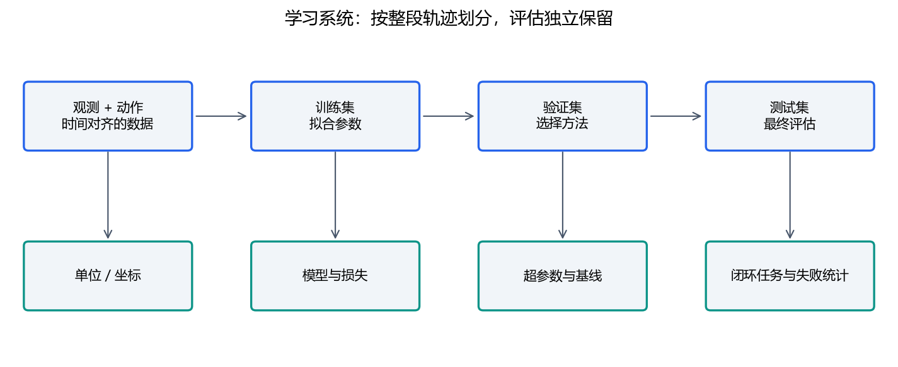

# 06｜机器人AI：数据、策略与闭环评估

必读约75分钟，学习实验45分钟。算法名称用于建立地图；本周运行的是可解释的合成回归，后续再进入真实数据训练。

## 1. 一个策略接口包含什么

策略是从观测到动作的映射`a=π(o)`。观测可含图像、关节、夹爪状态和历史；动作可能是绝对角度、角增量、速度、力矩或工具位姿。不同动作表示不能直接互换。

为每个字段写名称、shape、单位、坐标、时间戳、有效性。比如6维数组可能是六关节角，也可能是位置+旋转向量。数值shape相同不代表语义相同。模型20 Hz输出，不等于底层控制也应只在20 Hz更新。

## 2. 数据划分与最小学习例子

训练集拟合参数，验证集用于方法和超参数选择，测试集保留作最终评估。机器人数据按完整轨迹、环境或采集批次划分，避免邻帧泄漏。归一化统计只由训练集计算，再应用到其余集合。

本例拟合`y=a*x+b`：令x̄、ȳ为训练均值，`a=Σ(x−x̄)(y−ȳ)/Σ(x−x̄)²`，`b=ȳ−a*x̄`。如果所有x相同，分母为0，应明确报告数据退化。

**手算：** 样本(0,1)、(1,3)、(2,5)，x̄=1、ȳ=3，分子4、分母2，所以a=2、b=1。独立点(3,7)预测7，平方误差0。若用训练均值3作为基线，独立误差16。

运行`python labs/course_lab.py ai`，查看heldout_mse与constant_baseline_heldout_mse。合成关系容易学习，不能从该结果推断机器人抓取成功率。

## 3. 模仿学习：从专家行为学习

行为克隆BC把观测与示教动作当监督数据，最小化预测误差，回归动作常用L1或L2等损失。输入偏离示教分布时，误差可能逐步累积，所以离线动作误差与闭环任务成功率都要测。

ACT一次预测一段动作，使用Transformer组织观测与动作序列；动作分块减少每次只预测一步的局限，也带来动作时序与执行方式的选择。原始工作还使用潜变量建模等设计。第一周先理解“观测→动作段→执行与反馈”，细节见 [作者ACT论文](https://tonyzhaozh.github.io/aloha/aloha.pdf)。

Diffusion Policy通过条件扩散生成动作序列：训练学习去噪，推理从噪声逐步生成动作，能表达复杂动作分布。多步生成也有推理时间成本。参考 [作者项目页](https://diffusion-policy.cs.columbia.edu/)。不要因为动作看起来平滑就省略执行约束。

## 4. 评估一个学习系统

离线看误差与不同场景分组；仿真看任务成功、碰撞、约束违反和时延；真实任务还看标定、环境变化、反馈恢复和失败分布。每次比较固定任务、数据划分、运行预算与随机种子，并报告多次运行差异。

例如“10次成功8次”提供的是有限样本观察，不能写成所有工况稳定80%。可单列遮挡、光照、初始姿态和物体变化。失败日志应能重放观测、动作与时间，避免只保留成功视频。

部署链应包含动作解码、单位转换、有效期、约束、插值或轨迹、控制反馈。模型输出NaN、过期动作、通信丢失都要有明确状态，不允许把错误零填充成“正常动作”。

## 5. 强化学习与VLA（进阶）

强化学习通过与环境交互，用奖励评估长期动作效果。状态、动作、奖励、终止条件定义了问题；设计错误奖励可能让策略找到与你任务意图不同的办法。

PPO常用当前策略采样并限制策略更新幅度；SAC使用经验回放与熵正则，面向连续控制的常见版本同时学习策略和价值估计。两者都有超参数、探索与样本成本。原理可读 [PPO](https://spinningup.openai.com/en/latest/algorithms/ppo.html) 和 [SAC](https://spinningup.openai.com/en/latest/algorithms/sac.html) 教学文档；这些是较早资料，勿照搬旧环境安装命令。

VLA结合视觉、语言与动作表示，可用于任务条件化策略。迁移到我们机器人仍需匹配动作空间、工具、观测、频率与数据分布。语言理解能力不等于物理可执行性。

## 6. 自检

训练误差低不代表闭环好。相邻帧随机拆分可能泄漏。同一动作数组先确认语义。先比较简单基线，再判断复杂模型是否带来可验证收益。将测试集反复用于调参后，它已不再是独立最终测试。
