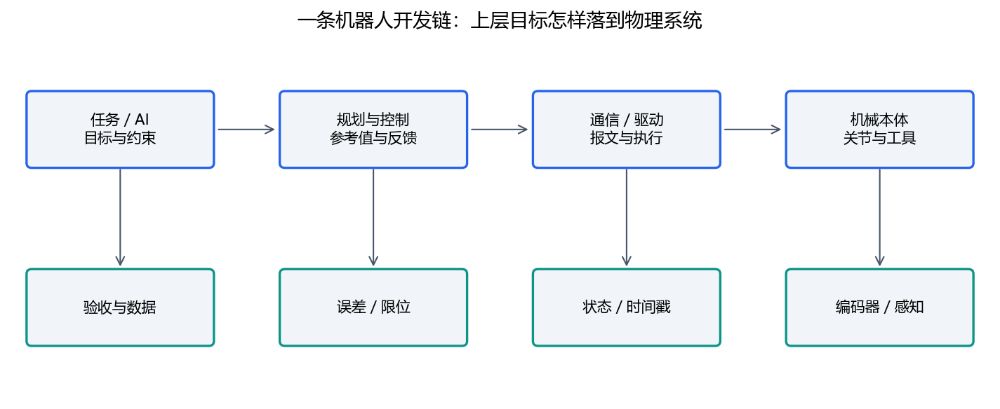

# 07｜软件与AI协作：从能跑到可维护

必读约60分钟，工具练习与结业项目另计。目标：读懂边界、定位错误、提交能复现的小改动。

## 1. 按职责理解项目

应用提出任务；规划生成候选路径/轨迹；控制跟踪；驱动编码与传输；设备执行并反馈。配置提供模型与参数，日志记录观察，测试验证约定。不要让UI直接隐藏设备控制的全部状态，也不要让底层驱动猜上层任务意图。

团队SDK封装可调用接口，自动验收项目组织任务与报告，碰撞和工作空间项目提供离线分析。这是阅读入口，不意味着所有仓库已经采用同一架构或命名。

## 2. 状态机、线程与时间

最小设备状态可以有DISCONNECTED、CONNECTED、READY、RUNNING、FAULT。每个转换指定触发、条件、动作和反馈。例如有连接不意味着可运行；反馈过期应触发明确状态。

一个线程收数据、一个线程计算、一个线程显示时，共享状态可能被读到一半更新。可用带时间戳的完整快照、锁或队列，结合吞吐与延迟选择。队列堆积会使“收到很多数据”变成“处理旧数据”，应记录年龄和丢弃策略。

测耗时使用单调时钟。周期循环测实际dt、处理超时，不只写sleep。重启恢复还需核对设备真实状态，不能仅把内存里的fault清零。

## 3. 编译、链接、导入与依赖

Python解释器运行模块，包安装在特定环境。C/C++先编译生成目标文件，再链接库，运行时可能加载DLL/so。头文件找不到、链接符号缺失、运行DLL缺失分别发生在不同阶段。

ABI包含二进制约定；Python原生扩展的版本、平台与编译工具链也会影响加载。遇到import失败，记录解释器路径、包位置、原生库位置和完整错误，不先把所有软件升级。

CMake组织配置与构建，不是编译器。按`configure→build→test→run`分步观察结果。基础课程标准库实验不需要CMake；可选练习见 [工具任务](../TOOLS.md)。

## 4. 测试怎样提供独立证据

协议用固定十六进制向量；FK用手算姿态；雅可比用中央差分；A*用可手数的最短长度；轨迹检查端点和边界；滤波用单次手算。不要只验证“函数可以调用”或重复实现同一公式。

测试至少有正常、边界、错误输入。随机测试固定seed并保留失败输入；基准测试记录环境、规模和时间。单元测试通过不能自动推导出GPU性能、连续几何覆盖或硬件正确。

## 5. 与AI合作的可执行循环

给出目标行为、文件范围、单位、当前证据和验收；要求先读取实现。每次完成一个可理解的小改动，查看diff、运行相应测试，再继续。AI解释是候选理解，独立例题和运行结果才是证据。

例：要求数值IK在达到步数上限时返回失败原因和最终误差，而不是“尽量让IK成功”。后者可能诱导放松容差、忽略碰撞或伪造成功。评审应检查这些行为是否发生。

若AI提出新库，先确认为何需要，是否与环境兼容，是否可用已有标准库实现教学目的。敏感凭证不进入提示或仓库。使用 [任务模板](../templates/AI_TASK.md) 和 [问题报告](../templates/LAB_REPORT.md)。

## 6. 自检

如果更换电脑后失败，先核对路径与环境，不先改业务逻辑。日志里“发送成功”不代表动作完成。diff回答改了什么，测试回答特定条件下做了什么；两者都不能替代解释。
