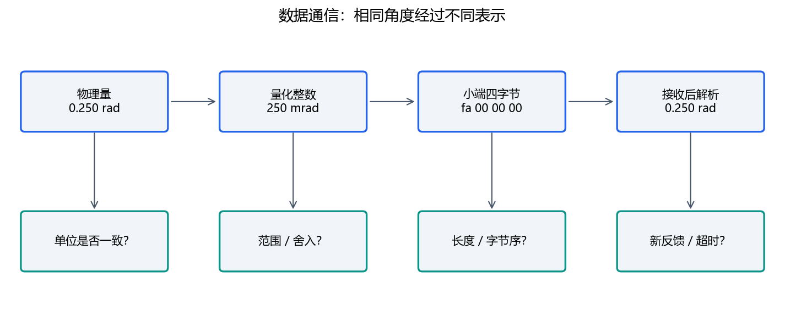

# 08｜通信自学：字节、时序与故障

必读约75分钟，实验45分钟。不需要设备：本章的报文、事件日志和SPI时序数据都在仓库中。

## 1. 同一个数怎样变成字节



教学角度.250 rad量化为250 mrad。250十六进制是FA，int32小端表示为`fa 00 00 00`。−250的32位补码为`ffffff06`，小端字节是`06 ff ff ff`。符号、位宽、字节序、量化单位缺一项都会解析错。

我们的自创载荷是8字节：标记A1、节点uint8、序号uint16、角度int32。它不是CAN帧本身，不含CAN ID、总线CRC等元数据，也不属于真实电机协议。

## 2. 串行链路与网络分帧

UART是异步串行外设，RS-485是电气接口；上层载荷另定义。SPI由时钟与片选组织传输，需要匹配CPOL/CPHA、位序和片选时序。USB由主机管理设备、接口和端点。CAN具有仲裁与错误机制，应用仍要定义ID映射和指令语义。

TCP提供字节流，应用一次recv不保证恰好一个应用消息，需要长度前缀或其他分帧方案。UDP保留单个数据报边界，但可能丢失、重复、乱序；接收缓冲不足也要检测截断。二者都不自动提供“动作完成”语义。

## 3. 读随仓库事件日志

打开 [protocol_events.csv](../labs/data/protocol_events.csv)。各行包含时间、方向、序号、角度和备注。它是教学事件序列，TX/RX只表示模拟观察点，没有连接任何设备。

```text
t=.000：发送seq=7
t=.020：收到seq=7反馈
t=.040：重复收到seq=7
t=.060：发送seq=8
t=.181：仍只有旧反馈
```

若100 ms超时，从最后有效反馈.020到.181经过161 ms。重复报文是否刷新“有效反馈时间”取决于协议语义；本作业要求重复序号不刷新。仅说“最近有包”不能证明状态新鲜。

记录序号回绕：uint16最大65535，下一次可能是0。简单用`new>old`会误判；本周先记录回绕现象，真实系统应按协议定义时间窗口与比较规则。

## 4. 独立观察SPI与CAN

打开 [spi_mode0.csv](../labs/data/spi_mode0.csv)。数据是合成模式0、MSB优先传输A5的采样表：时钟空闲低、上升沿采样，8个比特应为10100101。下降沿之间准备下一比特。用表格作CLK、CS、MOSI时间曲线，不需要逻辑分析仪。

CAN链路则核对通道、速率、标准/扩展ID、长度、原始字节与错误计数。CAN ACK说明有节点在总线层确认帧，不保证目标应用接受或执行。桥接主机→USB→SPI→CAN，各层计数能缩小故障范围。

## 5. 超时、重试和恢复

读取命令与运动命令的重试语义可能不同。运动反馈丢失时，上个动作可能已经执行；重发前需要协议设计保证幂等或确认设备状态。状态从RUNNING到FAULT的条件应能在日志里找到。

错误至少区分：传输打开失败、发送失败、超时、长度错误、未知标记、无效值、设备故障。不要全部变成一个False后让调用方猜原因。

离线练习：`python labs/course_lab.py protocol`；对decode_frame传短包和未知标记，确认抛出明确错误。查看固定测试向量后，再自己设计一个负角度输入。

## 6. 自检与答案

模式0的A5上升沿采样序列是10100101。−250 mrad解码后为−.25 rad。上述日志最后有效反馈年龄161 ms，超过100 ms。TCP一次读到8字节是一次观察，不能当作永久分帧保证。
