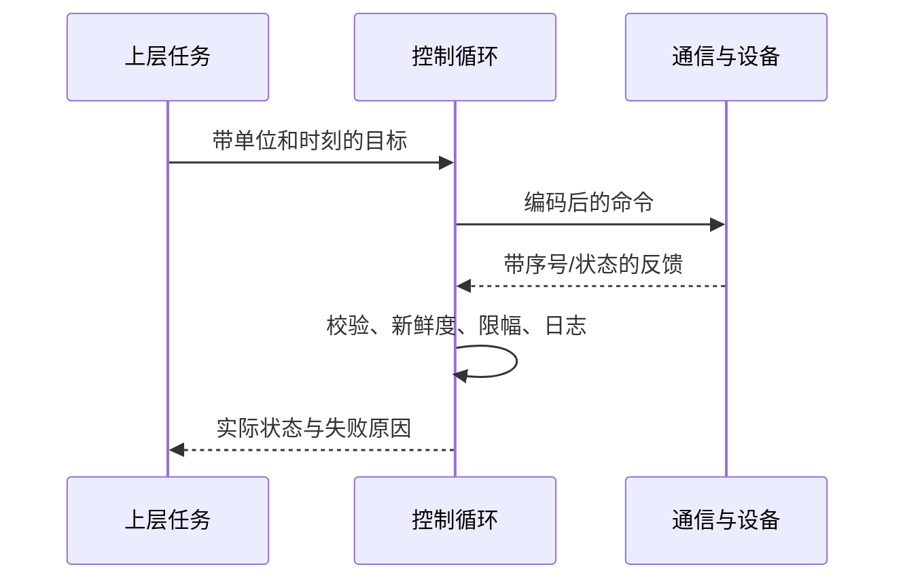

# 09｜从看懂故事到读懂工程实现

本章把七天主线中的技术台阶补齐。第一次先看每节的“问题”和数字例子，再做对应 Notebook；公式用于解释代码为什么这样写。完成这些仍是开发入门，不等于一周掌握完整机器人系统。

## 1. 软件里的一个位置，为什么不只是三个数

**问题：** `position=[300,0,100]` 能直接发给机器人吗？不能确定。我们还不知道单位、参考系、采样时刻、目标点属于哪个工具，以及是否有效。

一个更明确的教学记录可以是：

```json
{
  "frame_id": "base",
  "tool_id": "teaching_tip",
  "position_m": [0.3, 0.0, 0.1],
  "received_monotonic_s": 12.345,
  "sequence": 7,
  "valid": true
}
```

单调时钟只适合与同一时钟域比较间隔，不直接代表日期；另一台电脑的12.345通常不是同一时刻。序号比较也需要会话与回绕规则。状态不可用时应带明确标记，不能把默认零位置误当实测值。

函数合同至少规定输入类型、维度、单位、范围和输出；错误类别与正常返回也要区分。例：几何IK无解可以返回空解集，而输入NaN应报参数错误。这样上层不会把损坏输入统计成普通不可达。

在软件中沿着“输入→验证→计算→结果→记录”流动；UI显示的数字、日志数字、传给算法的数字应当来自同一份已验证状态。第一天实验用负时间和NaN练习这些边界。

## 2. 本体模型：几何、运动学、动力学各管什么

**问题：** 模型画得像，为什么算出来不一样？渲染只检验了部分几何信息。运动学还依赖关节连接、轴、零位、单位和工具偏移；动力学又多了质量、质心、惯量、摩擦和驱动能力。

| 数据 | 作用 | 常见错误及后果 |
|---|---|---|
| mesh / visual origin | 放置外观 | mm当m，体积放大十亿倍 |
| collision geometry | 碰撞查询的形状 | 太大误报、覆盖不足漏检 |
| joint origin / axis | 零位与运动方向 | 转轴放错、倾斜轴被当成主轴 |
| joint limit | 位置/速度/力矩声明 | 上下界相等、符号或单位错误 |
| inertial origin / mass / inertia | 动力学响应 | 质心与惯量参考系错配 |
| tool transform | 法兰到工具尖端 | FK漏掉一段偏移 |

三维变换写成 `T_AB=[R_AB,t_AB;0,1]`，把B系点变成A系点：`p_A=R_AB*p_B+t_AB`。串联链按父子顺序相乘，`T_base_tool=T_base_1*T_1_2*…*T_n_tool`。乘法一般不交换。旋转矩阵应满足 `RᵀR=I`、`det(R)=1`；逆变换的平移是 `−Rᵀt`，不能只把t取负。

URDF常见固定轴RPY采用 `Rz(yaw)Ry(pitch)Rx(roll)`。关节轴在关节框架表达，转动变换乘在零位origin之后。非主轴应使用一般轴旋转，例如 Rodrigues 公式；轴归一化不能掩盖零向量或无效输入。

力矩选型先估静态，再看动态。水平末端重物0.5kg、力臂0.3m时，重力矩约1.4715N·m；还要加每段杆自身的重力矩。减速比N、效率η下，理想关节输出力矩约 `τ_joint=η*N*τ_motor`，输出速度约 `ω_joint=ω_motor/N`。效率不是恒定万能修正，峰值/持续力矩、温升、背隙与结构强度还需规格及测量。

质量m平移距离d时，惯量按平行轴定理增加 `m((dᵀd)I−ddᵀ)`，不能把CAD质心处惯量直接填到任意坐标系。惯量单位kg·m²，与kg·mm²相差10⁶。本课两杆URDF没有惯量，因此只支持几何教学，不提供真实动力学结论。

**本项目诊断顺序：** 加载每条joint原始名称和axis → 输出关节顺序 → 检查origin单位 → 固定几个q对比FK → 检查工具偏移 → 再开碰撞与工作空间采样。D2026与spark2_v2比较时先核对这些基础口径，不能仅凭可达点数量判断设计好坏。

## 3. 通信：从数据字段到时间预算

**问题：** “发出去了”为什么机器人仍不动？它只证明发送层接受了数据，不等于设备接收、解析、执行并反馈成功。



通信分层要区分：物理电气连接、总线帧、设备协议、应用状态。教学8字节定义只覆盖载荷；CAN标识符、仲裁、位填充、CRC和ACK不在其中。总线有CRC也不能替代应用层节点、长度、范围、新鲜度检查。

若控制周期10ms，一个假设预算为：取状态1ms、计算2ms、发送1ms，剩6ms作为调度与波动余量。这些是预算示例，不是实测保证。测量每周期真实起止、反馈年龄、排队深度、丢包数和最大延迟；平均耗时低仍可能有偶发超期。`time.sleep(0.01)` 只能请求睡眠，不能保证完整循环恰好10ms。

课堂量化步长0.001rad，四舍五入误差通常≤0.0005rad。以0.5m等效力臂估算，角误差造成的局部位移量级约 `L*Δq=0.25mm`，只是单关节小角度量级，真实多关节用雅可比传播。精度还受编码器、背隙、结构变形和标定影响。

启动可按 `DISCONNECTED→CONNECTED→FEEDBACK_VALID→READY` 描述，异常进入 `STALE/FAULT`。具体是否停机、保持或去使能必须由驱动和系统设计定义；本课仅显示状态，不把教学逻辑当设备急停实现。

## 4. 运动学：解析、数值、姿态误差与失败分类

**问题：** 一个目标有几何解，为什么IK还报失败？数值方法通常只探索初值附近，有限的迭代预算并不等于遍历全部解空间。

两连杆FK和解析IK见[运动学手册](02_kinematics.md)。数值IK先定义误差e、求J，再解局部增量。阻尼最小二乘可从目标函数得到：

```text
min_delta ||J*delta-e||² + lambda²||delta||²
对delta求导并令其为0：
(JᵀJ+lambda²I)*delta = Jᵀe
常用等价形式：delta = Jᵀ(JJᵀ+lambda²I)^(-1)e
```

λ>0给求解增加稳定项，但不是“任意奇异点都能走出来”的保证。默认实现另有0.25rad增量范数限制和误差下降回溯；它并没有加入关节限位、碰撞或姿态。限位可在约束优化中处理，或者求解后筛选；简单裁剪q可能破坏下降方向，不能不复算误差就当作有效解。

六维位姿任务不能简单拼接三个米与三个欧拉角差。位置误差通常为 `p_target−p_current`；方向可由相对旋转矩阵的对数映射得到旋转向量。误差和雅可比要在同一坐标系，并用明确权重/容差平衡米与弧度。RPY在某些姿态有奇异，跨±π直接相减会产生错误的大角度；四元数q与−q表示同一旋转。

| 返回原因 | 能说明什么 | 下一步 |
|---|---|---|
| input/model error | 参数或模型没通过检查 | 保留加载堆栈、joint名、文件来源 |
| geometric unreachable | 简化几何约束已排除目标 | 检查单位、框架、杆长、目标 |
| stationary seed | 局部更新接近零 | 换非奇异seed，核对解析解 |
| iteration budget | 预算内未达容差 | 看误差曲线、步长、尺度和多初值 |
| joint-limit rejection | 候选解不符合限位 | 核对声明与合法分支 |
| collision rejection | 指定碰撞模型判重叠 | 查看碰撞对、距离、形状和忽略表 |
| pose tolerance failure | 位置或方向未满足 | 分别输出米和弧度误差 |

“lower velocity limit must be less than upper limit”这类错误先打印实际传入的上下界和关节名。URDF的velocity一般是非负最大幅值，有些规划器转换成[−vmax,+vmax]；若vmax=0，区间变成[0,0]，可能违反严格不等式。不能随手填一个大数来通过检查，应从已确认规格与项目配置补齐有效值。

## 5. 动力学、轨迹与反馈：三个层次的模型

**问题：** FK正确，为什么控制仍振荡？FK只给姿态映射，不描述力怎样改变运动。

完整刚体动力学常写作：

```text
M(q) qdd + C(q,qd) qd + g(q) + friction(qd) = tau + J(q)ᵀ F_external
```

M是随构型变化的惯量矩阵，C描述速度相关效应，g是重力项，外力通过Jᵀ映射成关节力矩。各项的符号和外力约定要一致。正动力学由力矩算加速度，逆动力学由期望运动算所需力矩。

本课三个模型逐层增加细节：基础P实验直接用速度积分位置；PID实验使用单位惯量、黏性阻力、力矩饱和；真实机器人再加入关节耦合、重力、传动弹性、摩擦、延迟与传感器噪声。不能把其中一个曲线当成所有机器人的响应。

离散PID的积分每次加 `e*dt`，微分含除以dt的变化率；dt改变而公式不变，会改变控制行为。阶跃目标引发大误差，输出饱和后积分仍增长会导致迟迟回不来，这就是积分饱和。条件积分和反算都是处理方法。本课用条件积分，微分用负测量速度。

评价要一起看：最终误差、超调、稳定时间、峰值速度/力矩、饱和持续时间。稳定时间应定义为“此后一直在误差带内”的首次时间，不能只取首次穿过目标。数值积分稳定也不证明真机在延迟和噪声下稳定。

LQR在线性模型 `x_next=A*x+B*u` 下按状态/输入代价求反馈增益；MPC每步解有限时域优化，可显式加入状态与输入约束，再只执行第一步并重算。两者都依赖模型、估计与时序；MPC不是“更大PID”。方法推导和适用范围见[控制手册](03_control.md)及[MIT LQR章节](https://underactuated.mit.edu/lqr.html)。

## 6. 碰撞与规划：怎样解释一个“无碰撞解”

球模型便于批量计算距离，但需要单独验证覆盖。对真实几何的保守覆盖意味着不会因缺口漏掉某些碰撞，代价可能是误报；球完全缩进物体内部则可能漏碰撞。厚度小、细长、折叠结构通常需要更多合理布置的形状，而非只改统一半径。

宽阶段先用简单包围体排除明显远离的物体，窄阶段再做更精细查询。自碰撞过滤必须按具体连接与实际结构确认，不能为消掉红色显示而屏蔽所有邻近链节。模型对、关节角、接触位置和有符号距离应能被记录并可视化。

构型空间把每个关节值作为一维坐标，障碍映射成不可用构型集合。检查两个构型都安全还不够，要检查连接它们的运动边；离散采样步长太大可能跨过薄障碍。二维线段圆距离实验给出一个可手算的反例，真实三维旋转网格需要对应的连续或足够保守检测。

A*的最优性依赖图、边代价和启发式条件；四邻接单位格的曼哈顿距离是合适例子。RRT在连续空间采样、朝随机点扩展树并连接路径；RRT*增加重连机制，在相应假设下渐近优化。有限时间的一次失败不能证明连续空间无路。PRM预先连接多次查询可复用的路网，适合环境相对固定的情况；轨迹优化适合在初始轨迹附近处理平滑性和约束，但受局部极值影响。见[LaValle规划教材](https://lavalle.pl/planning/)。

工作空间比较至少保留：模型/配置哈希、工具框架、采样范围和分辨率、种子、姿态约束、IK容差与预算、限位、碰撞配置以及分阶段计数。位置可达率、某组姿态采样通过率、雅可比可操作度是不同指标；不能统称“dexterous”然后直接横向比较。

## 7. 感知：误差如何沿变换链传播

针孔反投影要求去畸变后的像素和对应深度。深度单位、无效零值和RGB/深度对齐先检查；相机内参不能用网上示例数值代替。`T_base_camera`把相机点变到基座；若外参实际给的是相反方向，应取完整逆变换。

手眼标定中常见 `A X=X B`，A/B来自配对运动，X是待估计固定关系；具体哪两个框架取决于眼在手上还是眼在手外。不同姿态需要充分激励，所有运动都沿同一轴可能不足以可靠标定。训练中可先用已知平移/旋转验证变换方向，再处理真实图像。

局部误差传播可写 `Σ_y≈J Σ_x Jᵀ`。这把输入不确定性经过局部导数映射到输出；大误差和强非线性时只是近似。像素横向误差1px、Z=.5m、fx=600px，X方向量级约0.833mm；还没包括深度、外参和机器人标定误差。

Kalman滤波适用于对应的状态/噪声模型；EKF把非线性模型在当前估计附近线性化。RANSAC随机抽取最小样本拟合并以一致性拒绝离群点；PnP用3D点到2D投影估相机姿态；ICP用几何对应迭代对齐点云。三者解决的问题不同，错误对应、退化几何和差初值都可能导致失败。具体接口与坐标约定见[OpenCV标定文档](https://docs.opencv.org/4.13.0/d9/d0c/group__calib3d.html)和[Open3D ICP说明](https://www.open3d.org/docs/release/tutorial/pipelines/icp_registration.html)。

## 8. AI：从损失下降到任务成功，中间还缺什么

第六天让学员自己算梯度、保存每轮参数并播放训练记录，避免只调用一个 `train()` 看不见过程。线性模型仅两个参数，能用闭式最小二乘检查是否学到了同一个最优解。学习率过大会发散，训练数据不变化时斜率无法确定；先用这些简单故障理解优化。

机器人数据可表示为一个回合中的序列：观测图像、关节状态、动作、时间戳和任务标签。动作空间必须说明：绝对位置/增量/速度，基座系/工具系，单位与控制频率。训练时的归一化统计由训练集计算，部署时使用同一份统计；否则相同数字会代表不同动作。

| 方法 | 输入到输出 | 训练信号 | 关键限制 |
|---|---|---|---|
| 行为克隆 BC | 观测→动作 | 演示动作监督 | 偏离演示分布后误差可能累积 |
| ACT | 图像/状态→一段动作 | 动作序列监督等 | chunk长度与执行/重叠处理影响反馈延迟 |
| Diffusion Policy | 条件观测→去噪后的动作序列 | 噪声预测/去噪训练目标 | 推理步数、时延和约束需要评估 |
| 强化学习 | 状态/观测→动作策略 | 奖励与环境交互 | 奖励设计、样本量、仿真到现实差异 |
| VLA | 视觉/语言/状态→动作 | 多来源预训练及机器人适配 | 动作接口、数据覆盖和计算需求 |

ACT与Diffusion的细节以[ACT原论文](https://arxiv.org/abs/2304.13705)、[Diffusion Policy原论文](https://arxiv.org/abs/2303.04137)为准；表格是学习入口，不表示这些完整实现已加入本课。

评估按回合、物体或场景划分，避免同一段录像相邻帧跨训练/测试。报告成功判据、总回合数、成功数、失败类型、物体与光照变化、推理时延；只报准确率或训练损失不足以描述抓取。10次里成功8次不等于稳定证明成功率80%，应保留样本量并用更多独立回合评估不确定性。

AI生成动作还要进入明确的单位转换、频率匹配、限幅和下层控制。低层控制不能等一个耗时不定的推理调用才更新；可通过最新完整动作块和时间戳交接，并定义动作过期后的处置。

## 9. 工具与开发：把“能跑”变成“能解释、能复现”

第七天已有完整的子进程示例。外部命令用参数列表，不拼接来自自由文本的shell字符串；明确cwd、超时、stdout/stderr与返回码。某工具退出0只证明进程成功结束，仍需读它的业务状态，例如IK的success字段。

| 开发动作 | 具体方法 | 学员需要留下的证据 |
|---|---|---|
| 查源码入口 | `inspect.getsource(fk)`；VS Code跳转定义 | 当前实际调用的文件 |
| 查变更 | `git status`、`git diff`（需已装Git） | 修改了什么，为什么 |
| 定位异常 | 保留traceback；调试器断点查看输入 | 文件、行号、关键变量与单位 |
| 编译项目 | 按项目文档执行CMake配置/构建 | 编译器、配置、首个错误及完整日志 |
| 分析通信 | Wireshark打开教学pcap并过滤端口 | 字段拆解与预期字节对照 |
| 调用脚本 | `subprocess.run([...], cwd=..., timeout=...)` | 返回码、stdout/stderr、结果JSON |
| 验证算法 | 独立手算、边界值、性质检查、回归测试 | 预期来源和检查范围 |
| AI辅助改代码 | 描述合同、给上下文、审查diff、跑验证 | 接受的改动与未验证部分 |

测试要有独立依据。编解码往返可以同时犯同一个错误，所以还要固定字节向量；FK和IK互相验证外，还要直杆和直角等手算值；A*除了返回路径，还要检查边合法并与已知19步比较。错误输入不能被悄悄改成一个“看似成功”的默认值。

Notebook适合边讲边改，模块适合复用，命令行适合自动化，测试负责持续检查。把成熟函数抽到模块后，Notebook导入它；保留输入、源文件版本、依赖版本、输出和限制，最终交付给同事时才能顺利复现。

## 10. 一周之后怎样继续

第一周完成八本中的默认实验与一项独立修改即可。第二周选择一条线深入：本体/建模练多个URDF的FK对照和惯量；控制练采样、饱和和状态估计；规划练真实几何与路径边检查；AI练数据录制、回合拆分与任务评估。每条线都沿“模型假设→可运行实现→已知预期→失败案例”推进。

进阶题：给两杆增加不对称限位并报告拒绝原因；把PID记录计算成明确的稳定时间；给通信模拟加重启会话；给回归增加验证集且不触碰最终测试集。答案不必只有一个数，要解释使用了什么模型、哪些情况还没验证。

基础教材与论文的完整分级入口在[文献阅读路线](../references/READING_GUIDE.md)，已有数据来源在[数据说明](../references/DATA_GUIDE.md)。
