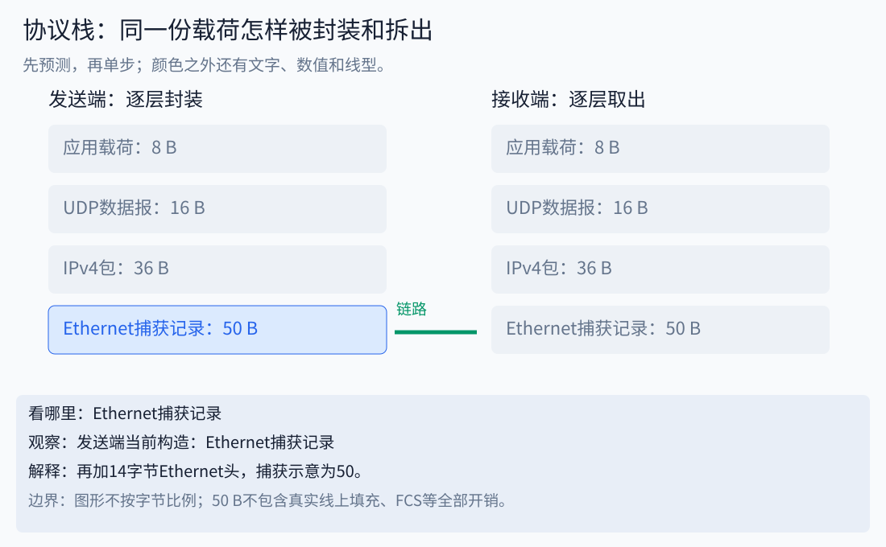

# 10｜通信：从历史问题，到协议栈，再到机器人报文

先读[字节与时序](08_communication.md)，再做[可编辑实验](../notebooks/08_protocol_stack.ipynb)。这章的目标不是背七层名称，而是看到故障时知道该观察哪一层。




图中选中发送端的完整封装；[逐步播放](../assets/interactive/concept_player.html)可继续看接收端怎样逐层取出。50B是本课未补齐线缆开销的捕获示例。

## 1. 为什么通信会发展成很多层

想象两个人递纸条：先要能看清纸上的笔画，再约定字词，再写收件地址，最后说明要办什么事。机器也如此：电压变化不等于一个字节，一个有效字节不等于一条合法命令，命令被接收不等于机械动作完成。

最初解决的是“两个设备怎样交换信号”。设备增多后，要解决“大家共用线路怎样避免冲突”；跨越不同网络后，又需要“如何寻址和转发”；文件与交互任务还需要顺序、重传、身份和应用语义。分层让这些问题可以分别改进，但层与层的时延和错误仍会相互影响。

| 里程碑 | 当时主要问题 | 今天在机器人开发中的影子 | 来源 |
|---|---|---|---|
| 1973 Ethernet备忘录 | 同一办公区域的多台计算机互联 | 上位机、交换机、相机之间的局域网 | [发明人口述史](https://archive.computerhistory.org/resources/text/Oral_History/Metcalfe_Robert_1/Metcalfe_Robert_1_2.oral_history.2006.7.102657995.pdf)，这是历史回忆材料 |
| 1980 UDP文档RFC768 | 提供机制较少的数据报服务 | 状态流需要自行考虑丢包、重复和新鲜度 | [原始RFC](https://www.rfc-editor.org/rfc/rfc768) |
| 1989 RFC1122 | 整理Internet主机通信层要求 | 区分链路、IP、传输及应用职责 | [RFC1122](https://www.rfc-editor.org/rfc/rfc1122.html) |
| 1986 CAN公开介绍 | 多个控制器共享可靠的串行总线 | 用ID仲裁、按错误状态诊断设备网络 | [CiA技术历史](https://www.can-cia.org/can-knowledge/history-of-can-technology) |
| 1991 CAN进入量产应用阶段 | 从技术方案走向汽车电子应用 | 规范发布与实际产品采用不是同一日期 | [Bosch电子历史](https://www.bosch.com/stories/history-of-electronics/) |
| 2022 TCP核心规范整合为RFC9293 | 汇总早期TCP规范及修订 | 查实现约定应看适用的新规范及更新 | [RFC9293](https://www.rfc-editor.org/rfc/rfc9293) |

这些日期分别指备忘录、文档、公开介绍或产品采用，不是把每种技术的诞生都压成一个年份。现代交换式全双工Ethernet的工作方式，也不能完全用早期共享同轴总线冲突模型解释。历史帮助理解设计动机，具体实现仍以设备和协议版本为准。

## 2. OSI七层与常用TCP/IP视角

先问每层负责什么，再记名称。下表是教学映射，不是所有实际软件都按七个独立进程实现。

| OSI层 | 核心问题 | 一个例子/关联 | 观察方法 |
|---|---|---|---|
| 7 应用 | 消息表示什么任务？ | 读状态、写目标、HTTP、设备私有协议 | 字段、状态码、业务日志 |
| 6 表示 | 数据如何表示？ | 字节序、序列化、编码；加密也涉及跨层设计 | 编解码前后比对 |
| 5 会话 | 对话如何建立和延续？ | 会话标识、重连后的状态协调 | 会话ID、重启事件 |
| 4 传输 | 端到端数据怎样交付？ | TCP字节流、UDP数据报、端口 | 分段、重传、应用分帧 |
| 3 网络 | 怎样到达另一个网络？ | IP地址、路由 | 本机地址、路由表、IP包 |
| 2 数据链路 | 同一链路上的帧怎样传？ | Ethernet帧、CAN仲裁/错误机制 | MAC/ID、帧长度、错误计数 |
| 1 物理 | 信号如何通过介质？ | 电气电平、收发器、线缆和连接 | 波形、终端匹配、接线 |

常用TCP/IP教材把职责归为应用、传输、Internet、链路四层；也有把物理单列的五层教学法。OSI是一种参考视角，TCP/IP是一组实际协议及其组织方式，不能把“四层”和“七层”当作通信速度的等级。

TLS、DDS等跨越多个实现职责，强行塞进唯一格子常会误导。Socket是程序接口，也不是一种物理线缆或单独的网络协议。[RFC1122](https://www.rfc-editor.org/rfc/rfc1122.html)本身也提醒严格分层只是简化模型。

## 3. 同一个命令怎样被封装

使用本课8字节教学载荷作为例子：

```text
应用： A1 01 07 00 FA 00 00 00                           8 B
UDP：  [源端口 目的端口 长度 校验和] [应用载荷]          16 B
IPv4： [20 B基本头，不含选项] [UDP数据报]                36 B
Ethernet捕获示意： [14 B头，不含VLAN] [IPv4包]           50 B
```

50B是仓库合成PCAP中的这个记录长度，不是完整真实线上的开销。真实Ethernet还涉及最小帧填充、FCS、前导码和帧间隔；网卡和抓包位置可能不把它们全部交给抓包软件。不能用8B除以链路速率就宣称一个命令的实际时延。

接收端反向处理各层，应用最终才得到8字节。每层检查的对象不同：IP头校验不能证明应用角度单位正确；CAN总线ACK也不能证明目标电机执行了动作。

UDP头字段使用网络字节序；我们的教学应用载荷却约定小端。这不是冲突，因为不同层分别定义自己的编码。实验会让你同时读取UDP长度16和小端角度250，避免“整个报文只能一种端序”的误解。

看[协议栈逐步图](../assets/interactive/concept_player.html)，选择“协议栈”。每步先猜下一层增加什么，再点“下一步”。图形宽度不是字节比例。

## 4. TCP的字节流：拆包和粘在一起其实是什么

应用写两次，不代表接收端一定读两次。发送 `ABC`、`DE`，接收端可能依次读到 `A`、`BCDE`。TCP保留字节顺序，不保留应用每次写入的消息边界。

本课人为增加两字节的大端长度前缀，得到：

```text
00 03 41 42 43 00 02 44 45
      A  B  C       D  E
```

解析器维护缓冲区：不足2字节就等待；读到长度后，不足完整消息继续等待；取出一条后循环检查剩余字节。设置最大长度，防止错误长度引发无限等待或资源消耗。长度非法时本教学解析器进入失败态；只有确认新的流边界后才能reset，不能随便从后一个字节猜测恢复。

这是应用分帧，不是重新实现TCP重传。长度前缀也不是唯一方案，还可用带转义的分隔符或固定长度；选择时要考虑载荷里会不会出现分隔符、消息大小、同步恢复与版本兼容。

## 5. UART、RS-485、SPI、USB、CAN不是同一层的替代品

| 名称 | 先理解的职责 | 还缺什么 |
|---|---|---|
| UART | 异步串行收发、起止位与可选校验 | 电气收发器、帧格式、应用含义 |
| RS-485 | 差分电气接口 | 谁何时发、地址、帧、重试语义 |
| SPI | 由时钟和片选组织同步移位 | 模式、时序、从设备寄存器/命令协议 |
| USB | 主机管理设备、接口、端点和传输 | 类驱动或厂商接口，以及设备应用协议 |
| CAN | 总线仲裁、帧与错误处理 | 应用ID布局、状态机、单位与指令定义 |
| CANopen等上层协议 | 在CAN上定义更多通信和设备语义 | 设备对象字典、配置、适用规范与实现支持 |

例如“USB→SPI→CAN”桥接系统通常在桥接固件中解析并重新组织数据，未必是把三层完整原封不动套在一起。应分别看USB接收计数、SPI事务结果、CAN发送/错误计数以及电机反馈；具体项目入口在[项目地图](../PROJECT_MAP.md)。不要把所有私有电机CAN协议都称为CANopen。

## 6. CAN逐位仲裁：为什么小ID常优先

只看同时开始发送的标准数据帧11位ID阶段，显性0会覆盖隐性1。节点发送1却读到0，说明另一节点占优，应退出本次仲裁。0x120与0x100在高位相同，到bit5前者发1、后者发0，所以0x100继续。

这不是两条消息碰撞后都损坏再随机重发。它是这里所述条件下的无损位仲裁。标准/扩展帧、远程帧以及整个仲裁字段还有其他规则；本课动画只实现11个ID位，不伪装成完整CAN控制器。

高优先级业务如果持续占用总线，低优先级消息会等待。设计ID时应把周期、最坏等待时间和负载一起考虑，而非把所有消息都设置最高优先级。

## 7. 可靠、实时和动作完成是三个指标

可靠交付关注是否丢失、重复、乱序；实时性关注是否在截止时间前；业务完成关注设备是否成功执行。旧状态最终可靠到达，也可能已经没有控制价值。

记录端到端时间轴：传感器采样→固件排队→总线→主机接收→解析→控制读取→下次命令。总延迟由这些部分及调度波动组成。跨机器时间戳需要同步；单调时钟只能在同一时钟域内直接比较。

针对持续状态可定义“最新有效样本”的策略；针对动作命令则要明确序号、确认、幂等或执行状态查询。TCP重传、应用重试、设备重新执行是不同机制，不可混为一次“再发一遍”。

## 8. 自检与答案

1. USB插得上但CAN无反馈，先检查哪层？按桥接链分层确认，不能仅凭USB枚举成功认定CAN已发送。
2. TCP连续读到2B、7B，能解出两条消息吗？按长度缓冲、循环提取即可；接收次数不是消息数量。
3. 0x120和0x100在本实验谁赢？0x100，首次分歧在bit5。
4. UDP包没丢，角度却错1000倍，哪里最可疑？应用单位/量化约定，链路成功并不排除它。
5. 8B载荷为什么不是8B线上流量？还有各层头部及链路开销，抓包长度也受观察位置影响。

练完后写一个分层故障报告：观察点、原始数据、时间、对应层、支持的判断、还不能排除的原因。
