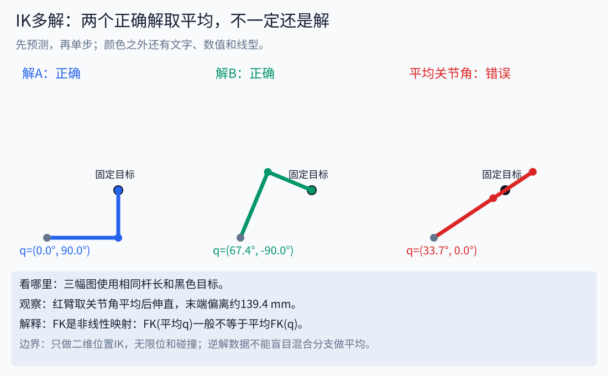

# 11｜逆运动学全景：几何、代数、集合、Jacobian与数据驱动

读到深入知识卡住时，先用[前置与深入路线](16_prerequisites_and_deeper_topics.md)判断缺少的是直觉、计算还是工程背景，再看对应的补课资料。

先读[两连杆FK与基础IK](02_kinematics.md)，再做[方法对照实验](../notebooks/09_ik_families.ipynb)。这一章既讲几何法，也讲解集与约束；它们不是同一个概念。




先记住这个问题：两幅正确姿态取平均，为什么末端反而错开139.4mm？后面的几何、代数、解集与学习方法共同回答它。

## 1. 先定义问题，才有方法可以比较

FK是映射 `f:Q→X`：关节构型q属于构型空间Q，末端任务量x属于任务空间X。IK是找满足 `f(q)=x_target` 的q。这里Q可能包含角度、移动距离及限位，X可以是二维位置、三维位置或三维位姿。

逆映射通常不是一条单值函数：同一目标可能有多个解、没有解，或在冗余机构上有连续解。用一个网络或一个数值求解器返回单个q，是它做了某种选择，不代表数学上只有一个。

比较方法前固定：同一URDF与工具、同一目标（包括方向）、同一单位与限位、同一碰撞规则、同一成功容差。只比较运行时间而忽略成功率、残差和失败分类，会把问题难度不同的结果混在一起。

## 2. 几何法：用图形关系直接构造

两杆0.3m、0.2m去(.3,.2)m，基座到目标距离r=√.13m。由三角形余弦定理得到第二关节的cos值为0，所以q2=±90°；再用两个atan2得到q1=0°或约67.38°。

优点是过程直观、计算少、分支容易解释。缺点是依赖机构结构；球腕、平行轴等特殊几何有助于分解，任意偏置和倾斜轴未必保留简单构造。不能从两杆的推导跳到“任何六轴都能用这套式子”。

画图时区分关节相对角与杆的世界方向。q2是第二杆相对第一杆转多少，第二杆世界方向是q1+q2；把两个角独立当作世界方向会得到另一台机器人。

## 3. 代数法：从方程组消元与枚举

仍从FK出发：

```text
x = l1*cos(q1)+l2*cos(q1+q2)
y = l1*sin(q1)+l2*sin(q1+q2)
x²+y² = l1²+l2²+2*l1*l2*cos(q2)
```

平方相加消去了q1，得到与几何法一致的c2。令 `c=cos(q2), s=sin(q2)`，再加约束 `c²+s²=1`，就能解释s有正负两个分支。

更一般的符号法可把三角项转成代数变量，或用半角替换 `t=tan(q/2)`：`sin(q)=2t/(1+t²)`，`cos(q)=(1−t²)/(1+t²)`。这使某些三角方程转为有理/多项式方程，随后消元、求根、恢复角度。q=π等半角参数无穷的情况要另处理；消元、平方和数值求根也可能产生伪根或丢失分支。

因此代数候选解仍需代回原始FK，检查位置/方向误差、角度周期、关节限位和碰撞。解析表达式存在也不一定意味着数值上稳健；接近重根时应检查灵敏度。这里实现的是两杆代数消元，没有实现通用六轴多项式消元器。

## 4. 集合视角：把“有解”拆成明确条件

定义几何解集 `S(x)={q∈Q | f(q)=x}`。工程上可再取交集：

```text
S_valid = S_pose_tolerance ∩ Q_limits ∩ Q_collision_free
```

有姿态误差容差时集合通常有一定厚度；有速度/加速度限制时还涉及整条随时间变化的轨迹。某个有效终点属于集合，不意味着从当前q到它的路径存在。

对于正规点附近、满行秩的m维任务和n维构型，若n>m，局部解集通常有n−m维自由度。这个说法有满秩与局部条件；奇异点、限位边界及不连通分支需要另看。两杆位置任务在一般可达点是离散的两个分支，不是任意连续解带。

可操作工作空间还可能要求某点的多种方向都可解。必须说明方向集合、采样密度和容差。“有一个方向可达”与“规定方向都可达”不是同一命题。

## 5. 为什么多解不能直接平均

对(.3,.2)m的两个解分别做FK，都正好命中目标。把关节向量平均后，q2变成0，手臂伸直；末端长度变成0.5m，离目标的误差约0.1394m。

这对数据驱动特别重要：用平方误差直接拟合多模态的逆解，可能倾向于预测平均值，得到一个两种姿态之间却不满足任务的构型。周期角度还有±π相邻而数值平均接近0的问题，必须处理角度表示和分支。

看[逐步对照图](../assets/interactive/concept_player.html)中的“IK两解与平均”：蓝绿两臂都正确，红色平均臂偏离目标。固定目标与杆长，只改变解的选择，才看得出原因。

## 6. Jacobian方法族：局部线性化以后怎样走

在当前q附近，`f(q+Δq)≈f(q)+JΔq`。J把关节小变化映射到任务量变化；同一个J还用于速度映射、力映射和误差传播，因此它不是只属于IK的一种黑盒技巧。

| 方法 | 更新想法 | 主要优点 | 必须注意 |
|---|---|---|---|
| Jacobian转置 | `Δq=α Jᵀe` | 简单，像沿误差下降方向走 | 步长、尺度、局部停滞 |
| 伪逆 | `Δq=J⁺e` | 线性化问题的最小二乘/最小范数性质 | 小奇异值会放大更新 |
| DLS阻尼最小二乘 | `Δq=Jᵀ(JJᵀ+λ²I)⁻¹e` | 抑制不稳定大步 | 阻尼引入偏差，仍受初值影响 |
| 带约束的局部优化 | 在局部问题中加入限位等约束 | 条件写得更明确 | 求解预算、可行性和线性化误差 |
| 冗余任务/零空间 | 主任务更新外，利用剩余自由度 | 可加入远离限位等次任务 | 精确与阻尼投影性质不同，仍要复算 |

用奇异值分解 `J=UΣVᵀ` 可以看到：伪逆对非零奇异值用1/σ，DLS对应σ/(σ²+λ²)。σ很小时，前者会放大噪声，后者抑制增益。把λ调大也会减弱运动能力，不能称为“没有代价的稳定”。

“Jacobian动画”应同时显示：实际FK曲线、固定线性化点的直线预测、两者误差、Δq的大小。本课新图这样呈现，避免只画一根动箭头却不说明局部近似。

## 7. 不用Jacobian或不只用Jacobian的数值法

CCD逐个关节调整末端误差，循环到满足条件或耗尽预算；它容易解释，但关节顺序、限位和局部极值会影响结果。FABRIK从连杆几何位置迭代前后调整，恢复关节角与复杂关节约束则需要额外处理。

通用非线性优化可以最小化位姿误差、关节变化与其他代价，并加入约束。采样/区间分支界定等方法还可以探索更广的解空间，但计算量、完备性前提和数值条件要具体说明。多个随机seed是实用策略，却不能自动给出“无解证明”。这些方法在本课作为方法比较，没有完整实现。

## 8. Data-driven：学逆解，或学一个好的起点

从已知q采样，经FK得到x，就能形成(x,q)数据。数据可由模型生成，也可来自测量；模型有偏差时生成数据会继承偏差，测量数据则要处理标定和噪声。

| 路线 | 实际输出 | 能解决什么 | 仍需什么 |
|---|---|---|---|
| 查表/最近邻 | 数据库中相近目标对应的q | 快速给seed，行为容易观察 | 覆盖范围、内存、后续细化 |
| 监督回归 | 一个q或限定分支的q | 学习较快的近似逆映射 | 分支/周期表示、分布外检查 |
| 条件生成模型 | 多个候选q | 表达多模态或冗余解的多样性 | FK残差、限位、碰撞筛选 |
| 学习seed＋数值细化 | 初值或候选→修正解 | 将数据先验与几何校验组合 | 时间预算与失败处理 |

本课真正实现的是**425个单分支样本的最近邻seed＋DLS细化**。30个离网格目标不参与建库；对照固定seed，报告FK位置残差、成功数和迭代步数。最近邻是数据驱动的一个简单例子，没有神经网络训练成本，也不能代表所有学习方法。

IKFlow展示用归一化流学习生成多样IK候选的研究路线，见[原论文](https://arxiv.org/abs/2111.08933)。先读它要解决的“多样解”问题，再读模型结构；本课程没有复现论文、没有声称具有其速度或成功率。

## 9. 怎样设计可信的比较

测试目标要覆盖内部、边界、奇异附近、限位附近、不可达和分布外区域；训练/验证/测试按规则分开。计入建库或训练成本，区分离线成本与每目标推理成本。一次运行的墙钟时间受解释器、缓存和硬件影响，不能把小样本教学耗时当工业基准。

至少报告位置残差（m）、方向残差（rad）、成功定义、成功数/总数、关节限位和碰撞是否检查、总时间或分位时延。角度误差不能简单以任意选定的某一“真值解”为标准，因为另一分支可能同样有效。

对我们的模型先确认加载与FK正确，再比较IK。零速度声明、倾斜轴处理错误、工具偏移遗漏属于模型/接口问题，增加网络规模或seed数量不能替代这些检查。

## 10. 自检与答案

1. 几何法和代数法能得到同样的两杆式子吗？能，几何关系与消元描述的是同一机构。
2. n−m维结论总成立吗？不，需局部正规点和满行秩等条件。
3. 两个正确逆解平均后还正确吗？通常不能保证；本例约偏139.4mm。
4. DLS失败能证明无解吗？不能，可能是初值、预算或局部停滞。
5. 学习模型输出候选后为何再FK？检查是否实际满足目标；还需独立检查限位、碰撞和路径。
6. 数据驱动是否一定是神经网络？不是，查表/最近邻也是利用数据作推断的简单路线。
