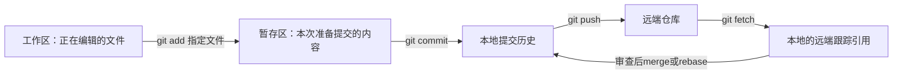

# 12｜开发工具全流程：从Git到GitHub，再到测试、数据与交付

工具要围绕任务学习。以“修复角度单位转换”为线索：描述问题→找代码→建分支→修改→验证→评审→合入→记录版本。先完成[第七天实验](../notebooks/07_tools_and_delivery.ipynb)，再做本章操作卡。

## 1. Git与GitHub：版本系统和协作平台

Git在本地保存版本、分支与合并关系；GitHub提供仓库托管、问题跟踪、Pull Request、自动化等协作服务。没有网络也能用Git提交，只有GitHub网页账户却未提交修改也不构成本地版本记录。

Git诞生于2005年Linux内核开发的协作需求，设计重视分布式工作和分支处理，见[Git官方历史](https://git-scm.com/book/en/v2/Getting-Started-A-Short-History-of-Git)。今天一个仓库副本通常包含提交历史，但大文件存储、浅克隆或缺失远端对象会影响实际可用范围。

先理解四个位置：



commit是一次内容及历史关系的记录；branch是指向提交的可移动引用，不是每次都复制整份机器人网格；tag通常标识特定版本。clone创建仓库副本，fork是托管平台上的派生仓库关系。fetch取得远端信息，pull还会执行整合步骤；具体merge/rebase行为取决于参数与配置。

## 2. 做一次能解释的本地修改

只在自己的练习仓库执行。先确认所在目录和已有修改，再创建未占用的分支：

```powershell
git status
git switch -c study/angle-units
# 修改自己的练习文件，例如endpoint_cm中的度到弧度转换。
git diff
python -m unittest discover -s tests -v
git add labs/course_lab.py
git diff --cached
git commit -m "Fix degree conversion in endpoint calculation"
git log --oneline --graph --decorate -8
```

这些是操作示例，不会由课程自动执行。若只是读教材，没有实际修复，不应按示例制造无意义提交。`git add`指定本次文件；否则容易把日志、虚拟环境或未完成的其他工作混进提交。

修改了一半但想检查旧行为，先理解差异并保存工作，再选择分支/工作树等机制。不要把 `reset --hard` 当通用“刷新”命令。已经共享的错误提交通常通过明确的修复提交或revert记录纠正；具体协作约定由项目决定。

## 3. PR / MR：让同事审核具体结果

GitHub叫Pull Request，GitLab常叫Merge Request。核心都是比较一组提交与目标分支，讨论修改、检查自动化结果，再决定是否合入。PR不是Git本身的一个命令，也不是必须把主分支拉下来才有的“pull”。

以本课为例，一个好描述应包括：输入90°以前错误地当90rad，现在转换为π/2；给出独立预期，列出测试命令，说明是否改变文件格式或API。已有[PR练习模板](../templates/PULL_REQUEST_EXERCISE.md)和[问题报告模板](../templates/ISSUE_EXERCISE.md)。

评审者先看问题是否被清楚复现，再看实现、接口兼容、异常和验证范围。只回复“代码能跑”不足以评审。讨论后又改了代码，需要确认检查对应的是最新提交。

网页练习按[GitHub Hello World](https://docs.github.com/en/get-started/using-github/hello-world)完成自己的练习仓库；本课程没有替你创建远端仓库、发Issue或提交PR。

## 4. GitHub、GitLab、Gitea与周边工具怎么分工

| 工具/类别 | 学习重点 | 适合的练习 | 不应混淆 |
|---|---|---|---|
| Git | 提交、分支、合并、远端 | 看工作区/暂存区/历史三个差异 | 不等于GitHub账号 |
| GitHub | 仓库、Issue、PR、Actions、Release | 完整走一次有验证的PR | 网页编辑器不必然有运行环境 |
| GitLab | 项目、MR与CI/CD流程 | 在已有团队实例阅读一次MR | 名称不同，仍需明确分支与检查 |
| Gitea | Git托管、Issue和PR | 了解团队自建托管的工作流 | 自建还涉及维护与备份 |
| GitHub CLI / Desktop | CLI或桌面协作入口 | 从已有授权仓库查看状态/差异 | 不能替代Git及评审概念 |
| VS Code / PyCharm等IDE | 导航、补全、断点、解释器 | 单步追踪decode_frame | 打开文件不等于选对环境 |
| JupyterLab | 讲解、交互试验与结果 | 改参数、看图、重启全跑 | 内核变量不是源码版本 |
| Codespaces / Dev Containers | 可定义的开发环境 | 看环境配置与工具运行位置 | 远程环境不自动访问本机USB |

平台流程参考[GitLab MR](https://docs.gitlab.com/user/project/merge_requests/)、[Gitea PR](https://docs.gitea.com/usage/issues-prs/pull-request/)、[Codespaces版本操作](https://docs.github.com/en/codespaces/developing-in-a-codespace/using-source-control-in-your-codespace)。这是功能学习地图，不是要求安装全部工具或购买服务。

## 5. 合并冲突：先解释两边意图

假设主分支把单位从mm改成m，你的分支把杆长从300改成350。冲突的正确解决不是机械选“ours”或“theirs”，而是保留“长度增加”和“改用米”两种意图，最后用0.35m验证FK。然后删除冲突标记、运行相关测试、查看最终diff，再提交解决结果。

文字不冲突也可能语义冲突：一个分支改了关节顺序，另一个新增的数组仍用旧顺序。Git只处理内容整合，数学与接口一致性要靠人和测试检查。

## 6. 从本地测试到CI

持续集成CI是在规定事件触发后，用声明的环境自动运行检查。一次workflow包含job，job里有step，执行环境叫runner。它可以检查测试、格式、构建和产物，但不能凭通过结果推断真机安全或未覆盖功能正确。[GitHub Actions概念](https://docs.github.com/en/actions/get-started/understand-github-actions)说明了这些职责。

课程提供[可复制的CI示例](../templates/course_checks.yml)，只运行标准库实验测试和本地链接检查。它放在templates下，因此当前不会自动触发任何远端工作流。学员在自己的练习仓库复制到 `.github/workflows/` 后再观察触发、日志和失败行。

先故意破坏一条已知预期，观察本地与CI都失败，再修复。检查失败时读第一个相关异常及完整上下文，不要只看最底部“exit code 1”。CI中的平台、Python版本、缓存和依赖与本机可能不同，差异本身是诊断信息。

## 7. 环境、构建、质量与分析工具

| 类别 | 常见工具 | 必须掌握的概念 | 本课程练习 |
|---|---|---|---|
| Python隔离 | venv；团队也可能使用Conda | 解释器、依赖版本、环境路径 | 打印sys.executable并与pip对应 |
| 环境封装 | Docker / Dev Containers | 镜像是模板，容器是运行实例，卷保存外部数据 | 画出代码/数据/设备在哪里 |
| C/C++构建 | 编译器、CMake、Ninja/Make | 配置、编译、链接、测试 | 读一个实际构建日志各阶段 |
| 单元与集成测试 | unittest / pytest | 独立预期、边界、夹具、隔离 | 运行课程已知字节向量 |
| 静态质量 | Ruff等 | 规则检查/格式不是语义正确证明 | 对比格式问题与单位错误 |
| 调试 | IDE调试器、GDB/LLDB等 | 断点、栈、变量、线程 | 找到角度何时被乘1000 |
| 性能分析 | cProfile、系统/GPU分析器 | 累计耗时、调用次数、同步 | 先测再优化采样循环 |
| 通信观测 | Wireshark、tshark、逻辑分析仪 | 包、显示过滤、时序、观察位置 | 打开本课PCAP与SPI数据 |

Docker不是完整硬件兼容层，容器运行仍涉及宿主机内核、驱动和设备映射，见[Docker概览](https://docs.docker.com/get-started/docker-overview/)。Ruff用途见[官方文档](https://docs.astral.sh/ruff/)。CMake与调试的具体操作入口保留在[工具说明](../TOOLS.md)，基础课程不要求装完本表。

## 8. 大文件、数据、模型与实验记录

源码、URDF文字和小型教学CSV适合普通版本管理；大型mesh、视频、模型权重与数据集要考虑体积、更新方式和共享需求。

Git LFS把大对象交给专门存储并在Git中记录指针；DVC围绕数据/模型版本与流程管理；MLflow记录实验参数、指标和产物。它们解决的重点不同，不能只用“保存一个文件夹”替代全部语义。参见[DVC数据版本](https://dvc.org/doc/start/data-management/data-versioning)与[MLflow实验跟踪](https://mlflow.org/docs/latest/ml/tracking/)。

本课先用简单清单：输入文件SHA-256、模型来源、配置、训练/测试拆分、工具版本、输出和失败原因。一个URI不能证明内容未变，一个哈希不能证明内容正确。真正复现还需要能取回对应版本的数据与环境。

例如换了碰撞球YAML但只记录URDF版本，可达率变化就难以解释；数据驱动IK换了建库分支但只记录网络名字，也无法公平比较。

## 9. 本周工具结业任务

用自己的练习文件完成一次小改动，留下Issue式问题描述、分支差异、独立测试、PR式说明和结果清单。没有远端账户也可用本地Markdown完成描述与评审练习；远端流程在自己的已授权练习仓库中做。

自检：commit之后是否自动到GitHub？没有，通常还要push。PR通过是否等于发布了新版本？不一定，合入、打tag、构建Release和部署是不同动作。Docker镜像是否包含宿主机相机驱动的一切？不能这样假定。Notebook最后的图是否证明当前源码跑过？重启内核全跑并保留版本，才有明确证据。
