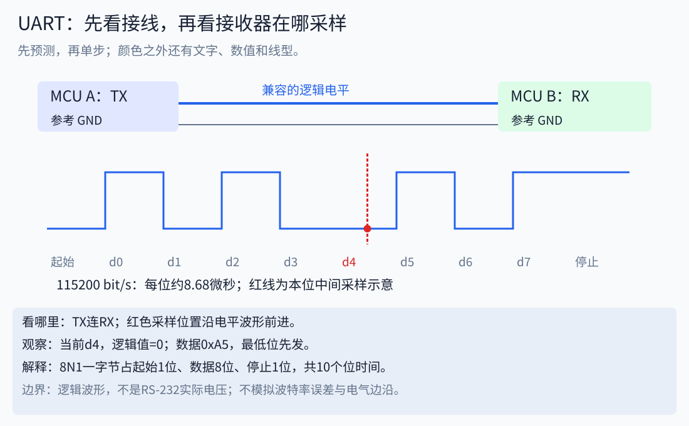
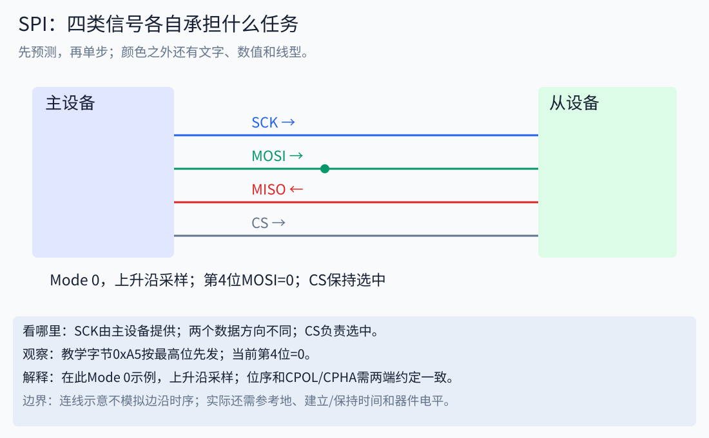
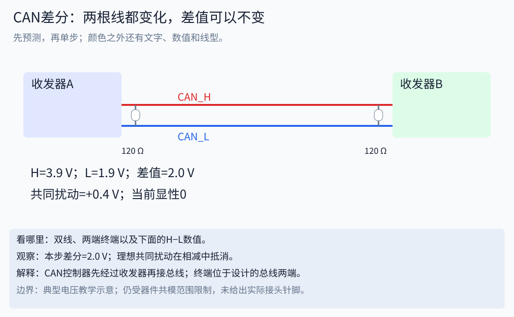

# 14｜从插头到命令：通信的物理连接与链路

这章从“手里的线究竟连到哪里”开始。前置只需认识电压、地、电阻和二进制；不会时先读[前置知识路线](16_prerequisites_and_deeper_topics.md)，再回到本章。协议层的完整背景见[通信历史与协议栈](10_communication_stack_history.md)。

## 1. 一根线并不能说明采用了什么协议

把一个系统拆成六个问题：**插什么头→哪根线接哪个引脚→电压如何表示0/1→怎样划分一帧→帧内字段是什么→设备收到后做什么。** 接头形状只是第一步。同样的RJ45外形可能有不同用途；DB9也不能仅凭外形确定CAN或RS-232接线。

连接时应拿到设备的型号、引脚定义、电平与隔离说明。本文的TX/RX、A/B、CAN_H/L是信号名称示意，不是团队所有板子的实际接头针脚号。丝印与不同厂家的命名仍需核对数据手册。

电压总是两个位置的差。单端信号用信号线相对参考地判断；差分信号关注两条线之差。差分能抑制一部分同时叠加到两条线的干扰，但接收器仍有共模范围，不能由“差分”推出“随便断开参考关系都能工作”。隔离器与隔离电源会改变具体连接方案。

## 2. 一张表分清常见连接

| 连接 | 常见物理信号与连接方式 | 电气特点 | 链路上还需约定 | 常见用途 |
|---|---|---|---|---|
| MCU UART逻辑口 | 一端TX接另一端RX，另一方向同理，参考地按硬件方案连接 | 常见3.3V或5V单端逻辑；实际看器件容限 | 波特率、数据位、奇偶校验、停止位 | 调试、板间低速消息 |
| RS-232 | 经收发器接对方的接收/发送信号及参考 | 电气电平与逻辑UART口不同 | 上层常使用异步串行字节格式 | 工控串口；不能直接接MCU裸引脚 |
| RS-485 | 收发器差分总线；常见两线半双工，共享总线 | 差分、方向使能、拓扑与终端重要 | 谁何时发送；Modbus RTU或私有帧 | 多站设备总线 |
| SPI | SCK、主发从收、从发主收、每从设备CS及参考 | 通常板内/短距离同步逻辑连接 | CPOL/CPHA、位序、字长、CS时序 | MCU与外设、桥接板 |
| I²C | SCL、SDA、参考；上拉到兼容电源域 | 常见开漏/开集，两线共享 | 地址、START/STOP、ACK、仲裁 | 板内传感器与配置器件 |
| 经典高速CAN | 经CAN收发器连接CAN_H/CAN_L双绞线 | 多节点差分总线，主干与短支线 | 位时序、ID、帧类型、错误处理 | 电机和控制器 |
| USB 2.0基本连接 | VBUS、D+、D−、GND；具体连接器另有定义 | 主机与设备角色、差分数据 | 枚举、端点、传输类型、设备类 | PC连接控制板 |
| Ethernet | PHY、双绞线与磁性器件或光纤；端口可能经过交换机 | 点到点链路组成网络；速率标准不同 | MAC帧、上层IP/UDP/TCP等 | PC、相机和控制器 |
| EtherCAT | 使用相应Ethernet物理层和专用主从设备 | 常见线型/树型等组织 | EtherCAT帧处理和同步机制 | 实时工业控制 |

这张表不是安装清单。先知道我们链路里实际用了哪几种，再逐种看信号与帧。

## 3. UART：同意“多久看一眼”，才能读出一串高低电平

没有单独的时钟线，所以两边要事先约定波特率。以教学参数115200 bit/s、8N1为例：8个数据位、无校验、1个停止位，另有1个起始位。一字节占10个位时间，理想连续发送的净数据上限是11520 byte/s，尚未计入应用头、等待和操作系统延迟。

一个位时间约为 `1/115200=8.6806微秒`。异步接收器通过起始位定位，再在合适的位置采样；不是看到每一个跳变就当作一个新比特。以0xA5为例，二进制写成10100101，常见UART先发最低位，因此发送数据顺序为1、0、1、0、0、1、0、1。

再用一个能区分位序的反例：0xA5的位串恰好左右对称，仅用它无法发现全部位序错误。换成0x96，按最高位写为10010110，最低位先发则为0、1、1、0、1、0、0、1。实际测试应包含这种非对称字节。

先观察TX到RX的物理连接，再看下面的电平和采样点。动画选择“UART接线与采样”。电平波形这里只是逻辑0/1，不能直接当作RS-232线缆上的实际电压。

诊断顺序：供电与参考→电平是否兼容→TX/RX是否连接正确→波特率和格式→字节是否正确→应用分帧。串口读到字节不证明字段正确；USB转串口被电脑识别也不证明外部UART接线正确。

## 4. SPI：时钟不是装饰，选中和采样边沿都影响答案

主设备提供SCK，用CS选中从设备。一条时钟可以让两个方向各交换一位。MOSI/MISO也可能写作COPI/CIPO或SDO/SDI；要按信号相对哪一方定义来连接。CS通常为低有效，但必须查具体器件。

CPOL规定空闲时钟电平，CPHA参与规定采样与移出数据的边沿。Mode 0是CPOL=0、CPHA=0，常见解释是在上升沿采样、下降沿准备后续位。其他模式不能直接套用这幅图。

发送前数据要提前稳定一段时间，采样后还要保持一段时间，分别对应建立时间和保持时间。线长、驱动、负载、电平转换器和频率都会影响波形。逻辑分析仪看到“偶尔正确”不足以证明时序裕量。

若时钟1MHz，76字节至少需要608微秒移位时间，此外还可能有CS间隔、DMA调度和应用等待。SPI有时钟不等于天然有可靠消息：长度、校验、超时、事务边界仍需上层设计。

## 5. I²C：为什么高电平不是所有设备都主动推出来

常见I²C设备把线拉低，释放时由上拉电阻让线变高，因此多个设备可以共享线路。SDA是数据，SCL是时钟。时钟高电平期间SDA的特定变化形成START/STOP；每8位数据后还有ACK/NACK位。ACK表示该字节传输阶段的应答，不等于应用任务完成。

上拉不是越小越好：过小会增加拉低电流，过大会使上升沿变慢。在简单RC模型中，以电平从30%上升到70%定义上升时间，则 `t_r≈0.8473 R_pullup C_bus`。例如4.7kΩ与100pF给出约398ns；是否符合要求要对照所选I²C模式的时序表及设备能力。这不是针对所有电路推荐4.7kΩ。

“7位地址0x50”和把读写位拼接后的“地址字节0xA0/0xA1”不是同一个表示。驱动API要求传7位地址还是移位后值必须查清。两块同地址设备并不能只靠接上SCL/SDA就自动区分。

## 6. RS-485：收发器负责电气传送，地址与命令来自上层

MCU的TX/RX通常先进入RS-485收发器，再连接差分总线。两线半双工时发送和接收共享线路，因此发送端需要方向管理，例如DE控制驱动使能。切换过早可能截掉最后一个停止位，切换过晚可能阻碍对端响应。

物理总线宜按设计主干连接并控制支线；在需要终端匹配的高速/长线方案中，终端放在线路两端，数值依据线缆特性阻抗和器件设计，常见示例为120Ω。偏置用于定义空闲状态，但部分收发器已有失效保护；不要重复叠加未经计算的偏置电阻。

A/B命名在设备资料间可能不统一，不能仅凭两个字母跨品牌接线。应对照差分极性、D+/D−或设备手册。RS-485本身不定义Modbus寄存器、设备地址或电机角度；“物理链路通”和“上层协议相同”需要分别检查。

## 7. CAN：MCU引脚、电气总线和电机协议是三件事

链路示意为 `MCU CAN控制器TX/RX → CAN收发器 → CAN_H/CAN_L双绞线 → 对端收发器 → 对端控制器`。MCU的CAN_TX/CAN_RX不是可以直接接到电机CAN_H/CAN_L的线。

高速CAN教学波形可用隐性时两线约2.5V、显性时H约3.5V/L约1.5V解释“差值”。这些是典型示意值，真实阈值、电压与共模范围看收发器数据手册。给两条线同时加0.4V，在理想模型中差值仍不变，但绝对电压变了，因此仍需关心共模范围。

常见高速CAN总线在两端各接120Ω终端；在适用的断电测量条件下，两只并联约60Ω。不是每个节点都再加120Ω。分裂终端、内置可切换终端、隔离和复杂设备电路会改变测量解释。

CAN ID通常标识消息及仲裁优先级，不应普遍解释为目的设备地址。某种电机把节点号编码在ID中，是该电机协议的约定。波特率、采样点、位时序、经典CAN/CAN FD模式等也必须兼容。CAN FD的仲裁段与数据段速率不能简单当作一个数字。

## 8. USB、Ethernet、EtherCAT：接口名称之后还要追到软件

USB主机先枚举设备，之后通过端点传输。PC上看到COM口通常是某种串行类/驱动接口；USB的D+/D−并不是远端UART的TX/RX。USB-C是连接器/线缆体系，不能单独证明支持某种最高速率或任意供电模式。

Ethernet首先要建立物理链路，再处理MAC帧；IP地址、子网与路由属于后续层。链路灯亮不证明IP可达，ping通不证明目标端口存在，更不证明机器人命令字段正确。100BASE-TX常见两对数据线，1000BASE-T使用四对；应以具体PHY和布线规范为准。

EtherCAT利用专门的帧处理与设备机制，不能因为端口外形相同，就假定任意普通网口设备能成为EtherCAT从站。其优势与实时性要放在完整主站、从站、拓扑与同步设计中理解。应用是否经TCP/IP也要查具体协议栈，不能把所有Ethernet应用都画成TCP消息。

## 9. 对照我们的项目：PC到电机经过哪些转换

本地资料 `f446_spi_can_board/README.md`描述了H750→SPI→F446→CAN1/CAN2链路。F446固件使用6个32位ID、6组8字节数据，再加4字节XOR校验的固定快照：`6×4+6×8+4=76字节`。这是该固件描述，不是所有SPI-CAN桥的标准。

这条链路应分开画：PC侧USB驱动与消息；H750上的解析与调度；SPI事务；F446的快照与CAN发送；总线收发器；电机的私有帧。某一层可能重新组织消息，而不只是原封不动给旧数据加个头。

CAN1的PB8/PB9、CAN2的PB12/PB13是该README记录的MCU外设引脚；它们不是机器人外部接插件编号。实际接线还需原理图、PCB版本、收发器和连接器针脚表。本课程未根据文件夹名称猜测这些未知针脚。

## 10. 做一次按层定位的练习

给定“电机没有反馈”，先写观察位置，不要立刻换驱动：USB是否枚举；桥接事务是否有返回；SPI的CS/时钟/数据是否满足时序；CAN是否有帧与错误状态；返回ID是否被过滤；应用是否接受序号和时间戳。

[线路与坐标实验](../notebooks/12_physical_links.ipynb)可手算UART带宽、SPI事务时间、I²C上升沿和终端电阻。它不调用设备。扩展复习见[新一轮练习](../assessments/FOUNDATION_BRIDGES.md)。

## 参考资料：从电气到链路逐级读

- [NXP UM10204](https://www.nxp.com/docs/en/user-guide/UM10204.pdf)：I²C时序图、START/STOP、ACK、上拉与电容。先读图，再核对所选模式的表格。
- [TI RS-485 Design Guide](https://www.ti.com/lit/an/slla272d/slla272d.pdf)：总线、支线、终端与失效保护。具体器件再看其数据手册。
- [CAN in Automation物理层](https://www.can-cia.org/can-knowledge/physical-layer)：总线电气与不同物理层范围。
- [USB-IF USB 2.0规范入口](https://www.usb.org/document-library/usb-20-specification)：设备、端点和协议与电气规范。
- [EtherCAT技术说明](https://www.ethercat.org/en/technology.html)：帧处理和系统结构。
- [协议栈讲义](10_communication_stack_history.md)中的IETF原始RFC解释IP/UDP/TCP；本章补充物理层，不替代设备接线手册。
