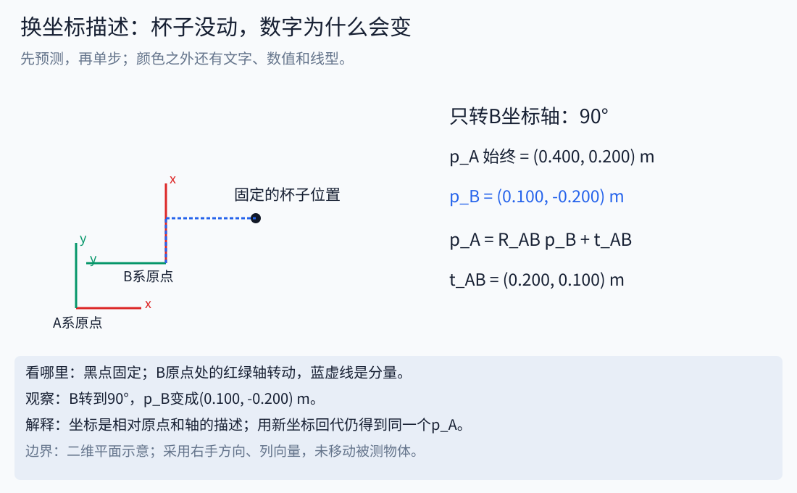
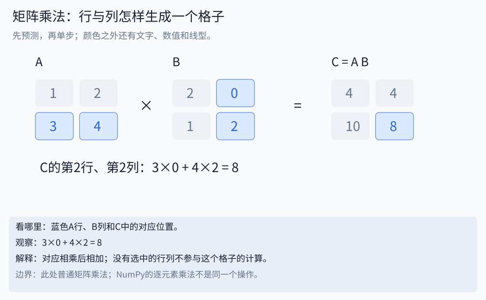
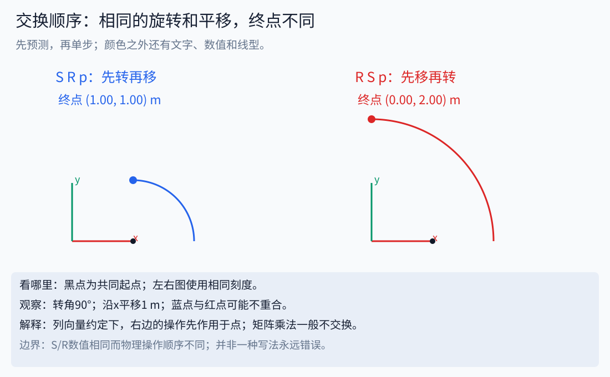
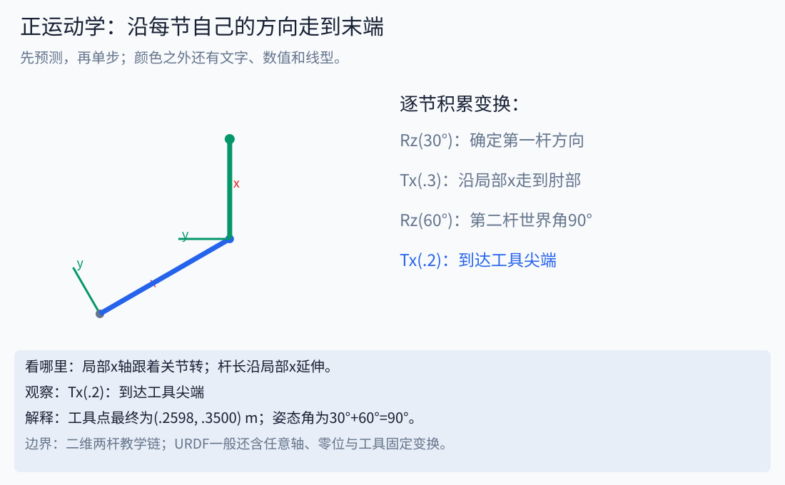

# 15｜从方格纸到正运动学：坐标、矩阵与变换顺序

前置知识只要求会加减乘除、在方格纸上画点。正弦余弦不熟时先读[数学台阶](../beginner/MATH_STEPS.md)；矩阵无需先学完整门课。本章依次回答“数是谁的坐标→如何换一种描述→如何把多节连杆接起来”。[对应Notebook](../notebooks/11_frames_matrices_fk.ipynb)允许逐行修改代码。

## 1. 同一个位置，为什么有两组正确数字

房间门口是一处原点，桌角又是一处原点。相同杯子相对门口可能在右边2m、前面1m，相对桌角可能只有右边0.2m。杯子没有移动，是参照物变了。

一个坐标系至少有原点、轴方向、单位和名称。本文用右手系、列向量、米和弧度。`p_A`表示“点p在A系中的坐标”，下标不是装饰。没有参考系的`[.2,.1,0]`不能直接与另一设备的数字相加。



动画中的黑点固定，B坐标系转动，`p_B`变化而`p_A`不变。先能解释这一点，再读矩阵。主动转动物体与被动换坐标描述可产生相似公式，但问题不同，必须先写清究竟什么在动。

## 2. 向量和矩阵怎样长出来

向量是按顺序排列的一组数，例如二维位置列向量有2行1列。矩阵是整齐的数表，行列数规定了运算可以怎样连接。矩阵不一定代表旋转，它也可以表示线性方程系数、数据表、Jacobian或相机内参。

若A有m行n列，B有n行p列，则AB有m行p列。中间的n必须匹配。结果第i行第j列是“A第i行与B第j列对应相乘后相加”。

```text
A = [1 2]      B = [2 0]
    [3 4]          [1 2]

C11 = 1×2 + 2×1 = 4     C12 = 1×0 + 2×2 = 4
C21 = 3×2 + 4×1 = 10    C22 = 3×0 + 4×2 = 8

AB = [4  4]
     [10 8]
```



讲义的第1行在Python里索引为0，因此数学里的C21对应代码C[1][0]。

这不是对应位置直接相乘。后者叫逐元素运算，在NumPy中`A*B`常执行逐元素乘法，矩阵乘法写`A@B`。维度相同也不意味着能随意交换顺序：上例BA为`[[2,4],[7,10]]`，与AB不同。

## 3. 为什么旋转矩阵里出现sin和cos

把B系的单位x轴在A系里画出来：转角θ后它的投影为`[cosθ,sinθ]`。B系单位y轴与它垂直，在A系的投影为`[-sinθ,cosθ]`。把两个投影作为两列，就得到：

```text
R_AB = [cosθ  -sinθ]
       [sinθ   cosθ]

p_A = R_AB p_B          （此处两系原点重合）
```

矩阵的列告诉我们B的基向量在A里如何表达。取θ=90°、p_B=[.2,.1]，结果p_A=[−.1,.2]。可以直接在纸上把右边0.2、上边0.1的箭头转90°核对。

一个真正的旋转应保持长度和夹角，满足`RᵀR=I`、`det(R)=+1`。只满足正交却det=−1可能是反射，不是三维刚体旋转。单位矩阵I相当于“方向不变”。三维绕z轴旋转是在上面的2×2块外保留z坐标不变。

## 4. 平移和旋转怎样合成一条公式

若B的原点在A里为`t_AB=[.3,.1,0]`，则`p_A=R_AB p_B+t_AB`。先把坐标方向对齐，再加B原点在A里的位置。取90°旋转和`p_B=[.2,.1,0]`，手算得到`p_A=[.2,.3,0]`。

为了把这两步写成一次矩阵乘法，在点坐标末尾加1，并使用4×4齐次矩阵：

```text
T_AB = [ R_AB   t_AB ]       [p_A] = T_AB [p_B]
       [ 0 0 0   1  ]       [ 1 ]        [ 1 ]
```

前三行最后一列存平移。末尾的1会把平移加入结果。方向向量末尾用0，因此变换方向时只旋转，不加位置偏移；把法向、速度方向或单位轴当作点处理会引入错误平移。速度完整换框架还有参考点与刚体运动问题，不能据此把所有6维速度都当三个方向分量。

## 5. 坐标系下标帮助检查乘法顺序

定义始终是`T_AB`把B系坐标转为A系坐标。于是：

```text
p_B = T_BC p_C
p_A = T_AB p_B
    = T_AB T_BC p_C
因此 T_AC = T_AB T_BC
```

相邻的B可以“对上”，得到A到C的表达。这里省略了点末尾的1。列向量约定下，最右边的变换先作用在点上；写代码时依次构建链，也可以从左开始积累矩阵。所谓“先乘哪个”必须区分矩阵积的构建顺序和对点的作用顺序。

反例：不说明含义地把`T_AB @ T_CD`相乘，数值程序可能不报错，但中间坐标系不对应，物理解释就可能错误。

## 6. 左乘与右乘：相同增量，在哪个坐标系里解释

假设T描述当前物体坐标系在世界中的位姿。`T_new=Δ_world T`表示在世界坐标中施加增量；`T_new=T Δ_body`表示在物体当前坐标中施加增量。它们一般不相等。要比较同一个物理增量，应满足`Δ_world=T Δ_body T⁻¹`，不能让两边机械使用相同数字后期待相同结果。

最小例子：二维点p=[1,0]，R是90°旋转，S是沿世界x平移1。

- `S R p`：先转得到[0,1]，再移得到[1,1]。
- `R S p`：先移得到[2,0]，再绕原点转得到[0,2]。



在动画中，两幅图有相同起点、相同转角和平移数值，但终点不同。左乘、右乘并不分别等于“正确”“错误”，而是在回答不同坐标描述的问题。

## 7. 逆变换：回去的路不是只给平移加负号

从`p_A=R p_B+t`出发，先减t，再左乘Rᵀ：`p_B=Rᵀp_A−Rᵀt`。因此齐次逆矩阵的旋转为Rᵀ，平移为`−Rᵀt`。

取R=Rz(90°)、t=[.3,.1,0]，逆平移是[−.1,.3,0]，不是[−.3,−.1,0]。验证方法是同一个点先正变换再逆变换，最后回到原坐标。用几个独立点测试比只看一幅图更可靠。

## 8. 正运动学：把每个关节的小变换串起来

正运动学FK的输入是机构参数和关节值，输出指定末端在指定参考系中的位姿。它不直接判断碰撞、不求电机力矩，也不会自动替你找到未知关节角。

两杆平面机械臂，L1=.3m、L2=.2m，关节角q2相对第一杆定义。第一杆的世界角为q1，第二杆的世界角为q1+q2。于是：

```text
x = .3 cos(q1) + .2 cos(q1+q2)
y = .3 sin(q1) + .2 sin(q1+q2)
```

相同计算也可用变换链表达：

```text
T_base_tool = Rz(q1) Tx(.3) Rz(q2) Tx(.2)
```

这里Tx把下一坐标系原点沿当前局部x方向平移。不要把它误看成每一杆都朝世界x延长。取q1=30°、q2=60°：第一杆末端[.2598076,.15]，第二杆再向世界y延长.2，得到工具点[.2598076,.35]，工具姿态角为90°。



分别用三角公式、矩阵链、方格纸画图做交叉检查。若三个结果冲突，先查角度单位、q2相对谁、乘法顺序和工具偏移，而不是先增加迭代次数。

## 9. 接到URDF：零位偏置、运动轴与外观偏置各自在哪里

关节`origin`定义父链接到关节零位的固定变换；`axis`定义关节框架中的运动轴。常见链可写成`T_parent_child(q)=T_origin T_motion(q)`。旋转轴不是z时，不能把任意轴关节都写成Rz；要用轴角公式或相应库。

URDF固定轴RPY通常对应`Rz(yaw) Ry(pitch) Rx(roll)`。这与随体轴旋转叙述需要区别。`visual origin`是在链接框架里放置网格，不能拿它代替joint origin计算运动链。网格的scale还决定原始顶点怎样换成米。

团队的spark2_v2 STL引用显式使用0.001比例；dual_v2_1的部分visual还带独立位置和角度。导出打印模型时，必须沿关节链，再乘visual变换，再把米换成打印用毫米。外观网格大小正确不证明运动轴正确。

## 10. 深入内容应该知道什么，何时再学

| 内容 | 它解决的问题 | 所需基础 | 下一步 |
|---|---|---|---|
| SO(3)/SE(3) | 所有合法旋转/刚体位姿具有怎样的结构 | 矩阵、逆变换、集合 | Modern Robotics第3章 |
| 欧拉角/四元数/轴角 | 同一旋转怎样编码，各有什么退化 | 三角函数、旋转矩阵 | 先练表示互转，区分欧拉角奇异与机械臂奇异 |
| 指数积POE | 用关节螺旋轴统一表达FK | 刚体运动、矩阵指数初步 | Modern Robotics第4章；本课没有实现通用POE求解器 |
| DH/改进DH | 用固定约定组织连杆参数 | 坐标系分配与变换顺序 | 先写清采用的版本，再与URDF的FK交叉验证 |
| 空间/本体Jacobian | 在不同框架描述关节到末端速度映射 | 导数、FK、局部近似 | 接[IK方法家族](11_inverse_kinematics_families.md) |
| Adjoint | 在约定一致时换6维刚体速度坐标 | 叉乘、刚体运动与参考点 | 学会标注twist分量顺序；不能只旋转两个3维块 |

前置路线和补课资料见[第16章](16_prerequisites_and_deeper_topics.md)。本节是下一步地图，不要求初学者一次学完所有名词。

## 11. 三个必须能解释的反例

1. 两个4×4数组相乘成功，是否说明框架对了？不，维度正确只是必要条件。
2. 一个点先转90°再移1m，是否能交换顺序？通常不能，手算[1,1]与[0,2]即可反驳。
3. FK末端位置正确，是否证明姿态、碰撞和模型全部正确？不，需分别验证姿态、几何和任务约束。

参考：[Modern Robotics教材与视频](https://modernrobotics.northwestern.edu/chapters/)、[MIT 18.06线性代数](https://ocw.mit.edu/courses/18-06-linear-algebra-spring-2010/)、[ROS URDF关节定义](https://wiki.ros.org/urdf/XML/joint)。ROS入口用于追到适用版本的模型定义，课堂不会要求为矩阵练习先装ROS。
