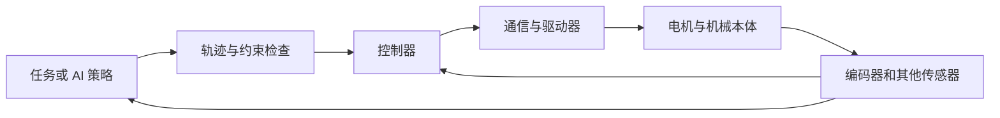

# 第一天：机器人系统与代码基础

目标：画出一条从任务到电机、再从传感器返回软件的链路，并运行第一个可解释的程序。

## 1. 机器人到底由什么组成

本体是连杆、关节、传动、支承和末端工具；执行器产生力或力矩；传感器提供位置、速度、力、图像等测量；控制器依据目标和测量计算输出。上层应用负责“去哪里、做什么”，底层控制负责“如何跟踪并报告状态”。



机器人收到目标不等于到达目标。应用至少区分：命令生成、发送、接收、执行中、完成、失败。机械、电子和软件都可能造成“没有动”，先定位链路再改代码。

## 2. 从零读懂一个程序

变量给数据命名，类型决定能做的运算，函数把一组操作变成可重复调用的步骤。列表保存多个关节值，字典保存带名称的配置；`if` 决定分支，`for` 重复处理数据。异常表示当前操作不能继续正常完成。

```python
import math

def to_radians(angle_deg):
    return math.radians(angle_deg)

joint_deg = [0, 90, -45]
joint_rad = [to_radians(value) for value in joint_deg]
print(joint_rad)
```

从输入 `[0,90,-45]` 开始，逐个跟踪函数参数和返回值。预期约为 `[0,1.5708,-0.7854]`。导入模块只是加载代码；安装包是把依赖放进环境；运行脚本才执行入口。这三件事经常被混淆。

Python 的变量名引用对象，`b = a` 不自动复制列表。给 `b[0]` 赋值可能改变 `a` 所指向的列表。配置复制、共享状态和多线程问题都与此相关。C/C++ 则还需要理解编译、链接、头文件、内存生命周期和 ABI，第一周先能识别编译错误与运行错误。

## 3. 单位与时间

长度常用 m，角度内部计算常用 rad，转动速度用 rad/s，力矩用 N·m。`90° = π/2 rad`。变量名建议写 `angle_rad`、`timeout_s`，文件中附单位；SDK 的具体接口单位必须单独查证。

100 Hz 表示理想周期 10 ms；它不保证每次恰好 10 ms。延迟是一次传输耗时，抖动是延迟的变化。测间隔用单调时钟，记录人可读事件时间可用墙上时钟，并注明时区。

## 4. 动手与项目阅读

执行 `python labs/course_lab.py units`。在 VS Code 的单位转换处打断点，观察输入和结果。再读 [项目地图](../PROJECT_MAP.md) 中 SDK 与自动测试的入口：只记录初始化、连接、反馈和运动调用的位置，先不要执行硬件示例。

用 Git 保存一个小改动：先 `git status`，修改注释，再 `git diff` 检查实际变化。版本控制记录的是文件变化；测试记录的是行为，两者都需要。

交付：系统图、三种单位转换、一个异常的完整 traceback，并解释最后一行和调用位置。完成 [第 1 天测验](../assessments/QUESTIONS.md)。Python 语法补充阅读 [官方教程的控制流、函数和异常章节](https://docs.python.org/3/tutorial/)。

下一课：[本体与 URDF](day02_body_and_urdf.md)。
