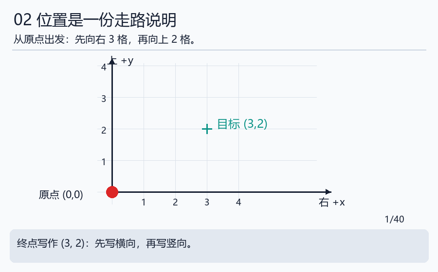

# 第一天｜先让机器人听懂一句话

完成本日再深入：[数学与软件接口](../handbook/13_systems_deepening.md)。先掌握单位和函数；矩阵、差分与概率可沿[深度地图](../DEPTH_MAP.md)逐步补。

**边读边做：** [本日可编辑Python实验](../notebooks/01_units_and_code.ipynb)（[启动方法](../INTERACTIVE.md)）。技术细节补充见[工程实现](../handbook/09_engineering_details.md)。

今天不要求会编程，也不要求会三角函数。准备两张纸、一支笔和计算器。有电脑就跟着运行，没有电脑先把纸笔部分做完。

**今天的问题：怎样让一台机器把桌上的积木拿到盒子里？** 学完你应能把这句话拆成小任务，知道电脑中的数字代表什么，并运行一个只做计算的程序。

## 第1步：把“大任务”拆成小问题

想象自己闭着眼睛拿积木。你至少要知道积木在哪里、手在哪里、怎么过去、有没有碰到东西、最后有没有放好。机器人也需要这些信息，只是它通过传感器、程序、电机来完成。

| 生活中的动作 | 机器人中对应的工作 | 现在先这样理解 |
|---|---|---|
| 看积木在哪里 | 感知 | 用相机等设备收集信息 |
| 想一条过去的路线 | 规划 | 决定经过哪些位置 |
| 手臂不断调整 | 控制 | 一边运动一边纠正 |
| 神经传递信号 | 通信 | 在各部分间传递数据 |
| 手臂和手指运动 | 本体与执行器 | 结构承担重量，电机产生运动 |

这里的对应只是帮助理解。机器人没有人的肌肉和神经，软件也不会自动理解“轻轻拿起来”的全部含义。


沿图从左到右走一遍，说出每个部分接收什么、交出什么。比如控制器接收“目标角度”和“当前角度”，交出下一步的指令。

## 第2步：给数字带上单位

“移动30”是不完整的话。30毫米和30厘米相差十倍。就像买水必须区分30毫升和30升，机器人数字也必须带单位。

今天只记三条：1米=100厘米=1000毫米；1秒=1000毫秒；一圈=360度。把厘米换成米要除以100，例如30厘米=0.30米。后面程序用米，纸条用厘米，两者描述的是同一长度。

**先做再看答案：** 20厘米是多少米？250毫米是多少米？答案分别是0.20米和0.250米。数值变小了，实物没有缩小，只是尺子的刻度单位变了。

## 第3步：位置是一份“从哪里走到哪里”的说明

在方格纸上选一点画圆，叫作原点。从那里向右走3格、向上走2格，把终点写成(3,2)。第一个数字记录横向，第二个记录竖向。这就叫二维坐标。



动画太快就看 [四步分镜](../assets/animations/coordinates_steps.png)。先指着原点，再数横向3格，最后数竖向2格。不要只记住“3和2”，要记住起点和方向。

如果你的同事把纸转了90度，或者换了原点，同一个积木会有不同的数字。所以告诉机器人位置，还要说明是哪一套尺子与方向；这一套约定叫**坐标系**。第三维z可以想成桌面向上的高度。

## 第4步：程序就是明确的小步骤

烹饪步骤“加水、搅拌、等两分钟”是一种流程。程序也把事情拆成步骤，但它要求说得更准确。下面的程序只做厘米到米的换算，不连接机器人。

```python
length_cm = 30
length_m = length_cm / 100
print(length_m)
```

第一行给30起了名字length_cm；第二行把它除以100，并把结果叫length_m；第三行把结果显示出来。等号在这里表示把右边结果保存到左边的名字，不是让你证明一道方程。

预测输出，再运行：应看到0.3。把第一行改为20，应看到0.2。只改一个地方，才能判断变化由什么造成。

## 第5步：第一次使用工具

先按 [从零操作卡](../beginner/COMPUTER_FIRST_STEPS.md) 找到文件夹、打开终端、运行Python。再在本仓库根目录输入：

```powershell
python labs/course_lab.py units
```

输出里暂时看不懂rad也没关系，第四天会解释。今天核对300毫米=0.3米、100次每秒对应每次0.01秒。100 Hz就是理想情况下每秒100次；时间间隔=1秒除以100。

## 今天交什么，怎样自己检查

画一条“任务→规划→控制→通信→本体”的线，并补回传测量的箭头。写三条带单位的换算。保存第一次运行命令和结果。

回答：①(3,2)必须配什么约定？②把30厘米写成30米会错多少倍？③程序显示“已发送”能证明积木拿起来了吗？

参考答案：①原点、方向和每格单位。②100倍。③不能，还需要设备反馈和任务结果。答错时回看对应步骤，再用不同数字重做。

明天我们把纸上的点连成两根可以转动的杆，学习长度、角度和重量怎样影响机器人。进入 [第二天](day02_body_and_urdf.md)。需要更多基础练习时看 [数学小台阶](../beginner/MATH_STEPS.md)。
