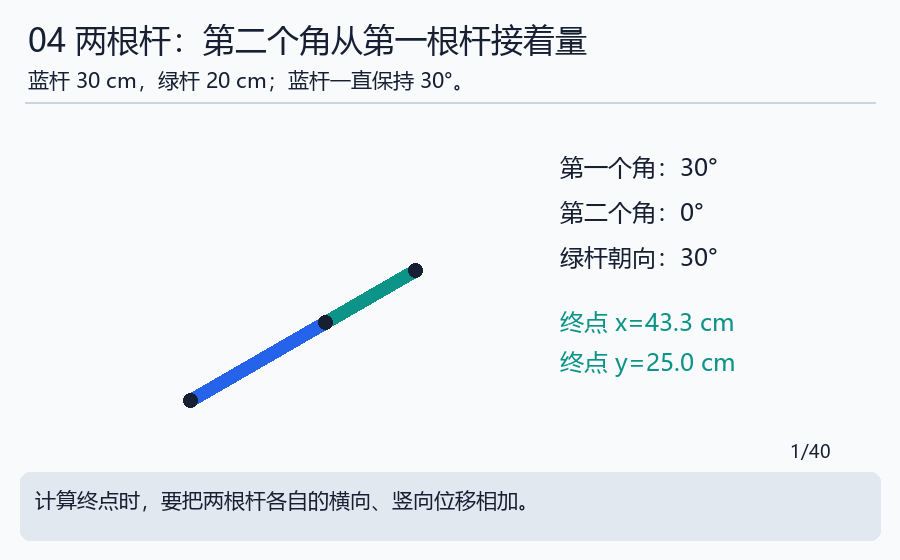
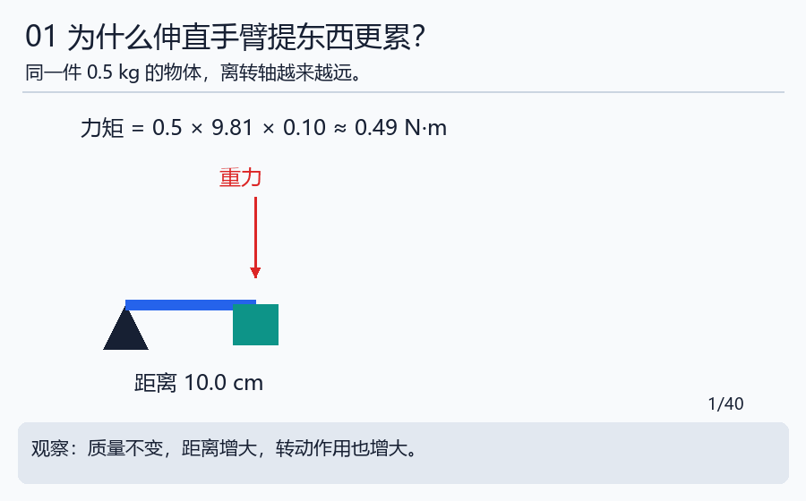

# 第二天｜用两根纸条做一只机械臂

**本门工程课程：**[本体、传动与电气](../engineering/02_body.md)及[模型与标定](../engineering/06_kinematics.md)。基础概念完成后，继续做计算、实现、故障诊断和验收；完整安排见[工程课程总入口](../ENGINEERING_PATH.md)。

[七天路线与本日过关](../WEEK_PLAN.md#day2) · [本日实验](../notebooks/02_body_and_frames.ipynb) · [运行方法](../INTERACTIVE.md)

## 先接上前一步

**接到实际工作：** 本日学会轴、零位和力矩后，进入[接线操作卡](../practical/01_wiring.md)，先辨认动力电源、驱动器、编码器与CAN接口，画出逐针接线表。卡中解释V、A、Ω与使能，并逐步带到上电检查。

昨天用数字表示位置，今天把纸上的点连成可以转动的杆。先摆30cm与20cm两根纸条，说明关节和零位，再读URDF字段；矩阵不是今天开始的前提。模型描述清楚以后，明天才有明确的关节对象可以发送命令。

先完成下面正文和三题自检。正文中的手册链接供需要时查阅；今天的扩展统一放在文末。

## 第1步：哪些部分动，哪些部分不动

把第一根纸条的一端按在桌面上，这个固定点叫基座。第一根纸条末端连接第二根，连接点叫关节；两根纸条叫连杆；最远端的小点是今天的工具点。

“关节”并不一定长得像人的肘关节，它只描述允许相邻部分怎样相对运动。我们的例子只允许在桌面内转动。真实机器人还可能有伸缩、夹持等运动。

## 第2步：说清零度是什么意思

先让两根杆都朝右，约定两个角都是0度。第一根杆的角从桌面向右方向量；第二根杆的角从第一根杆延长方向量。第二个角不是直接从桌面量，这一点后面特别重要。

先只动第二根，再只动第一根。观察：第一关节动时，后面的整段都会跟着动；第二关节动时，前面的杆不会跟着改变角度。

手算三个姿态：两杆向右时末端(50,0)厘米；第一杆向右、第二杆向上时末端(30,20)厘米；两杆都向上时末端(0,50)厘米。后面用这些简单答案检查程序。

## 第3步：为什么伸直手臂提东西更累

不用拿重物，只想象同一件物体分别放在距离转轴10厘米和40厘米的位置。越远，越容易让杆绕支点转动。这个转动作用称为**力矩**。

对水平杆和向下的重力，力矩=重量产生的力×到转轴的水平距离。0.5千克物体的重力约为0.5×9.81=4.905牛顿；放在0.1米处，力矩约0.4905牛顿·米；放在0.4米处约1.962牛顿·米，变成四倍。

这里9.81是教学中近似使用的重力加速度，不是每个地点精确测得的值。单位N·m读作牛顿·米。机器人选电机还要考虑杆自身重量、加速、摩擦与连续工作，不能只算物体这一项。

可查 [力矩对照表](../references/data/lever_reference.csv)，先自己算一行，再比较。若“力”和“质量”容易混淆，回看 [数学小台阶](../beginner/MATH_STEPS.md) 的力矩例子。

## 第4步：从纸条到CAD，再到URDF

纸条帮助我们想明白关系；CAD软件用来画准确尺寸和装配；URDF是让程序读取机器人连接关系的一种文本格式。它们回答的问题不同。

| 想知道什么 | 去哪里看 |
|---|---|
| 零件外形、孔和厚度 | CAD与工程图 |
| 哪根杆连接哪根杆、绕哪条轴转 | URDF的link和joint |
| 画面上零件怎么显示 | visual几何 |
| 计算碰撞用什么近似形状 | collision几何或碰撞球 |

打开 [教学two_link.urdf](../labs/data/two_link.urdf)。先只找四个名称：base、link1、link2、tool；再找q1、q2。不要试图第一遍理解所有XML符号。parent表示前一部分，child表示后一部分，origin说明零位连接的位置。

我们的文件没有外部网格依赖，适合自学读结构；它没有完整动力学参数，不能直接当作真实机器人的仿真规格。CAD具体操作在 [本体手册](../handbook/01_body.md)，今天可先做纸笔版本。

## 第5步：与我们团队的设计联系起来

真实项目中的D2026与spark2_v2都不能只凭外观判断是不是同一个机器人。应比较杆长、关节轴、零度姿态、运动范围与工具位置。

[本地模型参数快照](../references/DATA_GUIDE.md)记录了文件里写的参数和文件校验值。注意：“文件写了100”并不等于硬件真的允许100；CAD导出的0也可能是未填写。数据的来源和含义需要一起读。

## 今天自检

①两杆长度30、20厘米，完全伸直能到60厘米吗？②0.5千克物体力臂翻倍，其他条件不变，力矩怎样变？③mesh中心与关节中心必须是同一点吗？

答案：①不能，最大距离50厘米。②翻倍。③不必须，需要正确记录相对位置。保存一张尺寸图、三个简单姿态和一行力矩计算。

现在我们有了结构，但它还没收到命令。下一步学习怎样把“转到某个角度”变成数据，并确认设备有没有收到：[第三天](day03_communication.md)。

## 主线完成后再深入

[本日扩展小课堂](../handbook/17_extension_workshops.md#day2)提供先修、算例、自检与参考资料；[扩展选课表](../EXTENSIONS.md)列出所有暂缓主题及建议学习顺序。

[上一天](day01_system_and_code.md) · [返回七天路线](../WEEK_PLAN.md#day2) · [下一天](day03_communication.md)
