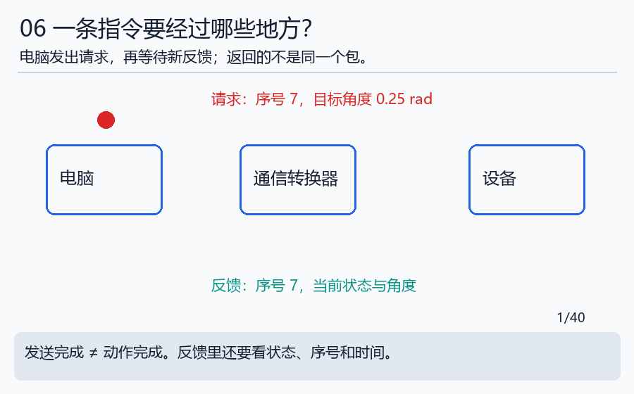

# 第三天｜给机器人寄一封不会看错的信

本日的字段解释配合[物理连接讲义](../handbook/14_physical_connections.md)：把TX/RX、收发器、总线、帧与命令逐层对应。

完成本日再深入：[通信历史与协议栈](../handbook/10_communication_stack_history.md)，并运行[08协议实验](../notebooks/08_protocol_stack.ipynb)。从一条指令追到每层字节，再区分传到、解析和执行。

**边读边做：** [本日可编辑Python实验](../notebooks/03_communication.ipynb)（[启动方法](../INTERACTIVE.md)）。技术细节补充见[工程实现](../handbook/09_engineering_details.md)。

昨天做好了两连杆模型。今天先不研究电机怎样转，只研究指令怎样到达设备、反馈怎样回来。

把通信想成寄信：信里要写清收件人、事情内容和这是不是新的一封。邮递员送到信箱，并不能证明收件人已经把事情办好。

## 第1步：先区分四个时刻

电脑生成指令；指令被发送；设备处理指令；新状态返回。它们可能相隔一段时间，也可能在某一步失败。

跟着红点看请求，再跟着绿点看反馈。反馈通常是另一个消息。软件打印“发送成功”只表示某个发送步骤成功，不能替代角度反馈或到位结果。

## 第2步：一个字节是什么

电脑底层用0和1表示数据。一个二进制位只能选0或1；8个位组成1个字节。就像一排8盏只有开关两种状态的小灯：多一盏灯，组合数翻倍；从2开始翻倍到8盏，共256种组合，可以表示0到255。

十六进制是把这些数据写短的一种记法，用0–9和A–F共16个符号。`FA`表示15×16+10=250。看不熟也没关系，今天先把FA与250对应起来。

**试一试：** 十六进制10不是十进制10，而是1×16+0=16。不要把两套记数法混着读。

## 第3步：共同约定一张字段表

为了教学，我们自创一条8字节消息。它不是真实电机指令，可以放心在内存中做计算。

| 字节位置 | 内容 | 为什么要有 |
|---|---|---|
| 第1个 | 标记A1 | 让接收方识别消息种类 |
| 第2个 | 节点号1 | 区分对象 |
| 第3–4个 | 序号7 | 区分新旧或重复消息 |
| 第5–8个 | 整数250 | 表示角度，约定单位毫弧度 |

弧度明天解释，今天把它当作约定的角度单位。1弧度=1000毫弧度，所以250毫弧度=0.25弧度。

这条消息写成`a1 01 07 00 fa 00 00 00`。较大的数占多个字节，需要约定先放哪一部分。本例低位在前，称为小端。字段长度、单位、符号和排列顺序都要一致。

运行`python labs/course_lab.py protocol`，核对原始字节与解析结果；把输入剪短一字节应报错，不能假装缺失的内容是0。

## 第4步：先认识道路，再认识道路上的信

UART、SPI、USB、CAN是你会遇到的通信相关名称，它们不都处在同一层。SPI常用于板内芯片连接，USB常连接电脑与设备，CAN常用于设备总线；设备还会在这些通道上传送自己的应用消息。

TCP和UDP用于网络传输。TCP像连续送来的纸带，程序自己要找每条消息的边界；UDP更像一封封独立信件，但信件可能丢失、重复或顺序变化。实际能力与限制看 [通信手册](../handbook/08_communication.md)，今天不需要背完协议细节。

## 第5步：用时间判断是不是旧消息

打开 [事件日志](../labs/data/protocol_events.csv)：0.020秒收到序号7；0.040秒又收到一次同样的序号；0.060秒发出序号8；0.181秒还没有更新的反馈。

本练习规定重复序号不刷新有效时间。最后一次有效反馈在0.020秒，因此年龄=0.181−0.020=0.161秒，即161毫秒。若允许100毫秒，就已经超时。这个结论来自明确定义，不是所有真实协议的通用规则。

不要立即重复发送运动指令：设备可能已经执行，只是反馈没回来。重复动作与重复查询的后果不同。

## 第6步：自己使用观察工具

有Wireshark时直接打开 [教学pcap](../labs/data/teaching_udp.pcap)，不需要接设备或启动抓包。用`udp.port == 5000`过滤，应看到4条消息；观察时间、方向和字节。没有软件就读CSV，也能完成主要问题。

SPI练习数据在 [spi_mode0.csv](../labs/data/spi_mode0.csv)，先看CLK从0变1的行，再读同一行MOSI。8位应为10100101，也就是A5。完整操作见 [实验说明](../labs/ALGORITHMS.md)。

## 今天自检

①FA是多少？②有消息收到就一定有新状态吗？③上述反馈年龄是多少？

答案：①250。②不一定，可能是重复或过期消息。③161毫秒。交一条逐字段解读和一次超时计算。

现在知道怎样可靠描述命令了。下一天回答更核心的问题：要到某个位置，两个关节到底该转多少？进入 [第四天](day04_control.md)。
