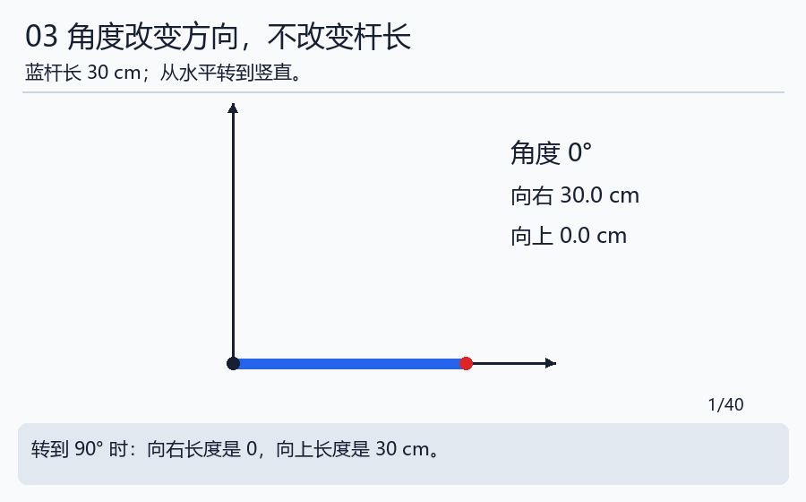
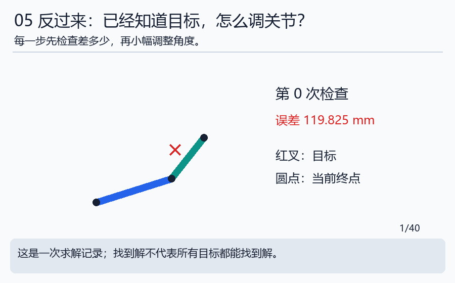
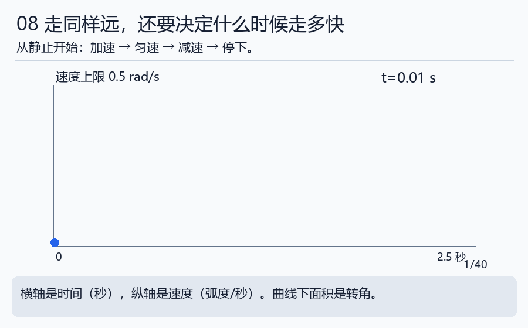
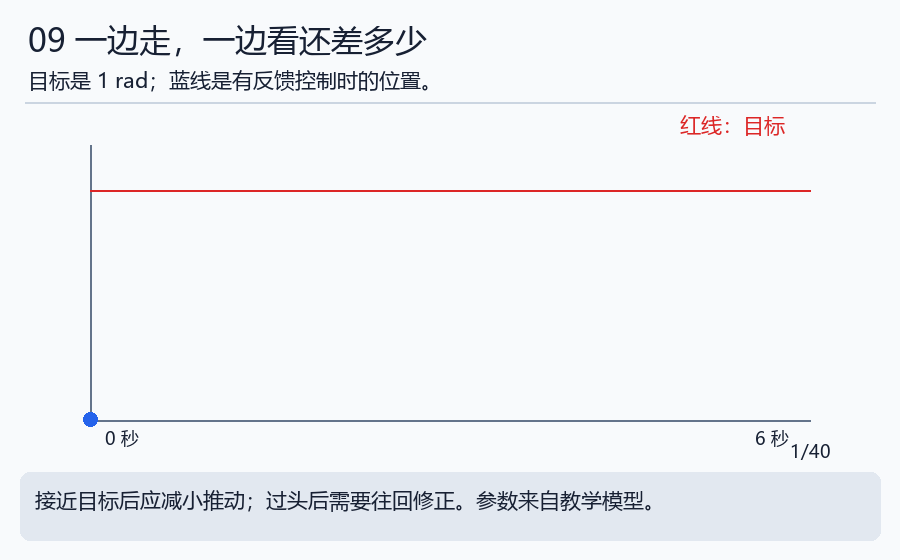

# 第四天｜先算到哪里，再学怎样到那里

[七天路线与本日过关](../WEEK_PLAN.md#day4) · [本日实验](../notebooks/04_kinematics_control.ipynb) · [运行方法](../INTERACTIVE.md)

## 先接上前一步

**接到实际工作：** 单电机调试先沿[实操路线](../PRACTICAL_PATH.md)通过接线、只读反馈和有限运动，再用[控制操作卡](../practical/03_control.md)学习模式、PID、限幅和同条件调参。单轴运动不要求先学完整FK/IK；本文的多关节几何计算用于后续机械臂工作。

昨天的消息已经能携带角度，今天先把角度换成位置，再讨论怎样到达。先学投影与FK/IK，再学轨迹和反馈；一次只解决一个问题。控制使用第三天的新鲜反馈，明天则检查整根手臂及运动途中有没有碰撞。

先完成下面正文和三题自检。正文中的手册链接供需要时查阅；今天的扩展统一放在文末。

## 第1步：斜杆在横向和竖向各占多少

水平的30厘米杆全部占在横向；竖直时全部占在竖向。斜着时，两边各占一部分。想象从杆尖分别向横轴、竖轴投影，形成直角三角形。

我们给“横向长度÷杆长”起名cos，给“竖向长度÷杆长”起名sin。今天可先查表，不用推公式。

| 角度 | cos：横向比例 | sin：竖向比例 | 30厘米杆的横向、竖向 |
|---|---:|---:|---|
| 0° | 1 | 0 | 30、0厘米 |
| 30° | 约0.866 | 0.5 | 约25.98、15厘米 |
| 90° | 0 | 1 | 0、30厘米 |

因此横向=l×cos(角度)，竖向=l×sin(角度)。这里l是杆长的名字，不是新的神秘量。

## 第2步：两根杆的位移相加，就是正运动学

第一根30厘米，角度30°；第二根20厘米，相对第一根再转60°。第二根相对桌面就是30°+60°=90°。

第一根贡献(25.98,15)厘米；第二根贡献(0,20)厘米。相加得到(25.98,35)厘米。这种“知道关节角，求工具位置”的计算叫**正运动学**，英文简称FK。

以后看到`q1`、`q2`，就读作“第一个角、第二个角”。完整公式只是把上面的过程写短：x=l1 cos(q1)+l2 cos(q1+q2)，y=l1 sin(q1)+l2 sin(q1+q2)。

Python的sin、cos用弧度。弧度也衡量角度：一圈2π弧度，约6.283；180°=π弧度。程序里用`math.radians(30)`把30度换过去，不要直接把30传给sin。更多小步练习见 [数学台阶](../beginner/MATH_STEPS.md)。

## 第3步：反过来找角度，就是逆运动学

如果目标是(30,20)厘米，我们可以摆出“第一杆向右、第二杆向上”，对应(0°,90°)。还能摆出另一个肘形到同一点。因此逆向问题可能有多个答案。

目标距离基座60厘米时，30+20厘米的两杆怎么摆都不够长，所以没有答案。实际机器人还会因为关节范围、碰撞等不能采用某些答案。

这叫**逆运动学**，简称IK。对于复杂机器人，程序会从一个初始猜测开始，算差距、调整一点、再检查。不要把一次“没找到”理解成已经证明“绝对不存在”。初始猜测或计算预算也会影响结果。

运行`python labs/algorithm_lab.py ik`，看最终误差。打开 [迭代表](../references/data/ik_trace.csv)，每行看当前位置和差多少。想自己拖动，用`python labs/kinematics_explorer.py`；没有图形环境就看动画与表格。

## 第4步：到达的过程也要安排

知道终点并不表示可以瞬间到达。像骑车一样，先加速、再匀速、最后减速。把位置与时间一起安排，称为轨迹。

图的横轴是经过的秒数，纵轴是每秒转多少。曲线变高表示转得更快，水平线表示速度不变，回到0表示停下。本例总转角1弧度、速度上限0.5弧度/秒、加速度上限1弧度/秒²，总时间2.5秒。

“加速度”是速度每秒改变多少，不是又一种位置。今天先会读图，分段计算在 [控制手册第2节](../handbook/03_control.md)。

## 第5步：反馈控制像走路时不断看目标

目标1弧度，当前0.9弧度，还差0.1弧度。用差距乘一个系数得到纠正量，就是比例控制的基本想法。太猛可能过头，太弱可能很慢，还会受到执行器能力限制。

PID是在此基础上加入“过去累积的差距”和“变化速度”的方法。先理解它为什么需要反馈，不必第一天就背三个字母的公式。进一步的PID、LQR、MPC在 [算法故事](../beginner/ALGORITHM_STORIES.md) 和手册里逐步展开。

## 今天自检

①第二个角为什么要加上第一个角才是相对桌面的方向？②FK与IK谁已知角度？③位置算对了是否就证明真实电机会准确到达？

答案：①它从第一杆方向开始量。②FK已知角度。③不能，真实控制、反馈、动力学与通信还要验证。交一行FK手算、一条IK结果和一段曲线解释。

现在会算位置和运动了，但桌上可能有障碍。下一天学习如何避开它们：[第五天](day05_collision_workspace.md)。

## 主线完成后再深入

[本日扩展小课堂](../handbook/17_extension_workshops.md#day4)提供先修、算例、自检与参考资料；[扩展选课表](../EXTENSIONS.md)列出所有暂缓主题及建议学习顺序。

[上一天](day03_communication.md) · [返回七天路线](../WEEK_PLAN.md#day4) · [下一天](day05_collision_workspace.md)
