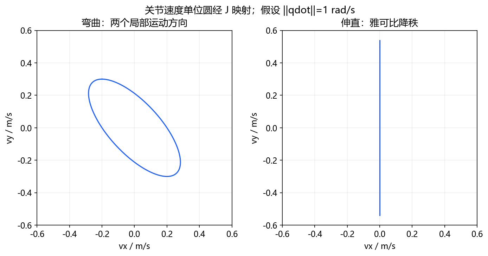

# 第四天：运动学、轨迹与反馈控制

深入自学：[运动学推导](../handbook/02_kinematics.md)、[动力学与控制](../handbook/03_control.md)。按 [算法实验](../labs/ALGORITHMS.md) 运行数值IK、PID与轨迹。



目标：计算一个简单机器人末端位置，理解控制循环为何需要测量、周期和约束。

## 1. 坐标和正逆运动学

位置需要参考系：“向前 10 cm”必须说明相对基座、工具还是相机。记 `T_AB` 为把 B 系坐标变为 A 系坐标的变换，则 `p_A = T_AB p_B`，使用齐次坐标时矩阵为 4×4；链式变换是 `T_AC = T_AB T_BC`，顺序不能随意交换。

两根平面杆长 `l1=0.3 m`、`l2=0.2 m`，第二关节角相对第一根杆：

```text
x = l1*cos(q1) + l2*cos(q1+q2)
y = l1*sin(q1) + l2*sin(q1+q2)
```

这就是 FK：关节状态决定末端位姿。IK 则从目标求关节角；可能多解、无解或数值求解失败。对本例，令 `c2=(x²+y²-l1²-l2²)/(2*l1*l2)`，若 `|c2|>1` 则目标在几何上不可达；否则 `q2=±acos(c2)`，再计算 `q1=atan2(y,x)-atan2(l2*sin(q2),l1+l2*cos(q2))`。

执行 `python labs/course_lab.py kinematics`，先 FK，再 IK，再 FK，比较位置误差；两组关节角可能到达同一点。该例只检查二维位置，没有姿态、真实限位和碰撞。深入阅读 [Modern Robotics 的正运动学课程](https://modernrobotics.northwestern.edu/nu-gm-book-resource/4-1-1-product-of-exponentials-formula-in-the-space-frame/)。

## 2. 轨迹与控制不是同一件事

路径描述经过哪里，轨迹还描述何时经过、速度和加速度。端点可达不代表中途无碰撞；端点合法也不代表插值满足速度、加速度约束。静态工作空间图无法证明一条运动轨迹能安全执行。

控制器比较目标 `q_ref` 与反馈 `q`。比例控制的简化形式是 `u=Kp*(q_ref-q)`。PID 增加累计误差的积分项和反映变化的微分项；积分饱和、测量噪声、采样延迟都可能使效果变差。实际伺服通常有电流、速度、位置等分层回路，具体结构依驱动器而定。

本课用最简单的一阶模型 `q_next=q+velocity*dt`，把比例控制输出当速度，并限制 `|velocity|≤0.5 rad/s`。它只用于理解闭环，不模拟质量、重力、驱动电流或接触。

## 3. 动手看控制过程

执行 `python labs/course_lab.py control`，打开 `outputs/control.csv`，以时间为横轴、位置为纵轴画图。观察初期速度饱和、后期误差减小。修改增益为较小正值，比较收敛速度；修改周期时检查离散系统行为，不能只比较循环次数。

雅可比矩阵在当前姿态附近把关节速度映射为末端速度。奇异姿态下某些方向的运动能力丢失或变差，IK 和速度控制可能变得困难。操纵度和条件数必须说明雅可比的定义和单位缩放，不能只凭一个数比较不同机器人。

## 4. 项目接口阅读

阅读 SDK 的 `calculate_kinematics.py`，找出 seed、success 和 FK 复算；再阅读 `move_point.py`，标出所有硬件启动和运动调用。静态阅读这些代码不等于已经验证真机运动行为。

交付：FK/IK 误差、控制 CSV 曲线和模型未覆盖的三个因素。下一课：[碰撞与工作空间](day05_collision_workspace.md)。
