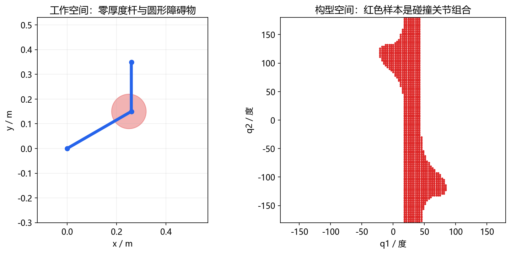
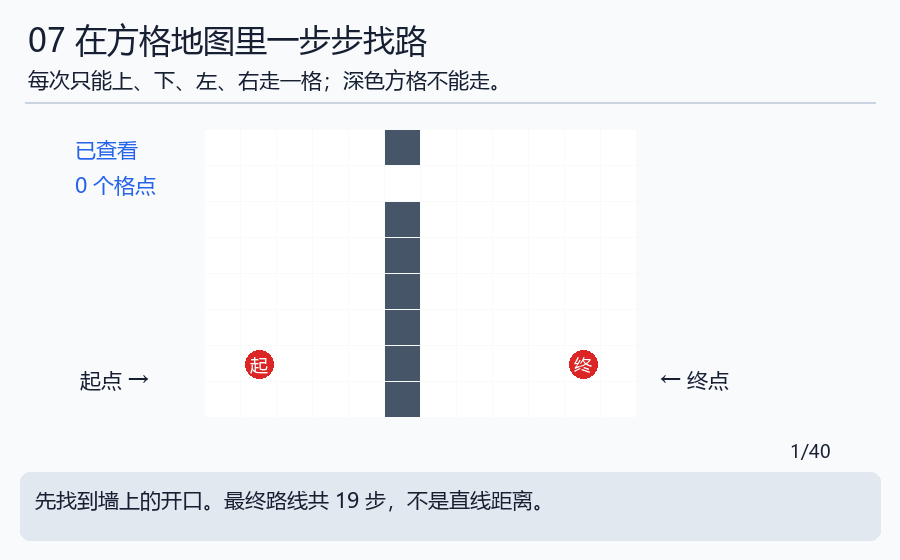

# 第五天｜终点能到，路上也可能撞到

完成本日再深入：[规划方法与边检查](../handbook/13_systems_deepening.md)。在[逐步演示器](../assets/interactive/concept_player.html)选择碰撞近似或A*主题，看数值和几何如何对应。

**边读边做：** [本日可编辑Python实验](../notebooks/05_collision_planning.ipynb)（[启动方法](../INTERACTIVE.md)）。技术细节补充见[工程实现](../handbook/09_engineering_details.md)。

昨天找到了一些到达目标的角度。今天问两个新问题：这些姿态有没有碰撞？从现在走到目标的途中有没有碰撞？先把这两个问题分开。

## 第1步：用走廊理解路径

你和目的地都站在空地上，中间却隔着墙。起点和终点合法，不代表直接走过去合法。机器人也一样：需要检查整段运动。

“路径”说经过哪里；“轨迹”再说什么时候到哪里。把路线画得圆滑以后，也要重新检查有没有靠近障碍；好看不等于有效。

## 第2步：计算机为什么画粗略外壳

真实零件有很多细小表面，逐个检查可能很慢。程序常用球、盒子等简单形状近似。就像搬家具前，先用它的最大长宽估计门能不能过。

动画里黑色物体一直分开，但很大的蓝圆会重叠。这个重叠说明近似外壳相碰，不一定说明真实物体相碰。把圆缩得太小也不行，会漏掉物体的一部分。

两球中心距离20毫米、半径各15毫米，表面间隙=20−15−15=−10毫米。负数表示球重叠10毫米；它不能直接当作真实零件的穿透深度。

这正好解释我们最近遇到的腕部折叠问题：先查球和零件是否贴合，再判断真实机构。不要只为了让结果变好就永久忽略一个碰撞对。

## 第3步：机械臂还有一张“角度地图”

普通地图用横坐标和纵坐标表示位置。对两关节机械臂，我们也可以用第一个角、第二个角作为两根坐标轴。图上的一个点表示整只机械臂的一种摆法，叫一个构型。

左边是桌面里的障碍物，右边红点表示会撞到它的角度组合。红区不是障碍物的实际外形。六关节需要六个数描述，画不成普通二维图，但“一个点对应一种摆法”的思路相同。

## 第4步：A*像带着距离估计找路

先用最容易理解的方格地图：每次只能上下左右一格，每步花费1。程序记住“已经走了多少步”，再估计“还离目标多远”，优先查看有希望的格子。这个搜索方法叫A*。

深色是墙，浅蓝是看过的地方，最后绿色是路线。起点(1,1)，终点(10,1)，墙在x=5，开口在y=6。必须至少向上5步、水平9步、向下5步，总19步。

运行`python labs/algorithm_lab.py planning`，应看到cost=19。这里cost就是步数。数据在 [地图](../references/data/grid_reference.csv) 和 [路线](../references/data/path_reference.csv)，可以自己用方格纸重画。

把墙完全封住，这张图上就没有路。它说明的是当前地图与规则无路，不自动证明真实空间绝对无路。关于RRT、PRM等方法，先读 [算法故事](../beginner/ALGORITHM_STORIES.md)，再看进阶伪代码。

## 第5步：工作空间图还回答了另一个问题

工作空间图通常在很多位置上尝试求解，记录哪些位置或方向成功。若某点试了16种工具方向，12种成功，覆盖比例是12÷16=0.75。

该点在这次采样下可达，但若显示要求“全部16种方向都成功”，它会被过滤。因此“图空了”可能是过滤条件，也可能是模型、碰撞或求解失败，不能只看一张图就下结论。

团队模型比较要保持采样设置一致，另说明尺寸、限位、工具等差异。参考 [模型数据说明](../references/DATA_GUIDE.md)，先读来源，再读数字。

## 今天自检

①端点没撞能证明中间没撞吗？②球模型重叠是否等于真实网格重叠？③12/16成功的比例是多少？

答案：①不能。②不能直接等同。③0.75。交一张19步路线和一份碰撞判断理由。

下一天，我们让机器人“看见”物体，并了解机器学习怎样从例子中形成规则：[第六天](day06_perception_ai.md)。
