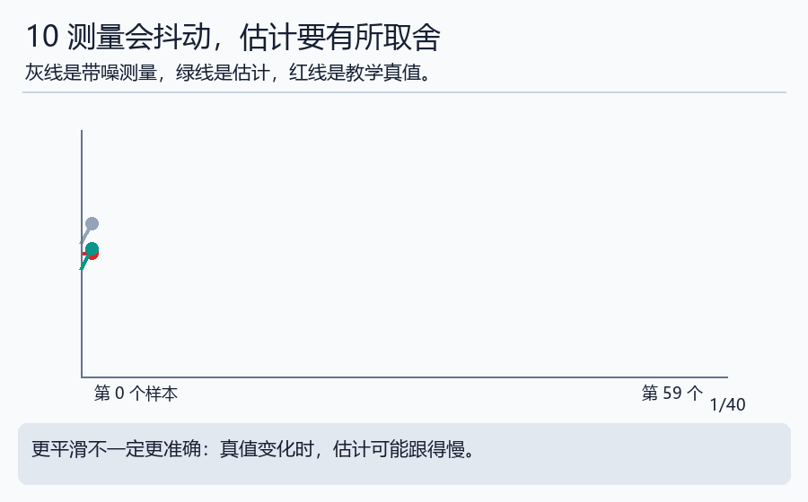
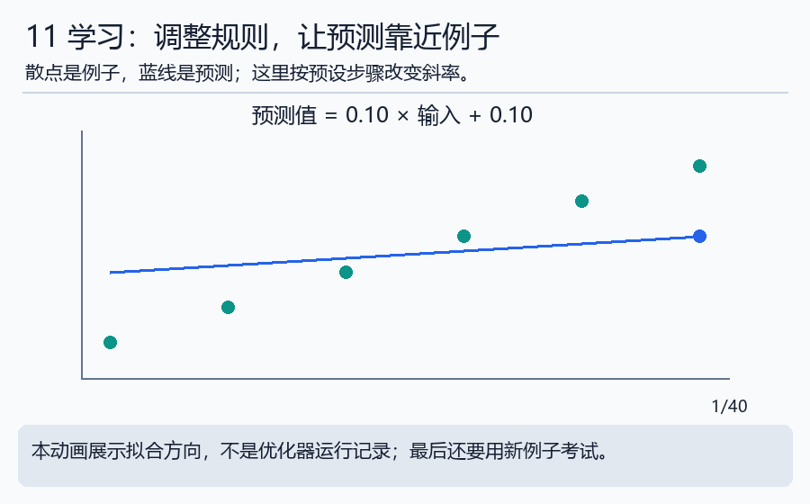

# 第六天｜让机器人看见，再学着做

**本门工程课程：**[感知与估计](../engineering/09_perception.md)及[AI与策略部署](../engineering/10_ai.md)。基础概念完成后，继续做计算、实现、故障诊断和验收；完整安排见[工程课程总入口](../ENGINEERING_PATH.md)。

[七天路线与本日过关](../WEEK_PLAN.md#day6) · [本日实验](../notebooks/06_perception_learning.ipynb) · [运行方法](../INTERACTIVE.md)

## 先接上前一步

前面假定目标和障碍位置已知，今天追问这些数从哪里来。先把像素连接到相机与基座坐标，再理解噪声、滤波和学习。学习顺序先运动后感知，真实运行时则常由感知提供目标，再交给规划控制。

先完成下面正文和三题自检。正文中的手册链接供需要时查阅；今天的扩展统一放在文末。

## 第1步：照片上的点还不是桌上的点

照片由许多小格子组成，每个小格子叫像素。检测程序说“物体在第370列、第240行”，只是在图片里定位，没有告诉机器人它离相机多远。

要得到三维位置，通常还需要深度或其他几何信息。相机自己的成像参数叫内参；相机相对机器人基座的位置与方向叫外参。用不同相机、镜头或安装方式，这些数可能不同。

先用最简单的例子：相机点(.1,0,1)米，相机相对基座只向x方向平移.2米、向z方向平移.3米，没有旋转。加起来得到基座点(.3,0,1.3)米。若相机还旋转，就不能只逐项相加，需要先换方向。

完整像素例子在 [估计手册](../handbook/05_estimation.md)。今天先会画“像素→相机坐标→基座坐标→工具目标”这条链。

## 第2步：测量不是永远准确的答案

用尺子反复测同一段长度，你可能读到10.0、10.2、9.9厘米。相机与传感器也会有波动。简单平均可以减小一些波动，但如果物体开始移动，旧数据又会拖慢反应。

灰线是带噪测量，绿线是估计，红线是教学真值。注意中间真值变了，绿线不是瞬间就到新位置。滤波是在“信新数据”与“信原来估计”之间权衡，并不是把线画平就完成了。

Kalman滤波是一类按模型和不确定性进行这种权衡的方法。最简单手算：原估计0，新测量2，两者权重各一半，更新为1。若测量更不可靠，就向2移动得少些。进一步的方差与公式放在进阶手册。

## 第3步：机器学习从例子里找规则

老师给几个例子：输入0对应1，输入1对应3，输入2对应5。你可能发现“输出=2×输入+1”。机器学习也会用数据调整规则，只是模型可能复杂得多。

动画中的线按预设步骤靠近点，用来展示“拟合”意思，不是训练程序的真实运行录像。实际可运行的线性回归在`python labs/course_lab.py ai`中。

“模型”就是可用于预测的规则，“参数”是规则里可调整的数。例如y=a×x+b中的a和b。训练是用样本决定这些参数；预测是给新输入算输出。

## 第4步：考试不能只考做过的原题

训练数据是练习题，测试数据是未参与训练的新题。把同一视频的相邻帧分到两边，就可能让测试题与练习题几乎一样，成绩看起来很好，换场景却不会了。这叫数据泄漏。

打开 [学习参考数据](../references/data/learning_reference.csv)，split列写train或test。测试数据不参与拟合。比较模型误差和“始终猜训练平均值”的简单基线，才能判断学习有没有帮助。

实际机器人应按整段轨迹、场景或采集批次划分。误差低还不够，需要在完整动作过程中看成功、碰撞、超时等结果。

## 第5步：机器人AI有几种常见学习方式

模仿学习：看人怎样做，学习观测与动作的对应。强化学习：通过交互得到奖励或扣分，逐渐调整行为。视觉语言动作模型还把图片与语言任务结合到动作预测里。

ACT会预测一段动作；Diffusion Policy通过逐步去噪生成动作。先理解输入和输出，再看名字背后的结构。它们不能替代正确的单位、关节顺序、控制与反馈。

例如模型输出6个数，SDK也收6个数，仍要问：是角度还是速度？是度还是弧度？顺序是否相同？这条输出是不是已经过期？

## 第6步：先读资料卡，再下载大数据

[参考资料阅读路线](../references/READING_GUIDE.md)介绍书籍与论文；[外部数据集卡](../references/DATASETS.md)介绍DROID和Open X-Embodiment。第一周看清字段与任务即可，不要求下载完整大数据集或训练大模型。

## 今天自检

①像素坐标能直接发成抓取位置吗？②曲线更平滑一定误差更小吗？③测试集为什么要独立？

答案：①不能，还缺深度、标定和工具定义等。②不一定，可能滞后。③检验新输入表现，避免记住练习题造成误判。

最后一天把这些知识做成一个小工具，并学习怎样让AI帮忙写代码而不盲信它：[第七天](day07_vibe_coding.md)。

## 主线完成后再深入

[本日扩展小课堂](../handbook/17_extension_workshops.md#day6)提供先修、算例、自检与参考资料；[扩展选课表](../EXTENSIONS.md)列出所有暂缓主题及建议学习顺序。

[上一天](day05_collision_workspace.md) · [返回七天路线](../WEEK_PLAN.md#day6) · [下一天](day07_vibe_coding.md)
