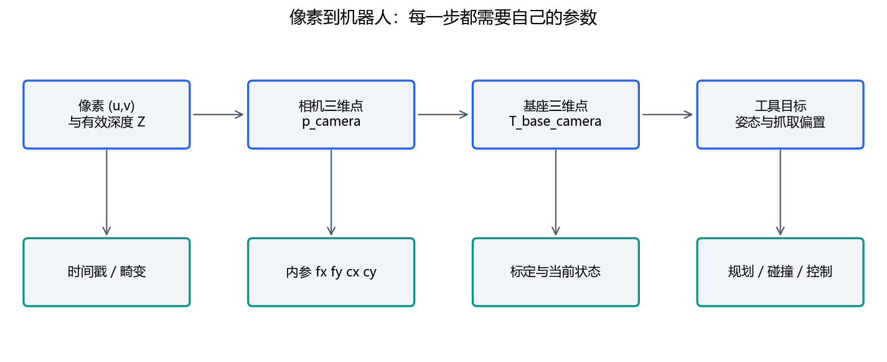

# 第六天：从相机数据到机器人 AI

深入自学：[感知与估计](../handbook/05_estimation.md)、[AI算法与评估](../handbook/06_ai.md)。配套Kalman和回归实验都有手算例题。

目标：解释感知如何进入机器人坐标系，完成一个可评估的小型学习实验，并识别部署缺口。

## 1. 感知先解决“看到了什么、在哪里”

图像是像素数据；检测框告诉我们图像中的区域，不直接给出机器人基座中的三维抓取位姿。相机内参描述投影关系，畸变参数修正镜头造成的偏移；外参描述不同坐标系的相对位姿。相机标定与手眼标定解决不同问题。

针孔模型中，已知深度 Z 时有 `X=(u-cx)*Z/fx`、`Y=(v-cy)*Z/fy`。深度单位、像素坐标约定和内参都必须一致。若得到相机坐标 `p_camera`，还需 `T_base_camera` 才能变为 `p_base`。运动中的工具相机还依赖对应时间的机器人姿态。

参考 [OpenCV 相机标定教程](https://docs.opencv.org/4.12.0/dc/dbb/tutorial_py_calibration.html)，理解多视角观测、内参与畸变、重投影误差。误差小不自动等于实际任务精度达标，还应保留独立验证点。团队 `calibration` 中的文件用于理解已有标定数据流程，不把历史结果当作当前安装的标定值。

## 2. AI 在链路中的位置

| 方法 | 输入输出 | 主要问题 |
|---|---|---|
| 规则与状态机 | 条件 → 确定动作 | 规则覆盖是否充分 |
| 监督学习感知 | 图像 → 类别、位置等 | 标注、泛化、误差 |
| 模仿学习 | 观测 → 示教动作 | 示教质量、分布变化、时序 |
| 强化学习 | 交互 → 策略改进 | 奖励、样本效率、仿真迁移 |
| 视觉语言动作模型 | 图像/语言/状态 → 动作表示 | 动作单位、坐标、频率、任务分布 |

AI 预测之后仍要有单位转换、时效检查、约束、控制和反馈。高层文字任务不能直接当电机报文。策略一次推理耗时与底层控制周期不同，通常通过明确接口交接动作。

## 3. 先学会评估，再谈大模型

执行 `python labs/course_lab.py ai`。用训练样本拟合一维关系 `action≈a*observation+b`，只在未参与拟合的数据上计算均方误差，再与“始终输出训练动作均值”的基线比较。该例是合成数据上的闭式线性回归，不是机械臂策略，也不是神经网络训练。

训练集用于拟合，验证集用于选择方法和超参数，测试集用于最后评估。实际机器人数据应按完整轨迹、场景或采集批次划分，避免相邻视频帧泄漏到测试集。记录传感器时间、机器人状态、动作单位、控制频率、失败原因与数据版本。

LeRobot 提供机器人学习相关的模型、数据集和工具，可从 [官方概览](https://huggingface.co/docs/lerobot/index) 了解完整工作流。第一周只阅读其数据、训练和评估的关系，不把下载预训练权重等同于适配了我们的机器人。

## 4. 仿真与团队实践

MuJoCo 可用于动力学与接触仿真，阅读 [官方概览](https://mujoco.readthedocs.io/en/stable/overview.html) 区分模型、状态和仿真步进。离线几何 FK 没有模拟接触动力学；动态仿真也存在摩擦、柔性、延迟等建模差异。

团队 `vision_robotics_skin_demo` 将 Python 学习程序与本地控制器分开。阅读其 README，找到模拟构建选项和通信边界。先提交接口表，再决定是否开展扩展模拟；基础课程不要求下载大模型或配置 GPU。

交付：像素到基座坐标的链路图、数据划分方案、模型与基线误差，以及模型可能失效的场景。下一课：[vibe coding 与交付](day07_vibe_coding.md)。
